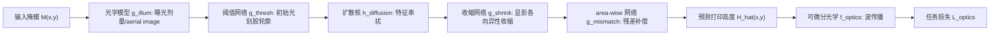

## 一句话总结

本文用"真实到仿真"（real2sim）的方式，从真实光刻系统的测量数据学出一个可微分的神经光刻仿真器（数字孪生），并把它嵌入计算光学的端到端设计闭环，从而在设计阶段就考虑制造约束，弥合"设计-制造鸿沟"。

## 研究背景

- 领域现状：计算光学（衍射光学元件、超透镜、全息光学元件等）借助可微分光学与深度学习，已能做出超越传统透镜的紧凑、多功能成像器件，端到端联合设计光学与重建算法成为主流范式。
- 核心痛点：现有设计流程几乎都把制造过程当作恒等映射，即假设"打印出来的结构就等于设计的掩模"。但真实光刻中光的衍射、系统像差和光化学反应会让实际结构显著偏离设计，尤其在接近衍射极限的精细特征上，导致设计性能与实测性能之间存在巨大落差——作者称之为"设计-制造鸿沟"。
- 本文 idea：与其事后做光学邻近校正（OPC）或反演光刻（ILT），不如先给真实光刻系统建一个高保真、可微分的数字孪生 $$\hat{g}_\theta$$，再把它作为"可制造性正则项"插入到下游光学任务的设计闭环里，让设计在满足任务指标的同时天然可制造。

## 方法

整体框架分两层：下层（follower）用真实测量数据离线预训练一个神经光刻仿真器 $$\hat{g}_\theta$$，把输入掩模 $$M(x,y)$$ 映射到实际打印高度 $$\hat{H}(x,y)$$；上层（leader）冻结这个仿真器，在它的预测之上优化掩模，使下游光学任务（全息元件 HOE、多级衍射透镜 MDL）性能最优。整体是一个双层优化问题：

$$M^\star(x,y) = \arg\min_{M(x,y)} \mathcal{L}_{\text{optics}}\!\left(f_{\text{optics}}\!\left(\hat{g}_\theta(M(x,y))\right)\right)$$

关键设计：

1. **物理引导的神经光刻仿真器（PBL 模型）**：把光刻过程拆成"光学模型 + 光刻胶模型"。光学模型在点扫描的双光子光刻（TPL）系统里被建模为掩模与高斯 PSF 的卷积；光刻胶模型用逐点网络 $$g_{\text{thresh}}$$ 处理阈值化、用可学习标准差的高斯核 $$h_{\text{diffusion}}$$ 建模反应物扩散带来的串扰、用逐点网络 $$g_{\text{shrink}}$$ 建模显影时垂直衬底方向的各向异性收缩，最后再加一个 area-wise 网络 $$g_{\text{mismatch}}$$ 补偿残差。物理先验保证泛化，数据驱动补足系统与光刻胶的个体差异。

2. **首个 2.5D real2sim 数据集**：不同于传统 2D 的 SEM 边缘位置误差数据，作者用原子力显微镜（AFM）测量真实打印结构的连续高度图，构建了 96 对"随机输入掩模—实测高度"数据（256×256、12 个高度层，对应 0–1.2 μm、相位调制范围 0–2.07π），并用单应性配准对齐掩模与 AFM 图像。

3. **端到端可微分的任务协同设计**：把打印结构近似为薄相位物体 $$\phi(x,y) = \tfrac{2\pi \Delta n}{\lambda} H(x,y)$$，用波光学前向传播（Rayleigh–Sommerfeld 卷积）计算全息像或 PSF。由于掩模是离散的 12 级层，用 Gumbel-Softmax 重参数化技巧让梯度能穿过离散设计变量。HOE 任务优化全息图 RMSE 加能量效率；MDL 任务分"直接成像"（优化 PSF 中心-背景比）与"计算成像"（对相机图做 Richard-Lucy 反卷积后比 MAE）两种。

## 实验结果

作者通过制造一个纯净衬底、一个平整打印面和一个 5 阶台阶结构，用 AFM 量化噪声上界，说明流水线性能的根本限制来自制造与测量的偶然不确定性（aleatoric uncertainty）。这一组测量是判断方法性能天花板的核心定量证据：

| 测量对象 | 指标 | 数值 | 含义 |
|----------|------|------|------|
| 纯净衬底（无打印） | 表面粗糙度 σ | 1.25 nm | 测量系统本底噪声 |
| 平整打印面 | 表面粗糙度 σ | 15.96 nm | 制造引入的线状随机误差，是主导噪声源 |
| PBL 数字孪生 | 预测误差 μ | 24.35 nm | 当前仿真器与真实打印的平均偏差 |

其余实验用文字概述：在前向预测上，PBL 模型的验证损失和误差均低于参数化物理模型（自由度不足、欠拟合）和 Fourier Neural Operator（易在训练集过拟合）。在 HOE 与 MDL 两个下游任务上，把光刻模型放进设计闭环后，实测全息像的 SSIM/PSNR、以及 MDL 的 PSF 亮度、成像对比度和高频细节都优于不考虑制造的朴素设计；尤为关键的是，不含光刻模型的设计在"设计端"SSIM 最高，却在"制造端"最差，暴露出巨大的设计-制造鸿沟，而 PBL 模型在制造端 SSIM 最高且设计-制造差距最小。

## 亮点与局限

- 亮点：
  - 首次把"设计"与"制造"作为两个可微分模块串进同一个端到端优化闭环，思路上把机器人领域的 real2sim 理念迁移到计算光刻。
  - 用 AFM 采集首个 2.5D 高度图数据集，支持对 3D 衍射结构的高度剖面优化，而非传统 2D 二值边缘校正。
  - 物理引导 + 数据驱动的灰盒建模兼顾泛化与系统适配，且真机制造与光学测试验证了性能提升。
- 局限：
  - 制造与测量的数据噪声（平整打印面 σ≈16 nm 的线状随机误差）从根本上限制了优化能力，是当前性能上界。
  - 神经光刻仿真器缺乏理论保证，在病态的逆向设计中可能产生不利设计。
  - 数据集规模小（96 对）、仅在双光子光刻系统上验证，SSIM/PSNR 整体数值偏低（受测量系统对齐与量化层数限制）。

## 延伸思考

这项工作把"可制造性"显式地写进了可微分设计目标，思路与相机 ISP、全息显示里的"硬件在环"优化一脉相承，本质上都是给难以解析建模的物理系统学一个可微分数字孪生再做反演。往下走，若把偶然不确定性显式建模（如输出分布而非点估计），或引入更多数据、更贴合线状缺陷的模型结构，甚至换到投影式光刻系统，都有望抬高性能天花板。更广地看，这套"real2sim 数字孪生 + 端到端反演"的范式，对超表面、微纳结构乃至任何需要跨越设计-制造鸿沟的物理制造流程都有借鉴价值。
