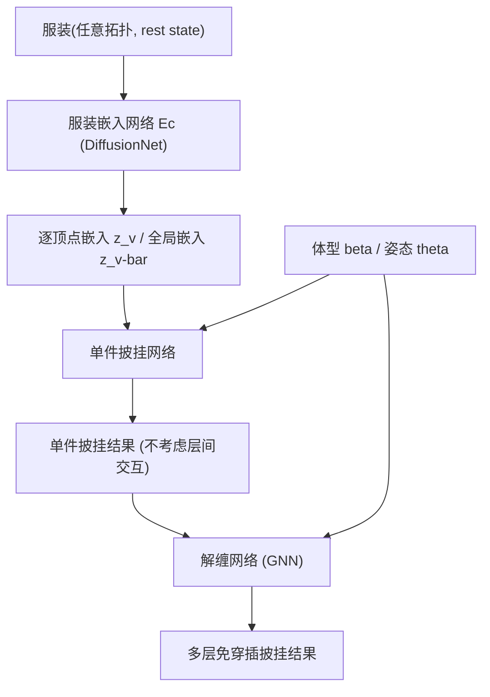

## 一句话总结

ClothCombo 用"服装嵌入 + 单件披挂 + 图神经网络解缠"三段式流水线，以无监督物理约束训练，实现任意拓扑、任意组合、任意层数服装在不同体型与姿态人体上的免穿插多层披挂。

## 研究背景

将服装披挂（draping）到 3D 人体上是计算机图形学的长期课题。传统基于物理的仿真结果真实但计算与内存开销大，难以用于实时场景；基于学习的方法能实时披挂但通常需要对每件服装单独训练，无法扩展到海量服装。

已有工作虽尝试处理任意拓扑服装，却难以应对多件服装相互交叠、层层纠缠的**多层穿衣**场景。核心难点在于**层间交互（inter-cloth interaction）** 建模非平凡：需要判断上下层如何相互挤压、变形并避免穿插。此前的解缠方法（如 ULNeF）只能在 T-pose 下工作，且需为每件服装在预处理阶段单独学习隐式场，难以推广到复杂多层场景。

本文提出 ClothCombo，目标是在多样体型与姿态下，对任意组合的服装做物理合理、免穿插的多层披挂，并且对服装拓扑不敏感。

## 方法

整体框架由三个子网络组成，均以 SMPL-X 参数化人体（形状 $$\beta$$、姿态 $$\theta$$）为条件：

**服装嵌入阶段。** 每件服装先粗略对齐到均值体型、T-pose 的"零体"（zero-body），称为 rest state。以 DiffusionNet 作为骨干网络（对拓扑不敏感），生成逐顶点嵌入 $$z_v$$ 和以质量加权平均得到的全局嵌入 $$\bar{z}_v$$：

$$z_v = \mathcal{E}_c(V, F)$$

$$\bar{z}_v = \mathrm{Avg}(z_v m_v)$$

**单件披挂阶段。** 先由全局嵌入与体型姿态导出单件披挂嵌入 $$z_s = \mathcal{F}_s(\bar{z}_v, \beta, \theta)$$；再用调制 SIREN 预测每顶点位移 $$\Delta x_s = \mathcal{D}_s(x, z_s, z_v)$$，加到 rest state 顶点后经线性混合蒙皮（LBS）映射到姿态空间。蒙皮权重初值取零体最近顶点权重，并由蒙皮网络 $$\mathcal{S}$$ 预测修正量 $$\Delta W_x$$ 加以优化。

**解缠阶段（核心）。** 把所有层服装看作一张全连接图：每件服装是一个节点，节点间的边表示交互。层号 $$i$$ 对应穿衣顺序（层 1 最先披挂）。层间"力"由两件服装的单件披挂嵌入计算：

$$f_{ij} = \mathcal{F}_f\left(z_s^i, z_s^j\right)$$

作用在第 $$i$$ 件服装上的净力，是来自下层与上层力的求和后拼接：

$$f_i = \sum_{i>j} f_{ij} \oplus \sum_{i<j} f_{ij}$$

再由 $$\mathcal{D}_m$$ 预测层间交互导致的顶点位移 $$\Delta x_m^i = \mathcal{D}_m(x_s^i, f_i, z_s^i, z_v^i)$$，最后经 LBS 得到最终多层披挂顶点。由于 GNN 对节点数不变，模型可推广到任意层数。

**训练。** 完全无监督，仅靠物理约束损失优化，无需生成大量多层合成数据。单件网络采用应变损失 $$L_s$$（StVK 弹性模型）、弯曲损失 $$L_b$$、重力损失 $$L_g$$、碰撞损失 $$L_c$$，并新增防自穿插的排斥损失 $$L_r$$ 与防下装滑落的保持损失 $$L_h$$。解缠网络额外引入多层碰撞损失 $$L_{mc}$$ 与距离损失 $$L_d$$（保证下层服装始终比上层更贴近人体）：

$$L_{multi} = L_{single} + \sum_{i=1}^{M}\sum_{j=i+1}^{M}\left(\lambda_{mc} L_{mc}^{ij} + \lambda_d L_d^{ij}\right)$$

训练中随机采样层数 $$M \in [1, 6]$$ 并随机排序，采用从 T-pose 到全姿态的渐进式学习策略。

## 实验结果

数据集使用合成的 Cloth3D++（6 类服装，4300 件训练、100 件验证），姿态取自 AMASS，体型参数在 $$[-2, 2]$$ 随机采样；另用真实 3D 扫描服装做定性验证。消融实验验证了各损失项与组件的必要性：

| Metric | All | w/o $$L_r$$ | w/o $$L_d$$ | w/o $$z_v$$ | w/o $$\mathcal{S}$$ |
|---|---|---|---|---|---|
| strain ↓ | 0.985 | 0.978 | 0.967 | 1.115 | 3.430 |
| bending ↓ | 0.103 | 0.099 | 0.097 | 0.093 | 0.181 |
| collision$$_{gb}$$ ↓ | 0.409 | 0.412 | 0.409 | 0.413 | 0.901 |
| collision$$_{gg}$$ ↓ | 0.138 | 0.155 | 0.309 | 0.377 | 0.312 |
| self-collision ↓ | 0.779 | 0.784 | 0.778 | 0.792 | 0.922 |

结果显示：去掉排斥损失 $$L_r$$ 主要使自穿插增加；去掉距离损失 $$L_d$$ 或逐顶点特征 $$z_v$$ 会显著抬高层间碰撞 collision$$_{gg}$$，导致服装间穿插；去掉蒙皮网络 $$\mathcal{S}$$ 则应变与体-衣碰撞大幅恶化。此外，多层披挂时随层数增加各层应变能比值单调上升，且最外层增幅最大，符合"多层挤压导致更强拉伸/收缩"的现实直觉。逐件推理时间上，嵌入 27 ms（每件仅需一次）、单件披挂 0.6 ms、解缠 0.4 ms，后处理 200~300 ms。

## 亮点与局限

亮点：
- 借助 DiffusionNet 的拓扑无关嵌入，可披挂任意拓扑服装，无需按服装单独训练。
- 用简洁的 GNN 建模层间交互，对节点数不变，可推广到训练时未见过的层数（如 7、8 层）与任意穿衣顺序。
- 全程无监督，仅靠物理损失，免去构造大规模多层合成数据；相比局部作用的解缠算子，在复杂多层场景更自然，且支持带姿态仿真。

局限：
- 结果几何偏平滑，缺少褶皱、褶裥等细节，可能源于嵌入网络对局部特征捕捉不足。
- 在极端情况会失败，如把紧身短裤套在长裙外面。
- 不建模二次动力学，网络仅以当前姿态为条件，长裙/长裤等的动态细褶表现不佳。
- 损失项虽能抑制穿插，推理时仍可能残留交叉，需耗时的后处理弥补，限制了实时部署。

## 延伸思考

将披挂细节的缺失归因于"全局/单件嵌入过于压缩、丢失局部几何"，暗示未来可引入局部处理或分别建模静态与动态形变的双编码器来找回褶皱。用"力的拼接"编码层的上下关系是个轻量而巧妙的归纳偏置，使 GNN 天然区分内外层；这种把物理直觉（层序、下层更贴身）显式写进损失（距离损失）的做法，也是无监督训练能收敛到合理层次结构的关键。后处理仍是实时化的主要瓶颈，如何在网络层面更硬地约束层间穿插，是把这类方法推向实用虚拟试衣的核心方向。
