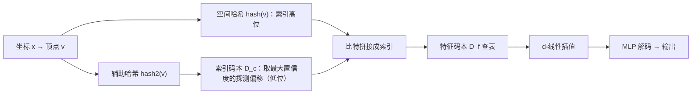

## 一句话总结

在 Instant NGP 的多分辨率哈希编码基础上引入"学习式探测"（learned probing），用一个可学习的小型索引码本来解决哈希冲突并复用特征，从而在几乎不损失查询速度的前提下把神经图形基元（图像 / NeRF / 纹理）压缩到接近 JPEG 的体积。

## 研究背景

- 领域现状：把可训练特征排布在空间网格里、再用小 MLP 解码的"特征网格"，是让神经图形基元又快又好的主流做法，广泛用于新视角合成、生成建模、光照缓存等。
- 核心痛点：现有特征网格要么内存占用大（稠密网格、因子分解网格、树、哈希表），要么速度慢（索引学习、向量量化）。索引学习虽然压缩率高，但训练极慢，且其代价随可学习比特数指数增长；树结构又带来缓存不友好的指针跳转和对稀疏先验的依赖。
- 本文 idea：把所有特征网格统一看成"把网格顶点映射到特征码本的索引函数"。既然它们最终都产出一个索引，就可以用简单的算术运算把不同方案组合起来。本文把哈希编码与索引学习拼接：哈希产出索引的高位比特，索引学习只负责低位的少数比特，从而把昂贵的索引学习成本压到很低。

## 方法

整体框架：对输入坐标 $$\boldsymbol{x}$$ 找到包围它的整数网格顶点 $$\boldsymbol{v}$$，对每个顶点计算一个索引函数 $$f(\boldsymbol{v})$$ 去查特征码本 $$D_f$$，查到的特征做 $$d$$-线性插值后送入 MLP。索引的高位由空间哈希决定，低位由一个可学习的索引码本决定——后者相当于在哈希冲突发生时，学习"往后探测多少格"来找到更合适的特征。

关键设计：

1. **学习式哈希探测的索引函数**。单个网格顶点的查表写作
   $$f(\boldsymbol{v}) = D_f\!\left[\, N_p \cdot \mathrm{hash}(\boldsymbol{v}) \bmod N_f + D_c[\mathrm{hash2}(\boldsymbol{v})] \,\right].$$
   其中空间哈希 $$\mathrm{hash}$$ 给出高位比特，索引码本 $$D_c$$（由使用不同素数的第二个哈希 $$\mathrm{hash2}$$ 稀疏化）给出低 $$\log_2 N_p$$ 位。直观上 $$D_c$$ 学会在 $$N_p$$ 个候选里"探测"以化解冲突、复用信息，这与经典哈希表的开放寻址探测同源。

2. **两套索引码本 + 直通估计器**。训练时用 $$\hat{D}_c \in \mathbb{R}^{N_c \times N_p}$$ 存每个探测位置的置信度；前向传播取置信度最大的那个特征（硬选择），反向传播则按置信度的 softmax 把梯度分配到探测范围内的所有特征——即"straight-through"估计器，用连续梯度学习离散决策。训练后把每行最大值对应的 $$\log_2 N_p$$ 位整数烘焙进推理用的紧凑码本 $$D_c \in \{0,\dots,N_p-1\}^{N_c}$$。

3. **把存储从"浮点主导"转为"整数主导"**。可学习比特数 $$\log_2 N_p$$ 很小（$$N_p$$ 取 $$2^1$$ 到 $$2^4$$），这些整数比 16 位半精度浮点还省得多；且低位比特对应的特征在内存中相邻、常落在同一缓存行，训练开销只有 $$1.2\text{–}2.6\times$$。推理时唯一新增开销是从 $$D_c$$ 多做一次索引查表，可忽略。

4. **超参选择流程**。方法继承 Instant NGP 绝大部分超参，只新增索引码本大小 $$N_c$$ 与探测范围 $$N_p$$。推荐流程：先令 $$N_c=1, N_p=1$$ 退化为 Instant NGP；按目标体积下界设特征码本 $$N_f$$；再翻倍 $$N_c$$（通常到 $$2^{16}$$）；仍想更高质量则翻倍 $$N_f$$；$$N_p$$ 越大 Pareto 略好但训练更贵。经验规律是最优配置约为 $$N_f \approx \tfrac{1}{3}N$$、$$N_c \approx \tfrac{2}{3}N$$。

## 实验结果

在合成 NeRF 数据集（8 个场景）上与 Instant NGP 的对比：本文在体积仅约 1/3（357 kB vs 1000 kB）时保持了几乎相同的平均 PSNR。

| 场景 | Instant NGP（1000 kB）PSNR↑ | Ours（357 kB）PSNR↑ |
|------|------|------|
| Mic | 35.08 | 33.88 |
| Ficus | 30.99 | 32.08 |
| Chair | 32.59 | 32.05 |
| Hotdog | 34.99 | 34.26 |
| Materials | 28.73 | 28.32 |
| Drums | 25.36 | 24.71 |
| Ship | 27.71 | 27.71 |
| Lego | 32.03 | 32.31 |
| 平均 | 30.93 | 30.66 |

其余实验以文字概述：在 Kodak 图像集上小体积时接近 JPEG（大体积略逊，因浮点参数占主导）；在 8000×8000 的 Pluto 大图上在大部分实用体积下超过 JPEG、ACORN 与 Instant NGP；真实场景 NeRF 上与需要量化+编码的 masked wavelet 方法（Rho 等）竞争而自身无需二者；纹理压缩上优于 BC 与 Instant NGP，但不及专用带量化的 NTC。速度上推理与 Instant NGP 相当甚至更快（体积小、更贴合缓存），训练开销随 $$N_p$$ 增大而升，最坏 $$2.6\times$$。

## 亮点与局限

- 亮点：
  - 提出"查表函数"的统一视角，把稠密网格、$$k$$-plane、树、哈希、索引学习都纳入同一框架，并用索引的算术组合催生新方法，理论优雅且可迁移。
  - 无需量化、无需熵编码、无需树细分即可做到接近 SOTA 的压缩-质量-速度三方权衡；支持随机访问查询，无需先整体解压，天然适合纹理压缩与 LOD 流式传输。
  - 应用无关：图像、NeRF、纹理同一套方法即可，超参有清晰的选择配方。
- 局限：
  - 小体积区间被"纯 MLP + 量化"类方法反超；在纹理上不敌专用架构 NTC。
  - 用哈希表换取了应用无关性，却牺牲了空间局部性，使其难以进一步接熵编码；作者尝试降低索引熵+熵编码收效甚微。
  - softmax + 直通估计器在探测范围大时需对所有候选反传，计算开销偏高；重建带高频噪声（虽 PSNR 相同，观感与 Instant NGP 类似）。

## 延伸思考

- "索引皆可组合"的框架启发了后续把不同空间数据结构按比特位拼接的思路；若能设计出兼具哈希表灵活性/性能又保留空间局部性的结构，就有望叠加熵编码进一步压缩。
- 值得追问的是：本方法把成本从浮点转向整数，那么数据自适应的浮点量化与索引熵最小化两条路线孰优？作者认为二者都值得深挖。
- 直通估计器可替换为稀疏/随机 softmax 变体，或借鉴 VQ-VAE 的最近邻查询、局部敏感哈希，以降低大探测范围下的训练代价。
- 面向内容分发（一次编码、多端低功耗解码、多尺度优雅降级）的定位，使其在直播 NeRF、游戏纹理压缩、体积视频、实时辐射缓存等场景有想象空间。
