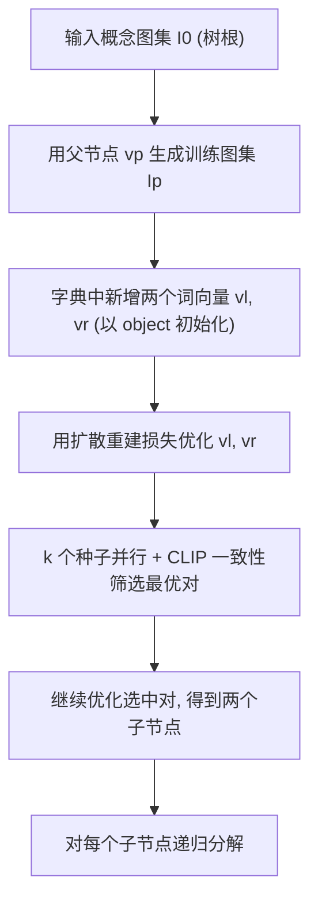

## 一句话总结

给定一小组描述某个概念的图片，本文把这个概念"拆解"成一棵二叉树，树上每个节点是注入到预训练文生图模型文本空间的一个新学到的词向量，分别编码概念的不同侧面（形状、纹理、子物体等），从而支持几乎无穷的视觉采样、树内与跨树组合，为设计与创意提供灵感。

## 研究背景

- 领域现状：文生图扩散模型与个性化（personalization）方法（如 Textual Inversion、DreamBooth）已经能把用户给的独特概念注入模型，生成高质量的变体与编辑。
- 核心痛点：创意往往不是整体复制一个概念，而是提取其中的某个"侧面"（aspect）重新组合。已有个性化方法把一个概念当作整体来学习，难以分离出可单独复用的子侧面，探索空间因此受限。
- 本文 idea：利用大规模视觉-语言模型丰富的隐空间，把一个视觉概念隐式地分解为层次化的多个子概念，用一棵二叉树来组织；每个节点是一个可采样、可用自然语言组合的词嵌入，让机器辅助人做高度探索性的创意联想。

## 方法

整体框架：以一组输入图片 $$I_0$$ 表示的概念作为树根，自顶向下逐层生长二叉树。每次针对一个父节点 $$v_p$$，同时优化它的两个孩子节点嵌入 $$v_l, v_r$$：先用父节点概念生成一小批训练图，再在预训练 Stable Diffusion 的文本查找表里新增两个词向量（都用单词 "object" 的嵌入初始化），最后用扩散重建损失把这两个向量优化成父概念的两个互补侧面。分解是隐式的，不预设"按形状还是按纹理"分。

关键设计：

1. **二叉重建（Binary Reconstruction）**：沿用 Textual Inversion 的重建损失，但一次同时学两个兄弟向量。用中性模板句 "A photograph of $$s_l\ s_r$$" 作为条件，对采样图片加噪后送入冻结的 UNet 预测噪声，梯度只回传到 $$v_l, v_r$$：

$$\{v_l, v_r\} = \arg\min_{v}\ \mathbb{E}_{z\sim E(x),\,y,\,\epsilon\sim\mathcal{N}(0,1),\,t}\big[\lVert \epsilon - \epsilon_\theta(z_t, t, c(y)) \rVert_2^2\big]$$

   这样两个向量"合起来"要能重建父概念，训练中它们从 "object" 逐渐分化出两个不同侧面。采样时借鉴 ReVersion 的重要性采样，让更大的时间步 $$t$$ 有更高概率：$$f(t) = \tfrac{1}{T}\big(1 - \alpha\cos\tfrac{\pi t}{T}\big)$$，取 $$\alpha=0.5$$，有助于提升稳定性与内容分离。

2. **一致性 / 连贯性（Coherency）**：只满足重建还不够，单个节点生成的图可能语义杂乱。作者定义基于 CLIP 图像特征的一致性度量——两组图 $$I_a, I_b$$ 的一致性是它们之间 CLIP 特征余弦相似度的均值：

$$C(I_a, I_b) = \operatorname{mean}_{I_a^i \in I_a,\, I_b^j \in I_b,\, I_a^i \neq I_b^j}\ \operatorname{sim}\big(\mathrm{CLIP}(I_a^i), \mathrm{CLIP}(I_b^j)\big)$$

   理想的一对兄弟节点：各自内部一致（对角高），彼此之间又足够区分（交叉低）。

3. **种子筛选**：用 $$k=4$$ 个不同随机种子并行优化到约 200 步（此时已充分离开初始词），得到候选对集合 $$V_s$$，每个节点用 40 张图算一致性，按下式选出最优对——不看绝对交叉分，而看它相对"最不一致节点"的差：

$$\{v_l^\ast, v_r^\ast\} = \arg\max_{\{v_l^i, v_r^i\}\in V_s}\Big(\min(C_l^i, C_r^i) - C(I_{v_l^i}, I_{v_r^i})\Big)$$

   选定种子后再用重建损失继续优化 1500 步定型。

4. **组合与探索**：因为方法只往字典里注入新词、不改模型权重，学到的侧面可以自由组合——树内组合（选取/剔除某些 $$v_i$$ 得到概念变体）、跨树组合（把不同概念树的节点词并列进一句话）、以及嵌入自然语言句子（如 "A chair made of $$v$$"）把某个侧面迁移到全新设计上。

## 实验结果

作者在 13 个概念（9 个来自已有个性化数据集，4 个自建）上构建对应的树，用 CLIP 一致性度量评估"重建"与"分离"两项树结构要求，并辅以人类感知研究。

| 评估项 | 度量 | 结果 | 含义 |
|--------|------|------|------|
| 重建质量 | $$C(I_{v_p}, I_{v_l v_r})$$ | 0.80 | 两兄弟合起来能较好重建父概念 |
| 兄弟分离 | $$C(I_{v_l}, I_{v_r})$$ | 0.59 | 兄弟间有明显区分，但仍偏近 |
| 一致性度量与人一致率 | 用户研究(35人/15对) | 82.3% | CLIP 一致性判断与人类感知吻合 |
| 侧面可溯源识别率 | 用户研究(35人/5物体×3侧面) | 87.8% | 学到的侧面确实与源概念相关且可辨认 |

文字补充：与直接对整体概念做 Textual Inversion（TI）相比，本文的侧面分解让文本生成更可控——TI 常被某一主导纹理支配、或干脆丢掉句中主体、或把所有侧面糅在一起，探索空间因而受限。

## 亮点与局限

- 亮点：
  - 把"概念分解"落到一棵可视化、可导航的二叉树上，节点即可复用的词嵌入，天然支持树内/跨树/自然语言三种组合探索。
  - 分解是隐式的，不预设分离维度，常涌现出意料之外、可作灵感的子概念。
  - 只注入新词、不微调权重，因此不同概念的树能自由跨树组合，且省显存。
  - 提出与人类感知高度吻合（82.3%）的 CLIP 一致性度量，用于筛选连贯的子概念。
- 局限：
  - 四类失败模式：背景泄漏、不可理解的侧面、某一子概念占据主导、两侧面重叠过多。
  - 难以构建更深的树或超过两个孩子的节点，子概念过简/不连贯时只能停止，疑与嵌入漂移到分布外有关。
  - 单个节点分解在单张 A100 上最多约需 40 分钟，依赖 Textual Inversion 优化效率。

## 延伸思考

- 分解质量受限于 Textual Inversion 本身的稳定性与可编辑性，若换用更鲁棒的个性化方法或加入正则项（约束嵌入留在词分布内），有望缓解主导/重叠等失败并支持更深的树。
- 一致性度量目前用于"筛选"而非直接进入优化目标，若把连贯与区分作为可微损失联合优化，或许能减少对多种子并行的依赖、降低成本。
- 树是二叉、侧面是隐式涌现的，这带来惊喜也带来不可控；对设计工具而言，如何在"可控引导分离主题"与"保留意外灵感"之间取得平衡是值得追问的方向。
