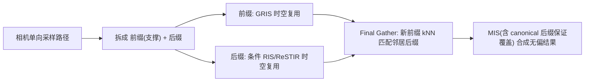

## 一句话总结

本文把广义重采样重要性采样（GRIS）扩展到**条件概率空间**，提出条件无偏贡献权重（conditional UCW）理论，使 ReSTIR 能够在给定路径前缀的条件下**只复用一段子路径（后缀）**，并据此为 ReSTIR PT 增加了一个类似光子映射 final gather 的原型，显著降低时空复用带来的相关性伪影。

## 研究背景

- 领域现状：ReSTIR 及其理论基础 GRIS 让蒙特卡洛积分能在复杂的、PDF 不可点评估的域之间做无偏的时空样本复用，用无偏贡献权重（UCW）$$W_X$$ 取代传统的 $$1/p(x)$$，把路径追踪成本摊薄到大量像素与帧上。
- 核心痛点：GRIS 只支持样本具有**可处理的边缘（marginal）贡献权重**的情形。如果想复用从单向采样路径中截取的**光子路径后缀**，就必须以路径前缀（那些不被复用的段）为条件来处理该后缀，而现有 UCW 理论无法表达这种**条件**权重，限制了 ReSTIR 可用的复用形式。此外 ReSTIR PT 在复杂光照加镜面表面时会出现强时空相关、闪烁与色偏。
- 本文 idea：把 UCW 推广到条件与联合形式，证明在整分变量与其贡献权重之间满足**条件独立**时，条件复用是无偏的；进而做条件 RIS/ReSTIR，只复用路径的后缀部分（至少丢弃起始一段），并借鉴光子映射的 final gather 思路降低相关性。

## 方法

整体框架：先把 UCW 的定义扩展到"给定 $$Z$$ 的条件 UCW" $$W_{X \mid Z}$$ 和联合 UCW，给出联合无偏的充分条件；再用条件 RIS（CRIS）在条件域里做重采样，用目标函数当作未知条件 PDF 的代理来算 MIS 权重；最后落到一个"后缀 ReSTIR + final gather"的原型，把相机路径的前缀与来自邻居的后缀重新连接。

关键设计：

1. **条件无偏贡献权重（conditional UCW）**：把 UCW 放进"$$Y$$ 取定值"的条件概率空间。定义 $$W_{X \mid Y}$$ 满足 $$E[f(X)\,W_{X\mid Y}\mid Y]=\int_{\mathrm{supp}(X\mid Y)} f(x)\,dx$$，并有 $$E[W_{X\mid Y}\mid X,Y]=1/p_{X\mid Y}(X\mid Y)$$。这让"只有 $$1/p_{X\mid Y}$$ 的无偏估计"（例如来自条件 RIS）也能参与无偏积分。

2. **联合 UCW 与条件独立条件（关键陷阱）**：直觉上想用 $$W_{X_1}\,W_{X_2\mid X_1}$$ 当作 $$(X_1,X_2)$$ 的联合 UCW，但直接相乘会有偏。本文指出必须让 $$W_{X_1}$$ 移到外层期望，为此要求 $$X_2$$ 与 $$W_{X_2\mid X_1}$$ 在给定 $$X_1$$ 时**条件独立**于 $$W_{X_1}$$。满足该条件时 $$W_{X_1 X_2}=W_{X_1}\,W_{X_2\mid X_1}$$ 才是合法联合 UCW；若存在 $$X_1$$ 之外的共享依赖，则各 UCW 必须进一步对这些共享量取条件。

3. **条件 RIS（CRIS）与广义 MIS**：输入样本 $$X_i$$ 及其域可条件依赖于 $$Z$$（如后缀的前缀）。用条件 shift mapping $$Y_i=T_i(X_i\mid Z)$$ 把邻居样本搬进积分域，按重采样权重 $$w_i=m_i(Y_i)\,\hat p(Y_i)\,W_{X_i\mid Z}\,\lvert T_i' \rvert$$ 选样，得到条件 UCW $$W_{Y\mid Z}=\frac{1}{\hat p(Y)}\sum_i w_i$$。MIS 权重沿用广义平衡启发式，用各域目标函数 $$\hat p_i$$（如后缀辐射）作为未知条件 PDF 的代理，并用 shift 的雅可比行列式做相应变换。为保证无偏，必须让样本支撑的并集覆盖被积函数支撑，做法是加入一个覆盖全支撑的 **canonical 样本**。

4. **后缀 ReSTIR 原型（final gather）**：从相机单向发射路径，用 ReSTIR 更新，但**只复用后缀**，至少丢弃起始一段——这天然要求条件 ReSTIR（后缀以被丢弃的前缀为条件）。实现上采用 Lin 等人的 hybrid shift，把重连接推迟到连续第二个高粗糙度顶点，之前为前缀、之后为后缀；因此需存前缀与后缀两份数据，reservoir 尺寸相较 ReSTIR PT 翻倍。final gather 阶段为每个新前缀用 kNN 找到最近的若干支撑前缀对应的邻居后缀，做 MIS 合成。作者指出这与不从光源采样的双向路径追踪、以及一种"无偏辐射缓存"在思路上相通。

## 实验结果

由于原文的定量对比以图像与等预算误差图形式给出（提取文本未含数值表），此处按论文正文与图 1 说明给出主实验的**定性对比**，不编造数字：

| 方法 | 时空相关/闪烁 | 复用粒度 | 备注 |
|------|--------------|----------|------|
| 本文（后缀 ReSTIR + final gather） | 明显更稳定、无可见相关伪影 | 复用单段后缀 | 目前更贵但相似光线预算下质量更好 |
| ReSTIR PT [Lin et al. 2022] | 复杂光照+镜面时有强相关、boiling、色偏 | 复用整条路径 | 速度很快 |
| MMIS gather [West et al. 2022] | — | 边缘 MIS 的 final gather | 相似光线预算下质量弱于本文 |

主要结论：三种方法都是无偏、随时间收敛到参考解；在 Tower Bridge 这类几乎全靠间接光照的场景，本文原型在每像素仅一条完整路径积分的条件下，给出时空稳定、无可见相关性的结果，且降低相关性还改善了现代降噪器在 ReSTIR PT 信号上的表现。作者强调这是未优化的概念验证，代价偏高。

## 亮点与局限

- 亮点：
  - 理论上完成了 Lin 等人开启的演进——把蒙特卡洛积分里的 PDF 彻底替换为 UCW，并使 UCW 可以存在于条件概率空间、联合依赖多个变量、对特定随机变量做边缘化。
  - 点明"直接相乘条件 UCW 会有偏"这一微妙陷阱，并给出清晰的条件独立性判据（Theorem 4.1），理论严谨。
  - 揭示 ReSTIR PT 与光子映射的相似性，用 final gather 降低相关性，为实时 GPU ReSTIR 引入迭代式 gather/滤波打开了口子。
- 局限：
  - 原型未优化、当前开销明显高于 ReSTIR PT；reservoir 需同时存前缀与后缀，存储翻倍。
  - 只复用了单段后缀（借一个 suffix），更一般的多后缀/多次迭代 gather 仅作为方向提出。
  - 目前是概念验证，距离生产可用仍有性能差距。

## 延伸思考

- 该条件 UCW 框架把"复用一部分路径"变成有原则的操作，天然可与后续 ReSTIR 家族工作衔接（如 Area ReSTIR 对子像素/镜头坐标的复用、ReSTIR MCMC 用变异去相关），值得思考条件独立性判据在这些变体里如何满足。
- "无偏辐射缓存"的视角很有意思：相比 VPL/光探针那类有偏缓存，条件 RIS 提供了在缓存/gather 语境下保持无偏的路径，可能对实时全局光照的缓存结构设计有启发。
- 相关性降低对降噪器友好这一观察提示，采样器与降噪器应联合设计——把"降低样本相关性"作为采样阶段的显式目标，而非只追求单帧方差。
