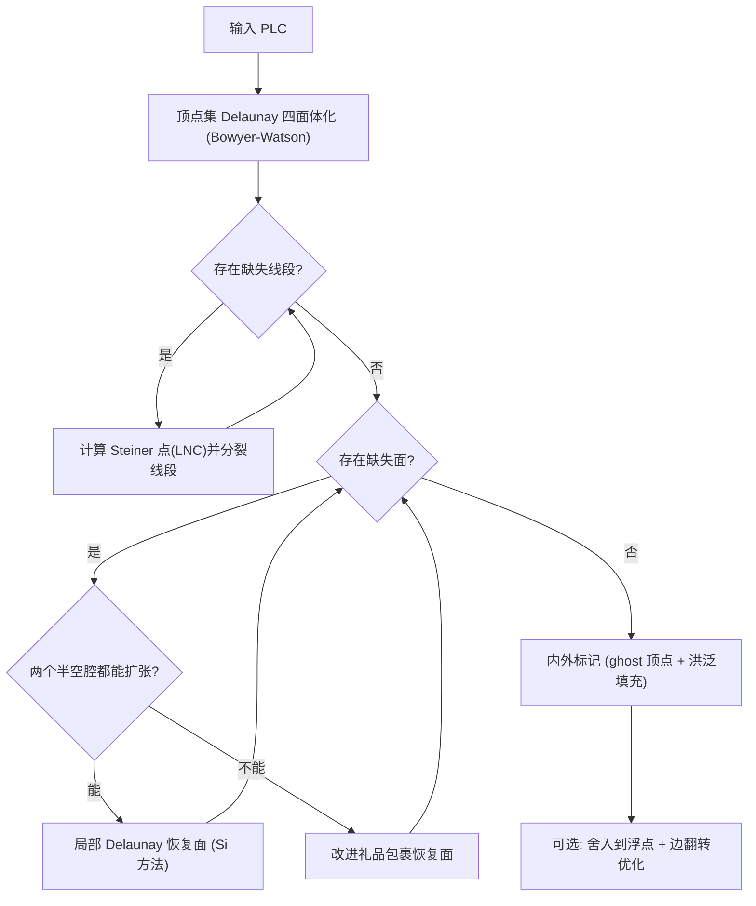

## 一句话总结

用隐式点（线性组合点）加间接几何谓词，把 tetgen 的约束 Delaunay 四面体化（CDT）算法改造成既数值鲁棒又高效的浮点实现，并修补了原理论的一处隐性缺陷，在 Thingi10k 的 4408 个合法模型上实现 100% 成功率。

## 研究背景

约束 Delaunay 四面体化（CDT）是把一个分片线性复形（Piecewise-Linear Complex, PLC）划分为四面体、并且精确保留输入表面边界的一种空间剖分，广泛用于偏微分方程求解、形状厚度计算、中轴近似、光线追踪等需要精确体离散的场景。与 TetWild、Quartet、CGAL 这类"包络/近似边界"的方法不同，很多应用（尤其在复杂域上解 PDE）要求边界被无损、精确地保留，因此需要真正的边界保持型 CDT。

三维 CDT 的难点在于：并非所有 PLC 都存在 CDT（例如 Schönhardt 多面体、Chazelle 多面体），需要在输入上加入额外的 Steiner 点才能保证存在性，而 Steiner 点的数量与最优位置至今仍是开放问题。当前唯一公开可用的 3D CDT 实现是 tetgen（基于 Si 与 Gärtner 2005 的算法），但它在 Thingi10k 的合法模型中约有 8.6% 会失败。作者指出这些失败不仅源于浮点容差，还源于 Si 理论中一个关于"局部空腔可被充分扩张"的隐性且不正确的假设，即使采用完美精度计算也会失败。

## 方法

核心思路是保留 Si 的整体算法框架（点集 Delaunay 化 → 线段恢复 → 面恢复 → 内外标记），但从两个层面根治其脆弱性：用可精确表示的隐式 Steiner 点替代会产生无理坐标的显式点；用一个基于礼品包裹（gift-wrapping）的备用算法处理空腔扩张失败的情形。

关键观察是：Steiner 点必然落在它所分裂的输入线段上，因此可以写成线段两端点的线性组合。作者定义了一种新的隐式点 LNC（LiNear Combination）：

$$p = t\,\boldsymbol{v_1} + (1-t)\,\boldsymbol{v_2}, \quad t \in (0,1)$$

其中 $t$ 是浮点数。由于任何 Steiner 点都能写成这种形式，就无需引入无理坐标，也无需 ad-hoc 容差。

在此基础上，作者把经典的 orient3d 与 inSphere 谓词扩展为作用于隐式点的"间接谓词"。以 orient3d 为例，四个显式点时其符号等于如下行列式：

$$\det \begin{pmatrix} p_{1x}-p_{4x} & p_{1y}-p_{4y} & p_{1z}-p_{4z} \\ p_{2x}-p_{4x} & p_{2y}-p_{4y} & p_{2z}-p_{4z} \\ p_{3x}-p_{4x} & p_{3y}-p_{4y} & p_{3z}-p_{4z} \end{pmatrix}$$

当第一个点是 LNC 时，只需把 $p_{1x}$ 替换为 $t\,v_{1x}+(1-t)\,v_{2x}$（$y,z$ 同理），得到的组合表达式仍是多项式，其符号可用浮点滤波加浮点展开无误判定。行交换只改变行列式符号，因此 16 种 orient3d、32 种 inSphere 变体可压缩到 5 种和 6 种，调用时把隐式点前移并跟踪交换次数的奇偶性即可。

针对空腔扩张失败，作者引入一个改进版礼品包裹算法（基于 Shewchuk）作为兜底。对每个缺失面 $f$ 挖出空腔并沿 $f$ 的平面分成两个半空腔，逐一填充四面体：为当前边界三角形 $\sigma$ 寻找一个合法的顶点 apex $w$，使新四面体 $t$ 满足三条件——正体积、与当前边界的相交必须是公共子单形、以及除被 $\partial C_1$ 遮挡不可见者外圆球内无其它顶点。为处理共球（非一般位置）导致的两半空腔在 $f$ 上三角化不一致，采用一致的符号扰动技术：当 inSphere 恰好判定为"在球面上"时，依据顶点在全局网格向量中的存储顺序确定内外，从而保证两侧在公共面上的三角化一致。

实现上作者提供了三种数值后端做公平对比：CORE 精确无理数、GMP 有理数、以及最终的间接谓词版本；实验证明用初始浮点近似的 $t$ 值总能得到与精确 CORE 完全一致的结果，无需迭代加倍精度。最后一步（可选）把隐式点舍入到浮点坐标，并用统一的边翻转操作（在 $n$ 个四面体共享一条边时可有 $n-2$ 种翻转方式，$n=3,4,5$ 分别对应 3-2、4-4、5-6 翻转）在保持 PLC 一致性的前提下单调降低最大 AMIPS 能量，以消除舍入产生的退化/翻转单元。

## 实验结果

在 Thingi10k 中满足 PLC 条件（不自交）的 4408 个模型上测试。76% 的模型在 1 秒内完成，平均耗时 4.3 秒；仅 1.2% 超过 60 秒，最坏 33 分钟。线段恢复平均占总时间 74.5%，是主要瓶颈。平均插入约 25k 个 Steiner 点，91% 的模型少于 50k。相较各类可比方法：

| 方法 | 失败数 / 4408 | 精确保持边界 | 舍入后浮点可表示且有效 |
| --- | --- | --- | --- |
| 本文方法 | 0（100% 成功） | 是 | 93.22%（加后处理 99.77%） |
| tetgen | 378（8.6%，-T0 时增至 720） | 是 | 是（全程浮点） |
| DA2021 | 0 | 是 | 61.7% |
| CGAL / DelPSC / Quartet / TetWild | —— | 否（近似边界） | —— |

本文方法在耗时与内存上与 tetgen、DA2021 相当，且内存消耗持续更低（平均峰值 46.5 MB）。数值后端对比显示：CORE 比间接谓词版慢数千倍，GMP 有理数也慢一个数量级以上。生成的 CDT 可直接作为 tetgen 的 refine-only 模式或 MMG3D 的输入用于后续网格优化。

## 亮点与局限

亮点：
- 首个在 Thingi10k 全部 4408 个合法 PLC 上都成功的 3D CDT 算法，失败率从 tetgen 的 8.6% 降到 0。
- 用 LNC 隐式点 + 间接谓词把"需要无理数/精确算术"的问题转化为纯浮点多项式符号判定，无需任何容差参数，实现无参数化。
- 发现并修补了 tetgen 理论中"局部空腔总能充分扩张"的隐性错误假设（在 4408 个模型中出现 2 次），并用改进礼品包裹算法保证终止。
- 输出可无损存为有理坐标，也可舍入到浮点；93.22%（加后处理 99.77%）舍入后仍有效。

局限：
- 使用基于边的 Steiner 点，因此不保证与原 PLC 的连接性一致；共面三角面构成非 Delaunay 2D 三角化时无法兼顾一致连接与约束 Delaunay。
- 3D Delaunay 条件不必然对应高质量网格（存在 sliver），本文不含完整网格优化阶段。
- 作者证明：并非所有输入在浮点分辨率下都存在可表示的 CDT（用嵌在单个浮点立方体内的 Schönhardt 多面体作为反例）。
- 未利用并行架构。

## 延伸思考

线段恢复占了近四分之三的运行时间且与所需 Steiner 点数强相关，这提示未来性能优化应聚焦于减少 Steiner 点或加速该阶段（如并行化 Delaunay 插入）。更有价值的方向是把"隐式点 + 间接谓词"的思路推广到 Delaunay 细化与网格优化：目前 tetgen 的浮点细化器会破坏收敛保证，若能为四维点（用于翻转细化）或内部 Steiner 点定义新的隐式点类型与间接谓词，就有望在保证鲁棒收敛的同时得到高质量四面体网格。此外"何种 PLC 才存在浮点可表示的 CDT"仍是开放的理论问题，值得进一步刻画其充要条件。
