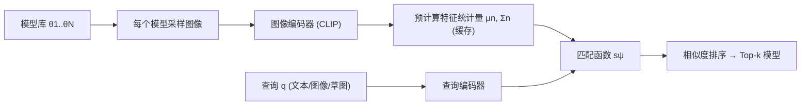

## 一句话总结

面对社区里爆炸增长的定制/预训练生成模型，本文提出"基于内容的模型搜索"任务：给定文本、图像、草图或另一个模型作为查询，从模型库中检索出最可能生成相似内容的生成模型，并用一套概率化建模加对比学习的方法在自建的 Generative Model Zoo 基准上超越多个基线。

## 研究背景

- 领域现状：大规模文生图模型（Stable Diffusion 等）非但没有让模型数量收敛，反而催生了海量定制模型；社区平台（Civitai、HuggingFace）上短时间内就积累了成千上万的微调模型，每个模型都封装了一小片精心策划的主题世界。
- 核心痛点：现有模型分享平台主要靠人工命名/标签来检索模型，但一个生成模型能产出的图像内容极其复杂且高度特定，很难用名字或标签充分描述。同时，"某张图能否由某个模型生成"这一简化问题本身就难以计算——GAN、VAE 等很多生成模型无法高效或精确地估计密度，也不原生支持跨模态（文本↔图像）相似度度量。
- 本文 idea：把"检索单张图像"升级为"检索图像分布"。每个模型 $$\theta$$ 定义了一个图像分布 $$p(x \mid \theta)$$，于是把模型搜索形式化为：找到最可能生成查询内容的那个模型，即最大化后验 $$p(\theta \mid q)$$；再针对不同查询模态给出可近似、可预计算、可学习优化的具体方法。

## 方法

整体框架分三步：先对库中每个模型批量采样图像；再用冻结的编码器把样本编码为特征，并预计算每个模型的一阶、二阶特征统计量（均值 $$\mu_n$$、协方差 $$\Sigma_n$$）缓存起来；最后学习一个匹配函数，输入查询特征与模型统计量、输出相似度分数，取分数最高的模型返回。

关键设计：

1. **概率化检索目标**。假设模型服从均匀先验，则 $$\max_\theta p(\theta \mid q)$$ 等价于最大化似然 $$p(q \mid \theta)$$。据此分两种情形处理：查询与模型同模态（如图像查图像模型）直接归结为密度估计；查询与模型跨模态（如文本查图像模型）则用跨模态相似度近似。

2. **同模态：Gaussian Density**。密度估计对多数生成模型不可行，于是把每个模型近似为 CLIP 特征空间上的高斯分布 $$p(z \mid \theta_n)\sim \mathcal{N}(\mu_n,\Sigma_n)$$，查询图像特征 $$z_q$$ 在该高斯下的概率密度即为打分。

3. **跨模态：1st Moment 与 Monte-Carlo**。文本查询对应多种可能图像，无法像图像查询那样化简。把 $$p(q \mid \theta)$$ 写成对 $$p(x \mid q)/p(x)$$ 与 $$p(x \mid \theta)$$ 乘积的积分，用 CLIP 相似度近似 $$\tfrac{p(x \mid q)}{p(x)}\propto \exp(\tfrac1\tau \tilde h_x^{\top}\tilde h_q)$$。逐样本取平均即 Monte-Carlo 法；预计算每个模型的 CLIP 图像嵌入均值、推理时直接用查询嵌入与该均值算相似度，即高效的 1st Moment 法。有意思的是，草图查询上 1st Moment 反而优于 Gaussian Density，因为草图与图像存在域差，密度估计不占优。

4. **对比学习微调匹配函数**。纯冻结特征对某些模态（尤其草图）并非最优。引入可学习矩阵 $$A_\psi$$ 对特征做投影/变换，用 InfoNCE 损失训练，使查询与其真值模型的相似度最大、与其它模型最小。$$A_\psi$$ 尝试了对角、三角、满秩三种参数化，通过在合成模型库上做 5 折交叉验证挑选最优形式。

## 实验结果

作者构建了 Generative Model Zoo 基准：259 个公开真实模型（涵盖 GAN、扩散模型、VQGAN、CIPS 等多种架构）组成的 Internet Model Zoo，以及 1000 个各在单张图上微调 Stable Diffusion 得到的合成模型；并为每个模型定义文本、图像、草图三种模态的真值查询，用 Top-k 命中率评估。下表为 Internet Model Zoo 上图像与草图查询的主实验（Top-k 命中率），对比不同打分公式及是否用对比学习微调（FT）：

| 查询模态 | 方法 | Top-1 | Top-5 | Top-10 |
|------|------|-------|-------|--------|
| 图像 | CLIP+Gaussian Density | 0.84 | 0.96 | 0.98 |
| 图像 | CLIP+Gaussian Density (FT) | 0.85 | 0.96 | 0.99 |
| 图像 | CLIP+1st Moment (FT) | 0.81 | 0.95 | 0.98 |
| 草图 | CLIP+Gaussian Density | 0.18 | 0.39 | 0.53 |
| 草图 | CLIP+1st Moment | 0.32 | 0.61 | 0.73 |
| 草图 | CLIP+1st Moment (FT) | 0.49 | 0.75 | 0.84 |

图像查询本身命中率已很高，微调收益有限；草图查询上对比学习带来大幅提升（1st Moment 从 0.32 提到 0.49 Top-1），验证了可学习变换对弱模态的价值。文本查询在 Internet Model Zoo 上做 5 折交叉验证（Table 3）也得到相似结论。此外与"用人工描述做文本匹配"的元数据检索基线相比（Table 4），基于内容的方法更优且免去了为每个模型写详尽描述的负担——当标签不准或无法枚举所需视觉概念时，元数据检索会失效。方法足够快，支持交互式的网页端实时搜索。

## 亮点与局限

- 亮点：
  - 提出并形式化了一个新任务——把检索的对象从"单张图像/实例"推广到"图像分布/生成模型"，并给出统一的概率化框架，兼容不同查询模态与不同生成模型架构。
  - 用预计算特征统计量把检索降到实时，配合对比学习提升弱模态（草图）表现，并给出了可交互的搜索 UI。
  - 贡献了 Generative Model Zoo 基准（真实 + 合成模型 + 多模态真值查询），为该任务后续研究提供了评测底座。
- 局限：
  - 目前只覆盖图像生成模型，尚未扩展到 3D、文本、音频、视频等更广的生成模型与媒介。
  - 有时无法契合用户细粒度意图：典型失败是草图查询"朝左的马"时，检索回的是通用马模型，而非最匹配的方向特定模型——方法不尊重查询中物体的空间朝向。

## 延伸思考

- 方法把每个模型压成 CLIP 空间的一阶/二阶统计量，本质是用一个（或高斯）向量概括整片图像分布；这对高度多样或多峰的模型可能损失严重，是否可以用更丰富的分布表示（如混合高斯、集合级表示）在效率与保真间取得更好折中值得探讨。
- "不尊重空间朝向/构图"的失败源自 CLIP 全局特征对布局不敏感，引入具备空间感知的特征或局部对齐或许能改善草图这类强调结构的查询。
- 随着模型即内容（model-as-media）成为常态，把该框架推广到 3D 资产生成器、视频/音频生成模型的检索，以及与模型合并、检索增强生成结合，都是自然的延伸方向。
