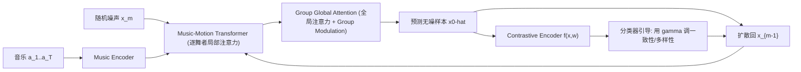

## 一句话总结

提出 Group Contrastive Diffusion (GCD)——首个面向音乐驱动群舞生成的去噪扩散框架，通过对比学习得到的引导信号，在采样阶段自由调控生成群舞的"一致性"与"多样性"。

## 研究背景

- 领域现状：单人舞蹈的音乐驱动生成已有大量工作（CNN/RNN/GNN/GAN/Transformer 乃至扩散模型如 EDGE），而多人群舞生成起步较晚，代表性数据集是 AIOZ-GDance，代表方法是自回归的 GDanceR。
- 核心痛点：现有方法要么难以生成高保真的长时序群舞（自回归模型误差累积、易冻结或漂移），要么无法提供可控体验。群舞独有的"多舞者之间的一致性（协调同步）"与"多样性（个体差异）"这对矛盾此前几乎没被系统探讨；GDanceR 主要靠跨实体注意力保一致性，却因训练过程确定性而忽视了多样性。
- 本文 idea：用扩散模型灵活操纵舞蹈分布，并训练一个对比编码器区分"高一致性"与"高多样性"样本，再把该编码器当作分类器引导信号插入反向采样，从而用一个可调参数在一致性与多样性之间连续权衡。

## 方法

整体框架：以 Transformer 为骨干的群舞去噪网络，一次性生成整段序列（非自回归）。每个扩散步输入含噪群舞与条件音乐，网络直接预测无噪信号 $$\hat{x}_0$$ 再回扩散到上一步，直至 $$m=0$$。同时训练一个对比编码器，学习区分一致性/多样性样本，其梯度作为引导信号控制生成。

关键设计：

1. **Music-Motion Transformer（逐舞者音乐对齐）**：先只学习每个舞者的动作与音乐之间的直接关联，暂不考虑舞者之间的互动。用带局部掩码 $$m_{local}$$ 的掩码自注意力，使每个舞者只关注自身的动作序列；再用交叉注意力把音乐条件（动作为 query，音乐为 key/value）注入个体动作特征。音乐特征取自冻结的 Jukebox 预训练模型，增强对野外音乐的泛化。

2. **Group Global Attention + Group Modulation（群体约束）**：用全局掩码 $$m_{global}$$ 让每个舞者充分关注其他所有舞者，保证协调与不碰撞。受 StyleGAN 启发，从音乐特征时间平均池化 $$\bar{c}$$ 注入随机噪声后经 8 层 MLP 学习"群体嵌入" $$w$$，并加入可变长度查表得到的舞者数量嵌入 $$e_n$$：
$$w = \mathrm{MLP}\!\left(z + \tfrac{1}{T}\sum_{t=1}^{T} c_t\right) + e_n,\quad z \sim \mathcal{N}(0, I)$$
再用 Group Modulation 层（类似 AdaIN 的仿射变换 $$\tilde{h} = S(w)\cdot\frac{h-\mu(h)}{\sigma(h)} + b(w)$$）把个体特征朝统一群体表征偏移，强化舞者间的关联。

3. **对比扩散构造正负样本**：训练一个对比编码器 $$f(\hat{x}, w)$$ 建模数据 $$x$$ 与群体上下文 $$w$$ 的互信息（密度比 $$f(x,w) \propto p(x \mid w)/p(x)$$），用 InfoNCE 目标优化。正样本取真实配对 $$p_\theta(x_{m-1} \mid x_m, w)$$，代表高一致性；负样本通过以一定概率把序列中的舞者替换成其他群舞的舞者、再走前向过程得到 $$p_\theta(x^{j}_{m-1} \mid x^{j}_m, w)$$，代表高多样性。由于负样本仍由被训练成"跟随音乐"的网络生成，它们并非随机坏样本，而是仍与音乐匹配的合法群舞。

4. **一致性 vs 多样性的可控采样**：把对比编码器当作分类器引导，用其对数梯度平移反向过程的均值：
$$\hat{\mu}_\theta(x_m, m) = \mu_\theta(x_m, m) + \gamma\cdot\Sigma_\theta(x_m, m)\,\nabla_{x_m}\log f(x_m, w)$$
其中 $$\gamma>0$$ 推动舞者间更一致，$$\gamma<0$$ 提升多样性，$$\gamma=0$$ 为中性默认。测试用 DDIM 50 步加速，可在单张 RTX 2080Ti 上 30 Hz 实时生成；长序列则分块重叠、用匈牙利算法在相邻块间匹配舞者身份、再球面插值融合。

## 实验结果

在 AIOZ-GDance 数据集上，与 FACT、Transflower、EDGE、GDanceR 对比。GCD 的中性模式在 FID/GMR 等真实性指标上全面领先，高一致性设置（$$\gamma=1$$）在 MMC/GMC/TIF 上更优，高多样性设置（$$\gamma=-1$$）在生成多样性 GenDiv 上更高，三种设置均显著超过所有基线。

| 方法 | FID↓ | MMC↑ | GenDiv↑ | PFC↓ | GMR↓ | GMC↑ | TIF↓ |
|------|------|------|---------|------|------|------|------|
| FACT | 56.20 | 0.222 | 8.64 | 3.52 | 101.52 | 62.68 | 0.321 |
| Transflower | 37.73 | 0.217 | 8.74 | 3.07 | 81.17 | 60.78 | 0.332 |
| EDGE | 31.40 | 0.264 | 9.57 | 2.63 | 63.35 | 61.72 | 0.356 |
| GDanceR | 43.90 | 0.250 | 9.23 | 3.05 | 51.27 | 79.01 | 0.217 |
| GCD 高一致性 ($$\gamma=1$$) | 31.48 | 0.272 | 8.78 | 2.55 | 39.22 | 82.01 | 0.115 |
| GCD 中性 ($$\gamma=0$$) | 31.16 | 0.261 | 10.87 | 2.53 | 31.47 | 80.97 | 0.167 |
| GCD 高多样性 ($$\gamma=-1$$) | 33.37 | 0.255 | 11.34 | 2.58 | 35.63 | 78.19 | 0.209 |

物理合理性 PFC 在三种设置下基本不变，说明调控一致性/多样性不会明显牺牲动作可信度。舞者数量分析显示：随舞者增多，GenDiv 略降、TIF 略升，但变化幅度远小于 GDanceR，碰撞频率控制良好。

## 亮点与局限

- 亮点：
  - 首个音乐驱动群舞的去噪扩散方法，非自回归一次性生成，避免误差累积，可生成任意长度、任意舞者数的群舞。
  - 用对比编码器把"一致性—多样性"权衡显式参数化为单个可调 $$\gamma$$，采样阶段即可连续控制，且不明显损失真实性与物理合理性。
  - 负样本"跨群换舞者"的构造巧妙，直接作用于反向过程，学到更强的群体表征，利于长时序一致性。

- 局限：
  - 依赖单一数据集 AIOZ-GDance，泛化到其他风格/文化的群舞未验证。
  - 群体嵌入与音乐特征绑定较强，$$\gamma$$ 的调节范围与语义边界靠经验设定，缺乏更细粒度（如按舞者/时间段）的局部控制。
  - 长序列靠分块+匈牙利匹配+插值拼接，属工程化处理，块边界的全局编排连贯性未做定量评估。

## 延伸思考

- 把"分类器引导可控扩散"从群舞推广到更一般的多智能体运动生成（多人交互、体育、人群动画）值得探索，负样本构造思路具有通用性。
- 单一标量 $$\gamma$$ 之外，可否学习空间/时间上非均匀的引导场，实现"某几位领舞高一致、其余高多样"的分组编排。
- 与轨迹可控类后续工作（如 TCDiff）相比，本文更侧重"风格层面的一致/多样"而非"空间轨迹的显式无碰撞约束"，二者结合有望同时兼顾编排美学与几何安全。
