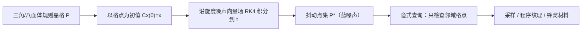

## 一句话总结

把规则晶格上的点沿"旋度噪声（curl noise）"这一无散度向量场平流一小段，就能隐式地生成兼具良好间距与低各向异性的蓝噪声点集——无需预先计算或存储整个点集，即可查询任意查询点附近的最近样本点。

## 研究背景

- 领域现状：计算机图形学里大量任务（采样、程序纹理、散布物体、生成蜂窝状材料/泡沫）都偏好蓝噪声分布，即点在空间上均匀、各向同性铺开、彼此不过分靠近。经典做法有 Poisson 圆盘采样、基于优化的方法（Lloyd、CCVT、最优传输、高斯蓝噪声）、tile 方法、低差异序列、误差扩散等。
- 核心痛点：绝大多数高质量方法都要求把**整个点集算出来并存下来**，本质上是迭代过程，无法在不生成全集的前提下只取某个子区域里的少量点。对于超大域或只需局部样本的场景（如实时程序纹理），这不可行。能"隐式"查询的只有基于抖动（jittering）的方法——在每个网格格子内随机扰动格点，从而只检查查询点附近格点的扰动位置即可找到最近样本。但传统抖动继承了规则晶格的各向异性，蓝噪声质量偏低。
- 本文 idea：作者把"抖动"重新理解为"让格点沿某个向量场的流线移动一小段"。既然如此，就该挑一个能提升蓝噪声质量的向量场。关键洞察是：旋度噪声是**无散度（保体积）**的向量场，没有源与汇，因而不会把点吸拢或推散，能在打散规则性、降低各向异性的同时保持点间距——正好把规则晶格转化为蓝噪声点集，且天然保留抖动方法的隐式可查询性。

## 方法

整体思路：从三角晶格（比方形晶格堆积更密、更接近最密圆堆积）出发，把每个格点当作初值，沿旋度噪声定义的向量场用 RK4 积分追踪一小段流线，终点即抖动后的点。由于位移有界（抖动半径 $$r_j$$），查询任意点 $$\boldsymbol{x}$$ 的最近抖动点时，只需检查其邻近一二阶（极少数三阶）格点抖动后的位置。

关键设计：

1. **把抖动写成流线追踪**。抖动点由微分方程 $$\frac{\mathrm{d}}{\mathrm{d}t}\boldsymbol{C}_p(t)=\boldsymbol{V}(\boldsymbol{C}_p(t))$$ 从 $$t=0$$ 积到 $$t=1$$ 得到。传统随机抖动相当于在每个子域内取常向量场；而换成"有噪声但无散度"的向量场，就能在保持点均匀分布的同时大幅削弱原始网格的各向异性。用 RK4 追踪流线明显优于单步 Euler。

2. **为何必须无散度**。3D 向量场的旋度 $$\nabla\times\boldsymbol{\Phi}$$ 因混合偏导相等（Clairaut 定理）恒为无散度，其对应的流保体积，因此没有源和汇。这是保证抖动后点"不聚不散"的数学根据。注意噪声的梯度场或平滑插值随机向量都**不是**无散度的，故被排除；旋度噪声（Bridson 等提出，本用于模拟不可压湍流）恰好满足要求。2D 时取 $$\boldsymbol{\Phi}=[0,0,f]$$，旋度落在 $$xy$$ 平面：$$\nabla\times\boldsymbol{\Phi}=\left(\frac{\partial f}{\partial y},\,-\frac{\partial f}{\partial x},\,0\right)$$。

3. **旋度噪声抖动（CNJ）的三参数**。方法由底层噪声函数 $$N$$、噪声尺度 $$s$$、追踪时间 $$t$$ 三者决定。噪声必须带限、平稳、各向同性且导数可高效计算。作者测试了稀疏卷积噪声（SC）、正弦和噪声（SoS）、Perlin 噪声三种。尺度过粗则晶格只是被整体平移、规则性仍在；尺度过细则退化为随机抖动。

4. **质量度量与调参**。基于点集分析框架（PSA），用径向平均功率谱定义各向异性 $$\bar{a}$$ 与有效 Nyquist 频率 $$v_{\text{eff}}$$，再定义质量 $$q=v_{\text{eff}}/\bar{a}$$（当抖动半径 $$r_j\ge\delta$$、即位移超过格边长 $$\delta$$ 时强制 $$q=0$$，以保证隐式生成成立）。在 $$(t,s)$$ 网格上扫参后，Perlin 噪声质量最高且计算最省，被选作 2D 实验的默认噪声。

5. **推广到 3D**。3D 取旋度需要向量值噪声（Perlin 需三次带偏移的求值）。初始晶格可用立方或体心立方（八面体）晶格，后者点分布更密。3D 中 Perlin/SoS 更依赖 RK4 以避免残留规则性，SC 用 Euler 步即可表现不错。隐式实现只需抖动到二阶邻域。

## 实验结果

在 2D 下与两类方法对比：可隐式查询的抖动类（CNJ、迭代版 ICNJ、相关多重抖动 CMJ、平滑抖动 SJ）和需全局邻域信息、不可隐式查询的（Blue Nets、CCVT、Poisson 圆盘 PDS）。指标为有效 Nyquist $$v_{\text{eff}}$$、平均各向异性 $$\bar{a}$$、质量 $$q$$、星差异 $$D^*$$ 与耗时（100 次平均）。

| 方法 | 可隐式 | $$v_{\text{eff}}\uparrow$$ | $$\bar{a}\downarrow$$ | $$q\uparrow$$ | $$D^*\downarrow$$ | time(s)↓ |
|------|--------|------|------|------|------|------|
| CNJ（本文） | 是 | 0.70 | 71.81 | 0.0097 | 0.0020 | 0.062 |
| ICNJ（本文迭代版） | 是 | 0.74 | 72.81 | 0.0100 | 0.0021 | 2.22 |
| CMJ | 是 | 0.82 | 960.6 | 0.00086 | 0.0023 | 0.0022 |
| SJ | 是 | 0.44 | 442.7 | 0.0010 | 0.0034 | 0.0079 |
| CCVT | 否 | 0.83 | 78.85 | 0.011 | 0.0020 | 20.8 |
| Blue Nets | 否 | 0.83 | 88.27 | 0.0095 | 0.00083 | 47.9 |
| PDS | 否 | 0.26 | 70.63 | 0.0036 | 0.0047 | 0.332 |

结论：在**可隐式查询**的这一类里，CNJ/ICNJ 是唯一同时保持低各向异性的方法，质量远超 CMJ 与 SJ（后两者各向异性高达数百上千）；总体质量仅次于需全局优化的 CCVT。有趣的是 Poisson 圆盘虽各向异性最低，但 $$v_{\text{eff}}$$ 也很低，整体质量反而不如 CNJ。隐式 2D 版在 ShaderToy(GLSL) 上用 RTX 3090 于 1080p 每帧仅约 2.04 ms。3D 应用包括：约 13 亿个小球堆成的兔子（近似颗粒材料的硬球堆积）、以及基于 Worley 距离公式生成的开孔铝/铜金属泡沫（用 OptiX/CUDA 路径追踪渲染），视觉上比逐格随机抖动明显减少了聚簇。

## 亮点与局限

- 亮点：
  - 视角新颖——把"抖动"重解释为沿向量场追踪流线，用旋度噪声的无散度（保体积）性质给蓝噪声一个直观且几乎零成本的来源。
  - 兼得两难：既能隐式查询（不必生成/存储全集，适合超大域与实时），又达到接近全局优化方法的蓝噪声质量与低各向异性。
  - 实现简单，可作为已有抖动流程的即插即用替代；2D/3D 通用，能驱动程序纹理（改进 Worley 噪声）与蜂窝/泡沫等蜂窝材料建模。
- 局限：
  - 缺乏形式化保证——"保体积保持点间距"只是启发式论证，作者承认难以给出严格证明，靠定量指标间接支撑。
  - 依赖预先给定的规则晶格，不直接支持自适应密度（如按图像强度变化的点密度），需晶格自身自适应，属未来工作。
  - 质量仍略逊于 CCVT 等全局方法；不同噪声函数在 3D 下对参数与积分器（Euler vs RK4）较敏感，SoS 偶有涟漪状规则性。

## 延伸思考

- 把"采样即向量场平流"这一视角推广开：是否可以用其它无散度场（或更高维旋度构造）得到不同谱特性的点集？作者也提到用时变噪声函数实现随时间演化的蓝噪声采样，这对时域抗锯齿、时序 ReSTIR 等实时渲染场景可能有价值。
- 隐式、可局部查询且带蓝噪声的特性，天然契合 GPU 上的程序化超大体素/材料生成——比如巨型场景的散布、体积雾/泡沫、以及需要按需求值而非预烘焙的采样掩码。
- 与低差异序列的互补：本文指出优化过的 dyadic net（Blue Net）差异极低却难以支持最近格点查询，而 CNJ 恰好补上"可隐式查询 + 低各向异性"，两条路线在不同指标上各有所长，值得思考能否融合（低差异 + 蓝噪声 + 隐式）。
