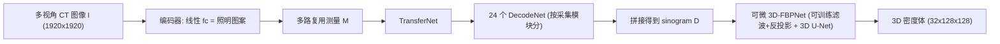

## 一句话总结

用一套无机械运动、由 1920 个光源与 1920 个探测器交错排布、以光纤连接高速 LED 阵列和单相机的可见光 CT 装置，配合一个把"采集"和"重建"同时映射进去、端到端联合优化的可微网络，实现对一般动态 3D 现象的实时采集与重建（最快每卷仅需 8 张照片、36.8 卷/秒）。

## 研究背景

- 领域现状：CT 是从不同方向的衰减光线测量中恢复完整 3D 结构的基础成像技术。把 CT 从静态扩展到动态（捕捉随时间变化的 3D 现象）在力学、生物、医学等领域价值巨大，但极具挑战——重建单个体积本就需要沿大量不同直线的密集测量，而场景在变化，这套密集测量必须在极短时间内反复完成，才能避免鬼影并保证时间分辨率，这对采样能力提出了远超传统方法的要求。
- 核心痛点：已有思路各有短板。利用特定运动性质（如周期运动）会牺牲通用性；只采一小部分测量、再靠先验补全信息缺口会受限于先验假设；传统多路复用（如 Hadamard 编码）需要的照片数仍等于光源数，且采集与重建是分开手工设计的；近年的全静态几何虽然消除了机械运动，但因光源/探测器的成本与摆放空间冲突，只能放很少的元件，采样反而更稀疏，且元件布局沿用传统扫描轨迹、没有探索更高效的排布。
- 本文 idea：一方面用"光路由"（光纤）绕开成本与空间限制，把 LED 阵列的光引到圆柱面上密集交错的收发点、再把衰减光汇聚到单相机，从而在无机械运动下获得密集且完整的投影空间采样；另一方面把采集与重建整体建模为一个可微网络（本质是一个自编码器），让照明多路复用图案与重建算法在端到端训练中被联合、自动地优化——相当于"学习如何物理地压缩、计算地解压缩"目标信息。

## 方法

整体框架：把物理采集和数值重建统一到一个自编码器里。网络输入是一张概念上的 1920×1920 多视角 CT 图像 $$\boldsymbol{I}$$（从不为直接采集），输出是 32×128×128 的 3D 密度体。编码器是一个线性全连接层，其权重就是采集时用的照明图案，负责把多视角 CT 图像"探测"成少量多路复用测量；解码器把这些测量还原成正弦图（sinogram）；最后由可微的三维滤波反投影网络从正弦图重建密度体。三部分联合训练，照明图案与重建权重一起优化。

关键设计：

1. **成像模型与多路复用**：源 $$j$$ 到探测器 $$i$$ 沿路径累积的密度由衰减比给出，$$\boldsymbol{D}_{ij} = -\log(\boldsymbol{I}_{ij}/\tilde{\boldsymbol{I}}_{ij})$$，其中 $$\tilde{\boldsymbol{I}}$$ 是空场景读数。Radon 投影写成矩阵形式 $$\boldsymbol{D} = \mathrm{Reshape}(\boldsymbol{K}\cdot\boldsymbol{x})$$，探测读数则为 $$\boldsymbol{I} = \exp(-\mathrm{Reshape}(\boldsymbol{K}\cdot\boldsymbol{x}))\odot\tilde{\boldsymbol{I}}$$。物理域的线性性使得在一组照明图案 $$\boldsymbol{P}$$ 下的全部测量为 $$\boldsymbol{M} = \boldsymbol{I}\cdot\boldsymbol{P}$$——这正好对应编码器那个线性 fc 层，因此照明图案可直接作为可训练权重被优化。
2. **编码器（学习照明图案）**：把采集写成一个线性层后，训练自动搜索出比手工 Hadamard/高斯图案更优的多路复用方案。用极紧的测量预算（低至 8 张照片）榨取装置的采样能力。
3. **解码器（分模块的自编码器）**：同一采集模块上不同光源对应的探测测量因空间邻近而高度相似。据此把整个正弦图按 24 个采集模块划分成 24 个子正弦图，先为每个模块预训练一个自编码器、取出其解码部分作为 DecodeNet，再在其上叠一个 TransferNet 把多路复用测量转成各 DecodeNet 所需的隐编码，最后拼接 24 个子正弦图得到完整正弦图。这样显式利用了"源方向上的相干性"。
4. **可微 3D-FBP 后端**：不从零训练一个直接"测量→体积"的端到端网络（域间跨度太大、结果差），而是接入一个可微的三维滤波反投影网络（滤波权重与反投影权重都可训练，后接 6 层 3D U-Net）。这样既借用了成熟的领域知识、避免过拟合训练数据、泛化更好，又能微调性能。
5. **损失与图案约束**：总损失 $$\mathcal{L} = \mathcal{L}_{\mathrm{vol}} + \mathcal{L}_{\mathrm{pat}}$$。体积项 $$\mathcal{L}_{\mathrm{vol}} = \lVert \boldsymbol{x}-\tilde{\boldsymbol{x}}\rVert_2^2 + \lambda_{\mathrm{vgg}}\mathcal{L}_{\mathrm{vgg}}$$ 含 L2 与感知损失。图案项含一个把权重约束到 $$[-1,1]$$ 的势垒项，以及一个鼓励强度趋近 $$\pm 1$$ 的二值化项 $$\mathcal{L}_{\mathrm{bin}} = -\sum \lvert \boldsymbol{P}_{ij}\rvert$$——因为设备投射二值图案比 8-bit 图案快得多；每个 $$[-1,1]$$ 图案可拆成一正一负两张物理图案实现。训练数据为合成：随机组合体素基元（椭球/立方体/球/各类壳）加上 Mantaflow 模拟的流体序列，并对测量加 10% 相对高斯噪声以增强物理鲁棒性。

## 实验结果

在快速变化的"喷发蒸气"场景上，与相同输入照片数（8 张）的相关技术对比，本文是唯一能在约 0.027 s 内采到该动态现象并重建出与照片相符 3D 体的方法：

| 方法 | 能否捕捉快速动态 | 关键限制 |
|------|------|------|
| OLAT（逐光源）| 否 | 完成一次扫描耗时过长，场景已改变 |
| 传统多路复用（Hadamard）| 否 | 需 3840 张照片，太慢 |
| 高速采集 SOTA · 限定角 | 勉强 | 仅用单模块 8 源，角覆盖约 15°，信息受限 |
| 高速采集 SOTA · 稀疏视角 | 勉强 | 8 源分散于 24 模块，单源曝光长、信息受限 |
| 本文（8 图案/卷）| 是 | 每卷约 0.027 s，重建质量最佳 |

其余结论（文字概述）：采集速度在 8/36 图案下为 36.8/8.2 卷/秒（若直接由电路板驱动可达 400 图/秒、约 50 卷/秒的相机上限），单卷重建 0.026 s；重建误差随图案数增加而下降、采集时间上升，可在质量与速度间灵活权衡；投影空间覆盖相比一项 SOTA 全静态几何提升约 10 倍。消融显示：学习到的图案优于手工高斯/Hadamard 图案；分模块解码 + 可微 3D-FBP 优于朴素端到端网络与纯神经网络（后者会过拟合）；去掉二值化项能小幅提质但曝光更长；直接套用 NeRF 式 IntraTomo 因约束（测量数）太少而效果不佳。

## 亮点与局限

- 亮点：
  - 首个用于一般动态现象实时采集与重建的可见光层析成像系统；用光纤光路由 + 单相机/单 LED 阵列，在无机械运动、低成本下实现 1920 源 × 1920 探测器、360° 完整覆盖、约 360 万条可采射线的密集采样。
  - 把采集（照明多路复用）与重建统一为一个可微自编码器端到端联合优化，思想上把物理压缩与计算解压缩合二为一；分模块解码 + 可微 3D-FBP 的架构显式利用数据相干性并注入领域先验。
  - 采集/重建均达实时，且能在质量与速度间灵活权衡，最少 8 张照片即可重建一卷。
- 局限：
  - 可见光不同于 X 射线，反射与折射影响更大，而方法未显式建模这些光学效应，限制了对某些流体运动的采集。
  - 单通道灰度假设与真实光传输有偏差（LED 谱宽、光纤对不同波长传输不同），作者预期换窄带 LED 可缓解。
  - 每卷独立重建、未利用时间相干性；空间分辨率被有意让位于投影空间的密集完整采样。

## 延伸思考

- 该工作把"学习照明多路复用"的思路（此前在反射率采集里已验证，如 Efficient Reflectance Capture Using an Autoencoder）成功迁移到跨度更大的 CT 领域，核心在于用可微 FBP 后端注入物理先验来弥合域间差距——这种"可学习编码 + 物理可微解码"的模板对其他计算成像/采集问题（如光场、显微、PET）都可能有借鉴价值。
- 作者明确指向的下一步很有想象力：结合时间相干性提升质量、用神经表示（如 NeAT）对测量做微调、以及把整套思想推向"首个通用动态 X 射线 CT"。
- 重建的喷发蒸气结果被作者认为可用于验证流体模拟技术，这提示了"采集系统 ↔ 仿真"闭环的一条路径：真实动态体数据反过来成为流体求解器的基准。
