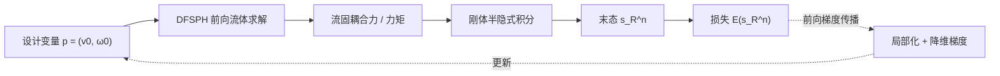

## 一句话总结

本文提出首个基于 SPH 粒子表示的可微两向流固耦合模拟器，通过"局部化 + 降维"的梯度计算方案解决了朴素微分导致的梯度爆炸，从而能用梯度优化高效地反求刚体在流体中的释放速度以完成各种控制任务（如水瓶翻转、打水漂）。

## 研究背景

- 领域现状：可微物理模拟近年在逆向设计中很有效，已覆盖多体系统、可变形体、布料、流体器件、单向流固耦合等，但**两向流固耦合的可微性几乎未被系统研究**。
- 核心痛点：想做"往水里扔一个刚体并控制它最终姿态"这类任务面临两大障碍。其一，流体与固体本构方程不一致、且流固交界处存在无处不在的**非连续接触**，可微性是开放问题；直接把 DiffTaichi 等自动微分工具套到 SPH 两向耦合模拟器上会**梯度爆炸**。其二，流体自由度（DoF）极高，传统做法要微分整个系统，计算成本高得不现实。
- 本文 idea：给 SPH 提供一个用粒子统一表示流体与固体的可微模拟器。关键假设是——**对固体状态的微小扰动通常不会显著改变流体环境的整体运动**，因此计算流固耦合梯度时只需考虑固体周围的那层流体，从而既稳定又高效。

## 方法

整体框架：前向模拟用 DFSPH 求解不可压流体，用 Akinci 边界粒子法做两向流固耦合，刚体用半隐式积分、刚刚接触用一个便于微分的罚力模型。作者采用**前向模式（forward-mode）**微分，先给出一个"完整但不稳定"的通用微分公式，分析其梯度爆炸根源后，替换为"局部化 + 降维"的稳定梯度方案。

关键设计：

1. **诊断梯度爆炸的两个根源**。其一是高自由度粒子交互本身的混沌性：耦合力梯度是一个随 DFSPH 迭代递归展开的公式，一旦某个反复相乘的项特征值大于 1 就会爆炸。其二是 **SPH 核函数对粒子间距过于敏感**——三次样条核虽二阶连续，但当粒子距离变小时其一、二阶导数 $$\nabla W, \nabla^2 W$$ 的量级急剧上升，固体边界的微小位移会让密度等估计量突变，进而产生突兀的不可压罚力和不稳定梯度。

2. **局部化梯度方案（治高 DoF 混沌）**。基于"扰动只影响紧邻固体的那层流体、需要时间才能靠不可压性传播出去"的假设，作者**丢弃 $$k>1$$ 阶邻域流体粒子的梯度贡献**，只保留与刚体粒子直接相邻的流体粒子 $$f_i$$。配合冲量-动量定理，耦合力对边界粒子状态的导数被解成一个紧凑闭式：
$$\frac{\mathrm{d}F_{b_j \leftarrow f_i}}{\mathrm{d}s_{b_j}} = \left(I + \frac{\Delta t}{m_{f_i}}\frac{\partial F_{b_j \leftarrow f_i}}{\partial v_{f_i}}\right)^{-1}\frac{\partial F_{b_j \leftarrow f_i}}{\partial s_{b_j}}$$
这样既拿到了流体的局部信息，又避免了微分整个高 DoF 系统的开销。

3. **降维梯度方案（治核函数敏感）**。既然扰动刚体的空间位置/朝向会激起核函数导数的剧烈响应，作者干脆**只从刚体速度的扰动来算梯度**，即 $$\frac{\mathrm{d}f^n}{\mathrm{d}s^0} = \frac{\partial f^n}{\partial v^n}\frac{\mathrm{d}v^n}{\mathrm{d}s^0} + \frac{\partial f^n}{\partial \omega^n}\frac{\mathrm{d}\omega^n}{\mathrm{d}s^0}$$，去掉了对位置和四元数的偏导项。实验证明这样得到的梯度方向更一致、更稳定。

4. **邻域搜索与刚刚接触的可微化**。假设相邻时间步刚体粒子的流体邻域集合变化不大，故复用同一邻域集合来算梯度。刚刚接触用基于 SPH 密度偏差的罚力（法向 + 摩擦）建模，天然可微，再按链式法则与流固耦合梯度串接成统一系统。

## 实验结果

主实验：在四个刚体轨迹优化场景里，比较本文的梯度法与两种无梯度进化策略（CMA-ES、(1+1)-ES）优化后的能量占初始能量 $$E_0$$ 的百分比（越低越好）。下表取"最终步"结果，本文方法在多数任务上把损失压到接近 0，明显优于无梯度基线。

| 任务 | 系统 DoF | 本文 (%) | CMA-ES (%) | (1+1)-ES (%) |
|------|----------|----------|-----------|--------------|
| 水瓶翻转 | 39942 | 0.0019 | 23.00 | 13.54 |
| 打水漂 | 713103 | 0.0031 | 0.43 | 0.18 |
| 水上漂流（兔子） | 315468 | 0.96 | 18.57 | 2.88 |
| 高台跳水（鸭子） | 468372 | 0.06 | 0.63 | 4.94 |

其余结论用文字补充：在 2D 水上倒立摆闭环控制器与自监督水瓶翻转控制器训练中，本文梯度法比强化学习 PPO **快约一个数量级**；局部化梯度只涉及全系统 0.4%~33% 的 DoF（打水漂仅 0.4%），大幅降低梯度计算耗时；倒立摆策略仅在 0–5 秒轨迹上训练，测试时能保持至少 9 秒平衡，并泛化到未见过的水流与初始位置。消融实验显示"完整梯度"方案会迅速爆炸不可用，而降维方案给出可用且平稳的优化曲线。

## 亮点与局限

- 亮点：
  - 首个基于 SPH 的可微两向流固耦合模拟器，流体与固体用粒子统一表示；打水漂、水瓶翻转这类控制结果在图形学中此前少见。
  - 对梯度爆炸做了清晰的机理分析（混沌 + 核函数敏感），并给出对症的局部化与降维方案，工程可落地（基于 SPlisHSPlasH 实现）。
  - 相比无梯度方法与 PPO 有最高约一个数量级的优化/训练加速，且能扩展到多刚体接触与神经网络控制器。
- 局限：
  - "局部化假设"（固体扰动不影响流体整体运动）与物理真值存在偏差，作者也承认这是有偏近似；在流固强耦合场景可能失效（文中给出兔子漂流的失败案例）。
  - 未处理 Gissler 等人那种强两向耦合，明确留作未来工作；核函数导数的整体尺度难以控制在安全区间也被搁置。
  - 采用前向模式微分，未给出可行的反向模式方案（DFSPH 缺乏显式 KKT 系统使其推导困难），设计变量维度较高时前向模式成本会上升。

## 延伸思考

- 该工作把"可微物理"从多体/可变形体推进到了棘手的两向流固耦合，其"只微分交界处局部流体"的降维思想，对其他高 DoF、含非连续接触的耦合系统（如 MPM 多材料、颗粒-流体混合）可能同样适用。
- 局部化假设本质是一种"梯度截断/预条件"，与深度学习里截断 BPTT、隐式微分（implicit differentiation）思路相通；若能对被丢弃的高阶邻域梯度做误差估计或自适应保留，或可在强耦合场景下兼顾稳定与精度。
- 结合可微渲染做端到端反演（从视频观测反求释放速度），或把该模拟器接入真实机器人控制回路（sim-to-real），都是自然的下一步；作者后续在 NeurIPS 2025 的工作也延续了可微模拟这一方向。
