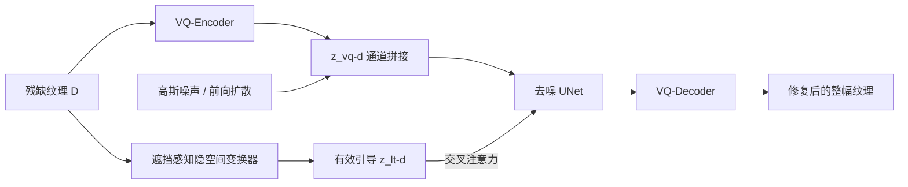

## 一句话总结

提出一个基于条件隐空间扩散模型（LDM）的框架，配合"遮挡感知隐空间变换器"，从自然图像里被遮挡、被几何形变的残缺纹理样本中，一步到位地整体修复并合成出干净、平整、可直接用于纹理合成的整幅纹理。

## 研究背景

- 领域现状：传统的基于样例（exemplar-based）的纹理合成方法能从一小块样本生成任意大的纹理，但都要求输入是"整幅纹理"——矩形、无几何畸变、无遮挡的干净样本。
- 核心痛点：自然图像里的纹理几乎总是残缺的：被前景物体遮挡、因物体表面几何和透视产生形变。获取干净样本需要大量人工，往往根本做不到。已有的自动纹理提取工作只处理遮挡填补、忽略形变，结果不自然。因此需要同时处理遮挡和形变。
- 本文 idea：把"从残缺样本恢复整幅纹理"建模成图像到图像的翻译问题。作者发现 GAN 在这种缺乏像素对齐、缺乏对应关系的困难任务上容易模式坍缩、产生不自然结果，转而用扩散模型作为骨干；并针对隐空间里"有效特征与无效特征纠缠"的问题，设计遮挡感知的隐空间变换器提供有效引导。

## 方法

整体框架建立在隐空间扩散模型（LDM）之上：先用 VQ-VAE 编码器把纹理压到隐空间以降低计算量；对残缺纹理做条件生成，把残缺样本的隐编码与扩散噪声在通道维拼接，同时用一个从头训练的遮挡感知隐空间变换器 $$\tau_\theta$$ 抽取"仅含有效特征"的引导，通过交叉注意力注入去噪 UNet。

关键设计：

1. **为什么用扩散而非 GAN**：残缺样本与目标整幅纹理之间没有像素级对齐、缺乏一一对应，GAN 因易模式坍缩、难以覆盖复杂分布而输出崩坏（实验里 pix2pix 甚至持续输出全黑图）。扩散模型训练目标平稳、分布覆盖广，更适合这种困难映射。

2. **两种条件机制配合**：拼接机制保证输出保留残缺样本的"身份"（整体一致性），但拼接得到的隐编码 $$z_{vq\text{-}d}$$ 会把来自遮挡区和有效区的有效/无效特征纠缠在一起，误导去噪。于是再用交叉注意力把变换器产出的纯有效引导注入，二者互补：拼接给整体引导，交叉注意力给关键有效特征。训练目标是条件分布 $$p(P \mid D)$$，其中 $$P$$ 为整幅纹理、$$D$$ 为残缺纹理。

3. **遮挡感知隐空间变换器**：用来解纠缠。它靠两类组件——一是**部分卷积（partial convolution）**，只在有效像素上做卷积并按有效比例归一化，逐层更新掩码，连用八层、其中三次下采样，从而剥离遮挡带来的无效信息、蒸馏出有效特征；二是末端的**自注意力块**，因为遮挡后有效信息稀疏，需要建模长程非局部依赖，从稀疏线索里补全上下文。部分卷积层定义为 $$x' = W^\top (x \odot m)\,\frac{\mathrm{sum}(1)}{\mathrm{sum}(m)} + b$$（当 $$\mathrm{sum}(m) > 0$$，否则为 0），其中 $$\odot$$ 为 Hadamard 积。

4. **合成数据生成**：真实场景没有"残缺-干净"配对，作者用变换从干净纹理造配对——单应变换（homography，模拟透视变化，畸变尺度 $$s_{hmg}\sim U(0.3,0.5)$$、概率 80%）、薄板样条变换（TPS，模拟几何畸变，$$s_{tps}\sim U(0.1,0.3)$$、概率 80%），再叠加自由形状掩码模拟遮挡。从多个纹理库收集并人工过滤后得到 22,043 张干净纹理，随机化变换尺度扩增，划分为训练 15,430、验证 2,205、测试 4,408 张，支持端到端训练。

## 实验结果

在合成测试集上与三个代表性基线（pix2pix、VQGAN、MAT）在同一数据集训练后对比，本文方法在四项指标上全面领先：

| 方法 | SSIM ↑ | LPIPS ↓ | GMD ↓ | FID ↓ |
|------|--------|---------|-------|-------|
| pix2pix | 0.0141 | 0.7742 | 39.29 | 607.15 |
| MAT | 0.2466 | 0.6751 | 34.17 | 187.40 |
| VQGAN | 0.4549 | 0.4407 | 24.65 | 45.21 |
| 本文 | 0.5096 | 0.3417 | 15.32 | 15.50 |

低 LPIPS、高 SSIM 说明结果在感知与结构上更接近干净纹理；低 GMD 说明纹理风格特征保留更好；低 FID 说明统计分布更贴近真实平整纹理。定性上，pix2pix 持续输出全黑图（视觉对比中被排除），MAT 出现模式坍缩、忽略残缺输入，VQGAN 能抓分布但生成结果与残缺纹理不匹配。消融实验证实：去掉自注意力或把部分卷积换成标准卷积都会明显掉点，只用拼接或只用交叉注意力也都不如二者结合。用户研究（14 名普通被试，合成图与真实图各 50 组）中，本文结果相对 MAT 被偏好 90.56%、相对 VQGAN 被偏好 75.32%。

## 亮点与局限

- 亮点：
  - 首个同时处理自然图像纹理样本中"遮挡 + 几何形变"的整体修复合成框架，把基于样例的纹理合成的适用范围扩展到真实残缺图像。
  - 遮挡感知隐空间变换器用部分卷积做遮挡剔除、自注意力建长程依赖，为扩散生成提供纯有效特征引导，解决了隐空间特征纠缠问题。
  - 用单应/TPS/自由掩码合成配对数据，绕开了真实"残缺-干净"配对难以获取的障碍，支持端到端训练。

- 局限：
  - 要求输入残缺纹理为固定尺寸，限制了灵活性与使用场景；作者指出可借助能生成任意大图像的扩散方法来放宽。
  - 训练成本高（8 张 A100 训练约 4 天、一百万迭代），且采样需 200 步 DDIM、生成一张 256×256 约 4 秒。

## 延伸思考

- 该方法把"纹理去遮挡去畸变"当作纹理合成的前置清洗步骤，天然可与后续的整幅纹理外扩、以及 3D 建模/PBR 材质制作串联，值得关注它作为流水线一环的实用价值。
- 固定输入尺寸的限制指向一个自然的后续方向：结合能处理任意分辨率、任意长宽比的扩散生成（如基于滑窗/联合去噪的方案），让框架直接吃任意形状的真实纹理区域。
- 合成数据靠人为变换模拟退化，与真实遮挡/形变的分布仍存在差距；引入更真实的退化建模或自监督真实数据，或许能进一步提升在野外图像上的泛化。
- 用交叉注意力注入"纯有效特征引导"的思路，对其他"输入部分可信"的条件生成任务（如带缺失的深度/法线补全）可能同样有借鉴意义。
