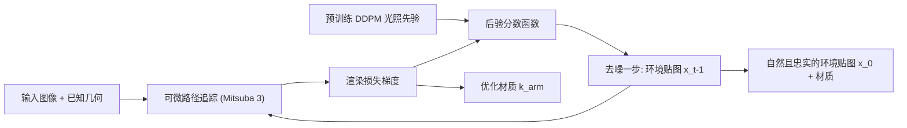

## 一句话总结

把在自然环境光图上预训练的去噪扩散模型作为先验，接入可微路径追踪的分析-合成优化框架，从而在光照未知的逆渲染中同时采样出"既真实又多样、且都能解释输入图像"的光照-材质组合，显式建模逆渲染的多解歧义。

## 研究背景

- 领域现状：逆渲染通常用"分析-合成"范式，靠可微渲染器按重建误差优化场景参数。为对抗病态性，方法会引入光照/材质先验，从简单的平滑约束到数据驱动的深度生成模型（GAN、VAE）都有。
- 核心痛点：渲染方程把几何、材质、光照耦合在复杂积分里，同一张图像可由无数种"材质×光照"组合产生（红像素可以是白光照红材质，也可以是红光照白材质）。但现有先验大多只把优化推向单个局部最优，在"重建精度"与"解的自然度"之间做权衡，忽视了逆渲染后验分布本身是多模态的，既难兼顾质量又难兼顾多样性。
- 本文 idea：用无条件扩散模型刻画自然光照分布，并借鉴扩散后验采样（DPS）从后验分布采样。关键在于把 DPS 从"已知固定的测量算子"推广到"测量算子（渲染函数）含可训练参数（材质）"的情形，实现光照采样与材质优化的联合进行。

## 方法

整体框架：先在真实环境光图上无条件预训练一个 DDPM，使其能生成逼真的环境贴图；随后给定输入图像与已知几何，启动一系列去噪采样过程。每个时间步里，可微路径追踪器以当前材质和对干净环境贴图的后验估计 $$\hat{\boldsymbol{x}}_t$$ 为输入渲染出图像，渲染损失的梯度一方面用来优化材质，另一方面被并入后验分数函数，引导 DDPM 生成一张既自然又能忠实解释输入的环境贴图。

关键设计：

1. **把 DPS 推广到含可训练算子的逆问题**。原始 DPS 假设测量算子 $$M(\cdot)$$ 已知固定，用来近似后验分数 $$\nabla_{\boldsymbol{x}_t}\log p_t(\boldsymbol{x}_t\mid \boldsymbol{y})$$。逆渲染中测量算子就是渲染函数 $$R(\cdot)$$，它同时依赖光照与未知材质。本文把后验分数改写为
$$\nabla_{\boldsymbol{x}_t}\log p_t(\boldsymbol{x}_t\mid \boldsymbol{y}) \simeq \boldsymbol{s}_\theta(\boldsymbol{x}_t,t) - \rho\,\nabla_{\boldsymbol{x}_t}\lVert \hat{\boldsymbol{y}}_i - R(\hat{\boldsymbol{x}}_t, \boldsymbol{k}_{arm}, \boldsymbol{c}_i)\rVert_2^2$$
其中 $$\boldsymbol{k}_{arm}$$ 是 256×256 的材质纹理（反照率、粗糙度、金属度，基于 Mitsuba 3 的 principled/Disney BSDF），渲染用四次弹射的路径追踪配合 path replay backpropagation，能建模全局光照效果。

2. **光照采样与材质优化交织进行**。先用 Mitsuba 3 联合优化材质与环境贴图作为初始化；随后保留优化得到的粗糙度、金属度，但把基础色重置为零，进入 1000 步去噪采样。每一步既按后验分数去噪环境贴图，又用渲染损失 $$L_{denoise}$$ 联合优化基础色、粗糙度、金属度。最后再用干净环境贴图对材质精修 200 步。

3. **动态调度权重 $$\rho$$ 平衡真实性与忠实度**。$$\rho$$ 过小则一味追求光照真实、忽略观测；过大则死守观测、牺牲真实度。前 500 步（$$t>500$$）令 $$\rho=0.1$$，把采样先推向真实光照流形；后 500 步（$$t<500$$）逐渐把 $$\rho$$ 提到 $$0.1\sim1$$，强迫结果拟合观测。后期噪声减小时，来自真实先验的光照估计能避免材质优化陷入局部极小。

4. **无缝球面环境贴图生成**。为保证等距柱状投影的全景在水平旋转下连续无缝，训练时对样本施加随机水平旋转/翻转增强；去噪时用旋转-去噪-反旋转的方案替换无条件分数函数（$$\boldsymbol{s}'_\theta(\boldsymbol{x}_t,t)=\phi_t^{-1}(\boldsymbol{s}_\theta(\phi_t(\boldsymbol{x}_t),t))$$），消除接缝处的可见断裂。室内、室外分别训练两个 DDPM（室内用 Laval，室外用 Streetlearn 并做 HDR 重建预处理）。

## 实验结果

在合成场景（源自 NeRF 数据集的多个场景、各 10 种室内外光照）上做定量对比。下表取室内光照的主实验，展示不同先验/方法在反照率、光照重建、新视角合成上的核心指标（$$\sigma^2_{sample}$$ 反映多样性、$$\sigma^2_{invar}$$ 反映稳定性，其真值未知，仅作参考）：

| 方法 | 反照率 MSE↓ | 光照 PSNR↑ | 光照 LPIPS↓ | 光照 FID↓ | 新视角 PSNR↑ |
|------|------------|-----------|------------|-----------|-------------|
| No Prior | 0.086 | 16.3 | 0.89 | 329.6 | 30.5 |
| Smoothness | 0.081 | 18.8 | 0.46 | 341.3 | 33.8 |
| GAN | 0.106 | 16.9 | 0.35 | 187.1 | 29.4 |
| RENI | 0.091 | 15.9 | 0.54 | 371.8 | 27.8 |
| NvDiffRecMC | 0.103 | 14.8 | 0.55 | 322.2 | 28.1 |
| 本文 | 0.033 | 21.9 | 0.26 | 135.6 | 34.0 |

本文在反照率精度、光照重建质量与自然度（FID 大幅领先）、新视角合成上全面优于数据无关先验（平滑、色度等）和数据驱动先验（GAN、RENI、VAE 系）。生成模型本身的无条件采样质量（FID）室内 12.3、室外 7.6，也显著优于 GAN 与 RENI。室外光照实验结论一致。多样性上，本文的 $$\sigma^2_{sample}$$ 较高但并未牺牲稳定性，能采出细节各异、整体结构一致的多组解，真实反映逆问题的歧义。

## 亮点与局限

- 亮点：
  - 首次把扩散后验采样从"固定已知算子"扩展到"算子含可训练材质参数"的逆渲染场景，实现光照采样与材质优化的联合。
  - 显式建模并采样多模态后验，兼顾解的真实性与多样性，而非收敛到单一模糊解。
  - 基于物理的可微路径追踪（Mitsuba 3，四次弹射）可处理全局光照，重建质量与光照自然度全面领先多种先验基线。
  - 提出旋转增强 + 旋转去噪的无缝全景生成方案。

- 局限：
  - 需要预先获得或重建场景几何，几何步骤与本方法正交，误差不在建模范围内。
  - 单个样本需约 20 分钟（1000 步交织的去噪与材质优化），且每个模型训练需四张 A100 训一周，代价较高。
  - 室内、室外需分别训练两个 DDPM，依赖对应的光照数据集；蒙特卡洛梯度噪声按高斯噪声近似处理，属经验性简化。

## 延伸思考

- 该工作把"扩散模型作先验 + 可微渲染作似然"的组合推向逆渲染，思路可迁移到几何、材质等其它场景属性的联合后验采样，也与后续用扩散先验做未知光照下逆渲染、乃至扩散引导的物体插入等工作一脉相承。
- 20 分钟/样本的开销主要来自逐样本的长去噪链与路径追踪；若能引入更快的采样器（如一致性/蒸馏模型）或分摊式推断，有望大幅提速。
- 把光照先验从等距柱状 2D 贴图换成更具几何一致性的球面表示，或将几何也纳入联合后验，是自然的下一步；此外如何从少量样本可靠地刻画"真实后验方差"，仍是评估多样性时的开放问题。
