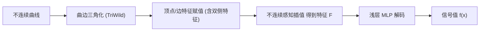

## 一句话总结

给定信号中不连续位置（以线段或 Bézier 曲线表示），本文用一套"曲边三角网 + 不连续感知特征插值 + 浅层 MLP"的混合表示，构造出一个只在指定曲线处间断、其余处处光滑的 2D 神经场，从而在渲染压缩、扩散曲线求解、物理信息神经网络等任务上以任意分辨率保持锐利边界。

## 研究背景

- 领域现状：坐标神经网络 / 神经特征场（如 InstantNGP、ReLU fields）把图像等 2D 信号编码为分辨率无关的连续函数，兼具高保真与紧凑存储，是像素网格表示的有力替代。
- 核心痛点：这类表示"构造上就是连续的"，无法表达跳变不连续，会在边缘处糊成一片；而 ReLU fields 依赖对 0/1 的钳制，两侧都非零的跳变表达不了，且梯度优化难以把不连续精确定位到边界处。
- 本文 idea：在很多场景（路径追踪渲染、矢量图形、扩散曲线、偏微分方程解）里不连续的位置是先验已知的。把这些位置作为输入，让特征场的采样点与不连续曲线对齐，构造一个只在曲线处间断、别处光滑的特征场，再交给 MLP 解码。

## 方法

整体框架：输入一组不连续曲线，先做曲边三角化让所有曲线成为网格边的子集并标记为"不连续边"；在顶点（及部分边）上放置神经特征向量；查询时用"不连续感知插值"得到一个特征向量，最后送入浅层 MLP 解码出信号值。特征与 MLP 联合训练。

关键设计：

1. **连续性判据（目标定义）**。作者用"方向连续性"刻画期望行为：曲线外部处处连续；曲线内部一点沿小圆走会在两个切线方向看到两次跳变；曲线端点处只看到一次跳变（朝向曲线内侧的切向）。形式化为：沿方向 $$\boldsymbol{d}$$ 的方向极限 $$\ell(\boldsymbol{x},\boldsymbol{d})=\lim_{t\to 0} f(\boldsymbol{x}+t\boldsymbol{d})$$，据此定义某点某方向是否方向连续。整套插值方案最终被证明满足这三条判据。

2. **曲边三角化**。用 TriWild 对输入曲线做鲁棒曲边三角化：线段成为三角形的一条边；Bézier 曲线被完整包含在某个三角形内部、其两端点为三角形的两个顶点。这样保证每个三角形至多含一条曲线，把复杂的曲线网络分解成可局部处理的单元。

3. **不连续顶点的双侧特征 + 径向插值**。对不与任何不连续边相邻的顶点只存单一特征 $$\boldsymbol{F}_i$$；对紧邻不连续边的顶点，则为该边每一侧各存一个特征（顺时针 $$\boldsymbol{F}^{cw}$$ 与逆时针 $$\boldsymbol{F}^{ccw}$$）。查询时先按重心坐标插值 $$\boldsymbol{F}=(1-b_1-b_2)\hat{\boldsymbol{F}}_0 + b_1\hat{\boldsymbol{F}}_1 + b_2\hat{\boldsymbol{F}}_2$$，其中每个顶点用到的 $$\hat{\boldsymbol{F}}_i$$ 由"从顶点指向查询点的方向"最近的顺/逆时针两条不连续边特征做**径向插值**得到，权重取查询方向与两条边的夹角 $$\theta^{cw},\theta^{ccw}$$。这样跨过不连续边时特征发生突变、其余方向保持连续。

4. **曲边不连续的处理**。对含曲线的三角形，额外在"正对曲边的那个顶点"存一个曲线特征 $$\boldsymbol{F}^{curve}$$，把三角形按曲线分成两个区域：查询点落在曲线与直边之间时用曲线特征、另一侧则退化为线性边情形。用隐式化（implicitization）把二/三次 Bézier 曲线转成隐函数，靠其符号判断查询点在曲线哪一侧。最终 $$f(\boldsymbol{x})=\mathrm{MLP}(\boldsymbol{F})$$，MLP 为两层、64 神经元（渲染用 128、PINN 用 tanh）。

## 实验结果

主实验为高分辨率渲染图拟合与压缩（Hairball、Rose Bush 场景）：在与基线**同等文件大小**下，本文在放大时仍保持锐利边界，而 InstantNGP 与 ReLU fields 只能给出连续近似，在边缘处模糊并在高倍放大时产生主导误差的伪影。作者报告在部分区域相比现有神经表示有超过 10 dB 的提升。

| 方法 | 文件大小 | 高倍放大 (33×/100×) 表现 |
|------|----------|--------------------------|
| 本文 | 25MB (Rose Bush) / 30MB (Hairball) | 保持锐利不连续边界，部分区域较基线 >10 dB |
| InstantNGP | 调至等大 (hash 表 $$2^{19}$$, 30MB) | 跨边缘模糊，高倍放大出现伪影 |
| ReLU fields | 调至等大 | 跨边缘模糊，无法表达两侧非零的跳变 |

其余应用以文字概述：(1) 将 $$100000^2$$ 像素、约 33GB 的路径追踪图压缩到约 25MB；(2) 用神经表示拟合 walk-on-spheres 生成的含噪扩散曲线数据，作为新的扩散曲线求解器，采样方差降低约一个数量级并自动去噪；(3) 用作物理信息神经网络的基，求解含跳变的偏微分方程，精度较替代方案高约 9 dB；(4) 对 Helmholtz 与波动方程的有限元/差分解压缩 20–50 倍。

## 亮点与局限

- 亮点：
  - 把"经典特征纹理 + 边缘保持重建"的思路迁移到神经特征场，用曲边三角网替代规则网格，从根上解决了神经场跨不连续模糊的问题；论文并证明该插值方案严格满足其连续性判据。
  - 表示与网络架构、损失函数解耦，因而可无缝对接渲染、扩散曲线、PINN、PDE 压缩等多种任务，通用性强。
  - 借助与不连续对齐的特征放置，边缘用极少网络容量即可表达，故能在同等大小下显著更准、并在扩散曲线任务上兼得锐利与更平滑的内部。

- 局限：
  - 依赖不连续位置**先验已知**并作为输入；对渲染等场景需先提取（投影轮廓边、法向不连续边并做遮挡裁剪），对一般图像仍需外部的不连续提取方法。
  - 依赖 TriWild 曲边三角化，其重采样会轻微改动输入曲线（作者假设可忽略）；曲线相交需靠三角化拆分处理，假设曲线除端点外不相交。
  - 三角形/顶点数随几何复杂度增长（如 Hairball 近百万三角形、约 40 万不连续顶点），复杂场景的存储与构建成本不低。

## 延伸思考

- 方法目前限定 2D 且不连续先验已知；一个自然方向是与不连续/边缘检测、图像矢量化联合，做到"端到端学习不连续位置"，这正是后续工作（如把所有网格边视作潜在不连续、以连续变量优化其幅度的思路）尝试推进的方向。
- 将曲边三角网 + 不连续感知特征插值推广到 3D（面片/表面不连续、体积渲染中的可见性边界）是有吸引力但更难的问题，涉及更复杂的三角化与方向连续性定义。
- 作为 PINN 的基函数处理含跳变解，与 XFEM（扩展有限元）在思想上呼应，提示"给神经表示注入结构先验"在科学计算与图形学交叉处仍有很大空间。
