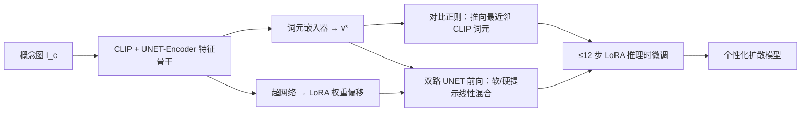

## 一句话总结

本文提出一个**领域无关（domain-agnostic）的调优编码器**，无需任何专门数据集或概念先验，只用一张图片和不超过 12 步的推理时微调，就能把文本到图像扩散模型快速个性化到任意新概念。

## 研究背景

- 领域现状：文本到图像个性化（personalization）让用户把自己的视觉概念嵌进自然语言提示里生成新图。早期方法（Textual Inversion、DreamBooth）需要多张图片和几十分钟的逐概念优化；近来基于编码器的方法（如 E4T、ELITE）通过预训练一个网络直接预测概念的文本嵌入，把个性化压缩到秒级。
- 核心痛点：现有编码器大多**局限于单一类别域**（人脸、猫、艺术风格），难以覆盖长尾的多样概念；有些还依赖分割掩码、多视角等外部先验。E4T 虽用编码器做初始化再短暂微调，但要为每个域单独训练一个编码器，且推理时微调需要约 70GB 显存。
- 本文 idea：在一个**不受限的通用域**上训练单一编码器。关键是用一种基于最近邻的**对比正则化**，把预测出的嵌入推向语义相关的真实 CLIP 词元附近，从而在"忠实还原概念"和"保持可编辑性"之间取得平衡，同时大幅降低显存与迭代需求。

## 方法

整体框架沿用 E4T 的迭代精化设计：用 CLIP ViT-H-14 视觉编码器和 Stable Diffusion 的 UNET-Encoder 作为特征提取骨干，抽取输入概念图 $$I_c$$ 的空间特征，经卷积网络后送入两个预测头——一个**词元嵌入器**预测代表概念的词嵌入 $$v^* = E(I_c)$$，一个**超网络（HyperNetwork）**预测去噪 UNET 注意力权重的低秩偏移。二者的预测再作为一次短暂 LoRA 微调的初始化。

- **低秩权重调制（HyperNetwork）**：仅靠词嵌入难以刻画概念细节。作者对 Stable Diffusion 的注意力投影矩阵（共 96 个，平均每个约 71 万参数）预测 LoRA 式的低秩分解 $$W' = W + A \times B$$，其中 $$A \in \mathbb{R}^{D_{in}\times r}$$、$$B \in \mathbb{R}^{r\times D_{out}}$$。$$B$$ 的预测层初始化为零、对 $$\Delta W$$ 做常数缩放并施加 $$L_2$$ 正则，避免训练初期破坏模型。
- **对比式嵌入正则**：欠约束下编码器容易预测出分布外嵌入，抢走其他词的注意力、损害可编辑性。作者用最近邻对比损失：给定 $$v^*$$，取其在余弦距离下最近的一组 CLIP 词元 $$\mathcal{N}(v^*)$$ 作正样本，同一 mini-batch 里其他概念图的嵌入作负样本，
  $$L_c(v^*) = -\log \frac{\sum_{\mathcal{N}(v^*)} \exp(v^* \cdot T_i / \tau)}{\sum_{\mathcal{N}(v^*)} \exp(v^* \cdot T_i / \tau) + \sum_{v' \neq v^*} \exp(v^* \cdot v' / \tau)}$$
  相比需要预定义正负词表的做法，这里正样本直接取最近邻、**无需任何域先验或监督**。再加一项范数约束 $$L_{L2}(v^*) = \lVert v^* \rVert^2$$ 防止嵌入范数膨胀。
- **超权重正则：双路适配（dual-path）**：超网络的预测同样可能过拟合。作者把每个 UNET 块复制成两路——第一路用原始权重且把预测嵌入替换为其最近邻硬词元 $$v_h$$，第二路用超网络调制后的权重和软嵌入 $$v^*$$，二者按系数 $$\alpha_{blend}$$ 线性混合：
  $$out = \alpha_{blend}\cdot B(f, C, W_\Delta) + (1-\alpha_{blend})\cdot B(f, C_h, \varnothing)$$
  这样保证有一路"免疫"注意力过拟合，在还原身份与保留模型先验之间取得平衡。
- **推理时个性化**：单次前向得到嵌入与权重初值后，以 $$lr = 2\times10^{-3}$$、$$\alpha_{blend}=0.25$$ 做不超过 12 步的 LoRA 微调（附带把权重与嵌入拉回编码器预测的 $$L_2$$ 项），显存从约 70GB 降到 30GB 以下。

## 实验结果

主消融实验验证了各组件的必要性（在 CLIP 相似度指标上，以完整模型为基准的相对变化）：

| 配置 | 对身份/提示相似度的影响 | 结论 |
|------|------------------------|------|
| 完整方法 | 基准 | 身份与可编辑性折中最佳 |
| 去掉推理时微调 | 物体相似度下降约 20% | 微调步骤对身份保持关键 |
| 去掉双路正则（保留微调） | 提示-图像对齐下降近 30% | 双路有效抑制过拟合、保留先验 |
| 去掉超网络分支 | 提示对齐变差 | 信息被迫塞进词嵌入，引发注意力过拟合 |

预训练数据为 ImageNet-1K 与 Open-Images（裁最大物体，共约 300 万张），最终模型训练 150,000 步。与 Textual Inversion、DreamBooth、LoRA、ELITE 的对比中，本方法**仅用单张图和 ≤12 步微调**即达到与需多图的调优类方法相当的质量，并明显超过同为编码器且额外使用分割掩码的 ELITE；相比优化类方法个性化速度提升约两个数量级。相对 DreamBooth 在身份-可编辑性权衡上仍存在取舍。

## 亮点与局限

- 亮点：
  - 打破了此前编码器"单域"的限制，无需分割掩码或域标签即可跨多类概念工作。
  - 对比式最近邻正则巧妙地把嵌入约束到可编辑的真实词元邻域，既忠实又可编辑，且完全免先验。
  - 双路软硬提示混合是抑制超网络过拟合的有效工程手段；推理显存从 70GB 降到 30GB 以下。
- 局限：
  - 表现受训练数据分布制约——ImageNet 上训练的模型对杂乱场景、人脸等表现不佳，作者认为需 LAION 级大规模数据缓解，但超出其算力。
  - 仍需一次推理时微调步骤才能提升下游相似度，尚未做到完全零微调。

## 延伸思考

- 该工作处在"优化式个性化 → 单域编码器（E4T/ELITE）→ 通用域编码器"的演进链上，核心贡献是把"可编辑性正则"从依赖域描述词升级为无先验的最近邻对比，思路可迁移到其他需要在生成模型潜空间里做受约束反演的任务。
- 双路硬/软提示混合本质是一种保先验的推理时结构，与后续各类"prior preservation"技巧（如 DreamBooth 的类别正则）思想相通，值得思考能否推广到无微调的纯前馈个性化。
- 若换用更大规模数据与更强骨干（如 SDXL 或后续扩散架构），本方法的最近邻词元空间是否仍足够表达长尾概念，是一个值得验证的方向。
