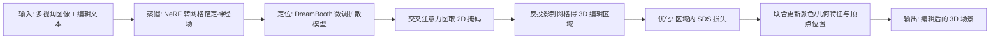

## 一句话总结

DreamEditor 把重建好的神经辐射场转成"网格锚定的神经场"，再借助文生图扩散模型的交叉注意力自动圈定编辑区域，最后只在该区域内用 SDS 损失联合优化几何与纹理，从而实现由文本提示驱动、局部精准且不破坏无关区域的 3D 场景编辑。

## 研究背景

- 领域现状：神经辐射场（NeRF、NeuS 等）在场景重建和新视角合成上已经很成熟，能把真实物体便捷地变成图形资产；文生图扩散模型也能从文本理解复杂语义并生成高质量图像，DreamFusion 更进一步提出 SDS 损失把 2D 扩散先验蒸馏到 3D 生成中。
- 核心痛点：神经场把几何和纹理隐式编码在高维网络特征里，传统建模工具无从下手；已有的神经场编辑要么需要大量人工交互，要么（如 Instruct-NeRF2NeRF）在整幅图像上操作、指令多样性受限，容易连带改动无关区域，精度和质量都不够。
- 本文 idea：用"网格锚定的神经场"这种显式-隐式混合表示，一方面能把 2D 编辑掩码反投影成 3D 编辑区域实现局部编辑，另一方面把几何与纹理解耦；配合"蒸馏—定位—优化"三段式流程，仅用一句文本提示就能完成精准编辑。

## 方法

整体 pipeline 分三步：先把原始神经辐射场蒸馏成网格锚定的神经场（每个网格顶点挂上颜色特征与几何特征）；再用针对场景微调过的扩散模型，通过关键词的交叉注意力图定位需要编辑的网格区域；最后只在该区域内用 SDS 损失联合优化顶点的颜色特征、几何特征和位置，使场景符合文本描述，同时冻结无关区域保持一致性。

关键设计：

1. **网格锚定的神经场（Distilling Neural Fields）**：先用 NeuS 学出原始神经辐射场，再以 marching cubes 抽出网格，采用教师-学生蒸馏把隐式场分解为组织在显式网格上的众多局部隐式场。每个顶点 $$\boldsymbol{v}$$ 携带颜色特征 $$f_c$$ 与几何特征 $$f_g$$；对采样点 $$x$$ 取其最近 $$K$$ 个顶点，用逆距离加权聚合特征 $$\tilde f_t(x)=\frac{\sum_{k=1}^{K} w_k f_{t,k}}{\sum_{k=1}^{K} w_k},\ w_k=\frac{1}{\lVert \boldsymbol{v}_k-x\rVert}$$，再由几何解码器与颜色解码器解出 s-density 与颜色。这种表示让背景和无关物体可以通过固定对应隐式场而保持不变，且显式网格便于界定编辑范围。

2. **自动定位编辑区域（Locating）**：先用 DreamBooth 把 Stable Diffusion 微调到当前场景（把主体绑定到唯一标识符 $$*$$）。利用交叉注意力层控制文本词与图像布局对应关系这一特性——注意力图 $$M=\mathrm{Softmax}(QK^{T}/\sqrt{q})$$ 反映了某像素对应某词的概率。取编辑关键词（如 "giraffe"、"sunglasses"）在多轮去噪、多个卷积块与注意力头上产生的注意力图，双线性插值到同一分辨率后聚合、归一化到 $$[0,1]$$，以阈值 $$\tau=0.75$$ 二值化得到 2D 掩码。以 45° 间隔遍历采样视角，把各视角掩码反投影到网格并合并，再用"丢弃小碎片"和"广度优先填洞"两步精修，得到最终编辑区域。关键词甚至可以是原场景中不存在的物体。

3. **区域内联合优化（Optimizing）**：在编辑区域内用 Stable Diffusion 在隐空间计算 SDS 损失并回传梯度，优化对象 $$\omega=\{f_{g,k},f_{c,k},\boldsymbol{v}_k\}_k$$——注意顶点位置 $$\boldsymbol{v}$$ 也被一同优化。作者指出只改几何特征不动顶点，远离网格面的点 s-density 难以约束光滑；因此提出顶点位置与几何特征的互补联合优化：位置优化保证整体形状贴合文本，几何特征优化细化局部细节，从而生成如玫瑰花瓣这样的复杂形状。为保持表面光滑，引入 Laplacian 损失与 ARAP（as-rigid-as-possible）损失，权重均设为 $$10^{-4}$$；实践中每次迭代先用 SDS 优化 $$f_c,f_g,\boldsymbol{v}$$，再固定特征只用正则项优化 $$\boldsymbol{v}$$，分开优化效果更好。

## 实验结果

在 DTU、BlendedMVS、Co3D、GL3D 四个数据集选取的六个场景上评测，用 CLIP 文本-图像方向相似度和用户研究（50 份问卷、投票选最佳编辑结果）与两个可定量比较的基线对比。

| 方法 | CLIP 文本-图像方向相似度 ↑ | 用户投票占比 ↑ |
|------|------------------------|--------------|
| DreamEditor（本文） | 18.49 | 81.1% |
| D-DreamFusion* | 12.43 | 12.1% |
| Instruct-N2N | 10.86 | 6.8% |

DreamEditor 在两项指标上都大幅领先：CLIP 方向相似度最高，说明生成的形状与纹理更清晰、更贴合编辑文本；用户投票超过 81%，反映出跨场景的更高满意度。定性上，本文方法能在户外花园等复杂场景中准确锁定马雕塑并将其变成鹿或长颈鹿，且能做戴墨镜这类局部编辑；相比之下 Instruct-N2N 因作用于整幅图像会改动整个场景、难以完成抽象操作，D-DreamFusion* 则难以精确表征真实场景导致无关区域明显变形。消融实验证明：去掉定位步骤会误改无关区域（如缩短玩偶手臂）；固定顶点位置会长出尖刺、固定几何特征则细节不足，唯有位置与几何特征联合优化才能生成细腻真实的玫瑰花蕾与花瓣。

## 亮点与局限

- 亮点：
  - 把隐式神经场转为网格锚定表示，天然支持"反投影掩码→3D 局部编辑"，既解耦几何与纹理，又能冻结无关区域保证前后一致性。
  - 复用扩散模型交叉注意力自动定位编辑区域，关键词甚至可以是场景中原本不存在的物体，交互只需一句文本提示。
  - 顶点位置与几何特征联合优化，突破了只优化特征时难以生成复杂几何的限制。
- 局限：
  - 继承 DreamFusion 的 Janus（多面）问题，物体从不同视角看都像正面。
  - 不直接建模环境光照，难以控制光照条件。
  - 依赖渲染视角，场景存在明显自遮挡时效果会受影响；受 NeuS 难以重建无界背景所限，目前聚焦前景物体级编辑。

## 延伸思考

DreamEditor 代表了"重建表示 + 2D 扩散先验蒸馏"这条 3D 编辑主线在 NeRF 时代的成熟形态：核心矛盾始终是如何在利用 2D 生成先验的同时守住 3D 一致性与局部性，本文用显式网格作为"可寻址的编辑锚点"给出了一个干净的答案。作者提出可结合 BakedSDF 等无界场景重建方法扩展到整场景编辑，是自然的下一步。放到今天看，把底层表示从网格锚定神经场换成 3D Gaussian Splatting，或把 SDS 换成更稳定的变体，都有望缓解 Janus 问题、提升编辑速度与质量；如何显式建模光照以支持可控重打光，也是这类文本驱动编辑走向实用的关键缺口。
