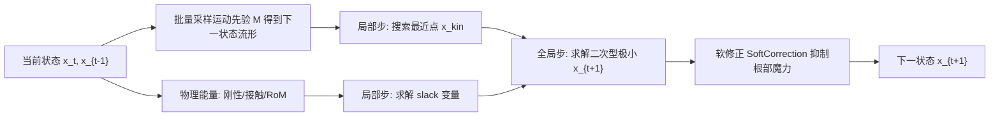

## 一句话总结

DROP 把一个预训练的生成式运动先验（HuMoR）当作投影动力学里的一个能量项，无需重训练模型或训练控制策略，就让纯运动学的角色获得对物理扰动的动态响应与恢复能力。

## 研究背景

- 领域现状：基于运动学的生成式运动模型（VAE、扩散模型等）能从大规模动捕数据中高效学习人体运动先验，可扩展性强；而基于物理仿真、带"仿真器在环"（simulator-in-the-loop）训练的强化/模仿学习方法则能产生高度真实的物理响应。
- 核心痛点：运动学生成模型不含物理，对环境扰动没有反应；而要给它加上物理，通常得额外训练控制策略或重训练带物理概念的先验模型，两者都显著增加设计与计算复杂度，损害可扩展性和易用性。
- 本文 idea：把"加物理"和"训练运动学模型"解耦。构造一个极简的、基于投影动力学的物理人体仿真器，把已有的运动先验作为其中一个投影能量项无缝接入，从而在不做任何额外训练的前提下，让运动先验的恢复轨迹被导向物理合理的方向。

## 方法

整体框架是一个基于优化的隐式欧拉积分器（投影动力学）。角色被建模为一个极简"棒状人偶"：$$N=22$$ 个质点位于人体关节处（按 SMPL 定义），用强弹簧代表刚性骨骼相连，系统状态由关节位置 $$\boldsymbol{x}\in\mathbb{R}^{3N}$$ 完全确定。每一步通过最小化"动量能量 + 各能量项"求解下一状态：

$$\boldsymbol{x}_{t+1}=\arg\min_{\boldsymbol{x}}\frac{1}{2h^2}(\boldsymbol{x}-\boldsymbol{y})^{T}\boldsymbol{M}(\boldsymbol{x}-\boldsymbol{y})+\sum_i E_i(\boldsymbol{x};\boldsymbol{x}_t,\boldsymbol{v}_t)$$

其中动量项来自后向欧拉离散、承载牛顿动力学，外力 $$\boldsymbol{f}_t$$ 通过它改变系统状态；投影动力学在"局部投影"与"全局求解"之间交替，局部步允许使用任意（甚至不可微，如采样）的投影例程，这正是本方法能接入生成模型的关键。

关键设计：

1. **物理能量项（无控制的人偶）**：包含三类不变量。刚性用强弹簧近似骨骼定长；接触用一个简化模型，把即将穿透的关节质点沿法向推出碰撞边界、切向保持静止（隐含静摩擦假设）；关节活动范围（RoM）借助 VPoser 这个位姿 VAE 把越界位姿投影回合法范围（以隐编码模长 $$\lVert \boldsymbol{z}\rVert < 6.0$$ 作边界）。

2. **把运动先验铸成投影能量**：一般自回归生成模型形如 $$\tilde{\boldsymbol{x}}_{t+1}=\mathcal{M}(\boldsymbol{x}_t,\boldsymbol{x}_{t-1},\dots,\boldsymbol{z})$$。通过采样一批噪声 $$\hat{\boldsymbol{z}}$$ 得到下一帧样本集合 $$\hat{\mathcal{X}}_{t+1}$$，即对状态转移流形的近似。于是定义运动学能量 $$E_{kin}=\frac{w_{kin}}{2}\min_{\boldsymbol{x}_{kin}\in\mathcal{X}_{t+1}}\lVert \boldsymbol{x}-\boldsymbol{x}_{kin}\rVert^2$$，局部步只需在样本集合里搜索离当前解最近的点。这使得任何可采样的自回归运动先验都能作为"控制力"接入，无需可微或 EBM 形式，也无需重训练。

3. **根部力矩度量与软修正**：$$E_{kin}$$ 会引入非物理的"提线木偶式"根部力/力矩来强行平衡。作者借助非负最小二乘（NNLS）求解一组接触力，去解释质心线动量/角动量的变化 $$\boldsymbol{b}=(\dot{\boldsymbol{P}},\dot{\boldsymbol{L}})$$，把 $$\lVert \boldsymbol{b}-\boldsymbol{F}\boldsymbol{c}\rVert$$ 作为"根部魔力"的度量。为稳定起见，不把它直接塞进迭代，而是在所有投影动力学迭代收敛后做一次带 KKT 约束的后处理软修正。修正很"温柔"——只把度量压回到与真实动捕相近的量级，度量本身已很小时则跳过，避免累积误差破坏运动自然度。

## 实验结果

方法建立在预训练 HuMoR（在 AMASS 上训练）之上，运行于 30Hz。除能量项与外力的改动外，所有响应与恢复动作都由生成模型随机产生，无需额外的运动控制或规划。核心的定量分析是"扰动-恢复"过程中各能量项随时间的中位轨迹（跨 250 条随机运动，在第 63–78 帧统一施加扰动）：

| 配置 | 扰动后 $$E_{kin}$$ 走势 | 最终物理能量水平 | 是否恢复到训练分布 |
|------|------|------|------|
| 完整方法 | 扰动时升高，随恢复逐步下降 | 低 | 是（各能量回落） |
| 单点流形（仅用先验均值/众数） | 恢复期 $$E_{kin}$$ 明显偏高 | — | 较差（恢复期比完整方法高 ≥30%） |
| 去掉接触 + RoM 能量 | 持续偏高 | 至少高 5 倍且无下降趋势 | 否 |

结果表明：用完整的转移流形（而非单点）在恢复阶段能把运动先验能量至少降低 30%，说明系统偏好"从流形中择优"的灵活性；接触与 RoM 能量则是把恢复轨迹拉回训练分布的关键。消融还显示：去掉 HuMoR 角色退化为被动人偶；去掉 RoM 出现超出人体关节范围的怪异位姿；去掉接触会与地面穿插；去掉根部软修正则出现提线木偶式的凭空恢复力。此外还展示了投射物、双人碰撞、方向跟随、被绊倒、倾斜平台、僵直膝盖等多种即插即用的下游编辑；并与基于强化学习的 ASE 做了定性对比——DROP 响应更柔顺、更多样，ASE 则在物理严格性上偶尔更强。

## 亮点与局限

- 亮点：
  - 真正做到"加物理"与"训练运动学模型"解耦——把运动先验当作一个投影能量项，模型无关、即插即用、零额外训练。
  - 投影动力学的局部步允许不可微的采样例程，使任意可采样的自回归生成模型都能接入，通用性强。
  - 大量下游任务（投射物、碰撞、目标跟随、绊倒、倾斜地面、僵直关节）只需增删能量项或外力即可零样本实现，充分复用了运动先验从大规模数据中继承的多样性与泛化能力。
  - 提出可量化"根部魔力"的根部力矩度量并做温和软修正，缓解非物理的凭空平衡力。

- 局限：
  - 依赖运动先验自身"从离群状态回归训练分布"的能力；一旦先验进入灾难性状态便无法靠系统救回，会出现"超人行为"（如贴地快速旋转）等失败案例。
  - 接触模型非常简化（关节处放缩放球、静摩擦假设），未用 SMPL 精细蒙皮几何做碰撞，也无 IPC 式无穿透保证。
  - 根部力矩度量含两次有限差分、数值敏感，只能把魔力压回真实动捕的量级而非彻底消除，部分视觉上非物理的根部受力不会被修正。
  - 未加力矩上限等物理约束；当前未优化的 Python 实现约 10 FPS，慢于实时。
  - HuMoR 自身放任随机演化时倾向收敛到占多数的行走类运动，某些高动态演示需用"模拟先验"引导到扰动时刻。

## 延伸思考

把生成先验当成变分积分器里一个"数据驱动能量/流形"的思路，本质上是把 example-based simulation 从"位姿样例"推广到"状态转移样例"，很有嫁接空间：换更强的运动先验（如扩散模型）理论上可直接替换 $$E_{kin}$$ 而不动框架，值得验证扩散先验的多峰性能否进一步改善恢复多样性。软修正只是对欠驱动/接触可行性的近似惩罚，若能引入更严谨的接触力学（IPC 式无穿透接触 + 摩擦锥）与关节力矩上限，或许能同时消除穿插和"超人旋转"两类失败。另一个开放问题是双人乃至多人交互目前靠"把对方当可碰撞物体"独立求解，若统一到一个系统中联合求解接触与动量，可能得到更一致、可信的交互行为。
