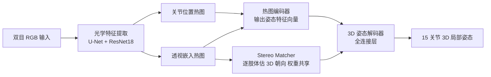

## 一句话总结

Ego3DPose 从头戴式双目鱼眼相机的自我中心视角出发，显式挖掘被以往方法忽视的两条 3D 线索——立体对应与透视效应，通过双路网络与三角函数编码的透视热图，把 UnrealEgo 数据集上的 3D 姿态误差（MPJPE）降低了 23.1%。

## 研究背景

- 领域现状：自我中心（egocentric）3D 人体姿态重建能给虚拟化身、运动分析等应用带来移动性。其中戴在眼镜/头盔上的双目鱼眼相机方案（EgoCap、EgoGlass、UnrealEgo）比单目更准，但精度仍远低于第三人称视角方法。
- 核心痛点：自我中心图像存在视角畸变、严重自遮挡、关节常超出视野等固有困难。而现有方法几乎只依赖 2D 图像特征、隐式地去学 3D 信息，这会让网络偏向数据集中常见的全身姿态分布，不仅在遮挡场景失败，甚至在图像里清晰可见的关节上也估不准。
- 本文 idea：双目自我中心输入本身就含有两条未被充分利用的 3D 线索——**立体对应**（两个视角间的视差）和**透视效应**（离相机近的肢体显得特别大）。把这两条线索显式建模并注入网络，就能摆脱对全身分布的依赖、提升整体精度。

## 方法

整体是一个编码-解码结构的端到端网络，输入两张 256×256 的双目 RGB 图，输出 15 个关节相对骨盆的 3D 局部姿态。作者不重新设计网络，而是在成熟架构里插入两个关键模块：光学特征提取阶段加入**透视嵌入热图**（Perspective Embedding Heatmap），编码阶段用**双路特征聚合**替换原来的单路，其中新增一条 **Stereo Matcher** 支路。

- **透视嵌入热图（是什么 / 为什么 / 怎么做）**：目标是把透视效应而非关节位置编码进热图。作者选用"肢体视角角"$$\theta_l$$——肢体与相机视平面的夹角，定义为 $$\theta_l = \operatorname{atan}\!\left( z_l / \sqrt{x_l^2 + y_l^2} \right)$$，其中 $$(x_l, y_l, z_l)$$ 是子关节相对父关节的 3D 坐标。难点在于要把 2D 位置、置信度、3D 朝向三样信息塞进一张 2D 热图。作者用三角函数解决：热图分正弦、余弦两个通道，像素值是缩放后的 $$\sin\theta_l$$ 与 $$\cos\theta_l$$，向量的模长表示朝向估计的置信度、正余弦之比表示角度本身，从而让透视信息与概率天然纠缠在一起。肢体用"线段"而非两个关节点表示，以增强对遮挡的鲁棒性。共为 14 条肢体、左右两个视角生成热图。
- **Stereo Matcher（逐肢体、权重共享）**：这是精度提升的关键。它每次只取**一条肢体**的透视嵌入热图（4 通道），单独估计该肢体的 3D 朝向 $$\boldsymbol{o}_l = [x_l, y_l, z_l] / \sqrt{x_l^2 + y_l^2 + z_l^2}$$。因为不喂全身信息，网络被迫依赖立体对应和透视线索去推朝向，从而不再偏向训练集里的全身姿态分布；又因处理过程与具体是哪条肢体无关，所有肢体共享权重、样本效率高。
- **双路聚合与 3D 重建**：一路是热图编码器，吃全部关节位置热图 + 透视嵌入热图，输出 20 维姿态特征；另一路是 Stereo Matcher 输出的 14 条肢体 3D 朝向。两者拼接后送入仅由全连接层组成的 3D 姿态解码器得到最终姿态。Stereo Matcher 的输出在送入解码器前会从梯度图中 detach，保证该模块独立学习。训练时还接一个热图重建器约束编码器保留不确定性（推理时不用）。

## 实验结果

在合成的 UnrealEgo 数据集上与两个 SOTA 双目自我中心方法（EgoGlass、UnrealEgo）比较，指标为 MPJPE / PA-MPJPE（越低越好，单位 mm）。Ego3DPose 在所有动作类别上全面领先，整体 MPJPE 相对 UnrealEgo 降低 23.1%、相对 EgoGlass 降低 27.0%。下表取整体及几个代表性动作：

| 方法 | Overall↓ | Crawling↓ | Sitting on Ground↓ | Standing-Whole↓ |
|------|----------|-----------|--------------------|-----------------|
| EgoGlass | 83.33 | 182.36 | 207.31 | 70.17 |
| UnrealEgo | 79.08 | 181.50 | 194.34 | 68.47 |
| Ours | 60.82 | 148.72 | 153.81 | 50.37 |

消融实验显示两个模块各有贡献且有协同效应：仅加透视嵌入热图 MPJPE 从 79.08 降到 75.82（-4.1%），仅加 Stereo Matcher 降到 66.72（-15.6%），两者合用降到 60.82（-23.1%）。在真实世界的 EgoCap 数据集上，MPJPE 也相对 UnrealEgo 提升 8.0%、相对 EgoGlass 提升 11.2%，验证了泛化性。整体推理时延仅 18ms，适合实时应用。

## 亮点与局限

- 亮点：
  - 重新审视双目自我中心输入，指出立体对应与透视两条被忽视的 3D 线索，并给出可落地的显式建模方式。
  - 三角函数式透视嵌入热图巧妙地把 3D 朝向、置信度、2D 位置统一进热图表示。
  - 逐肢体、权重共享的 Stereo Matcher 有效摆脱全身姿态分布偏置，且计算开销极小（1.51ms）。
- 局限：
  - 主要在合成的 UnrealEgo 上验证，真实数据仅用了自遮挡较少、姿态变化较窄的 EgoCap，真实复杂场景的表现仍待检验。
  - 依赖已知/固定的双目相机配置与准确标定，跨相机配置的泛化性未充分讨论。
  - 最难的动作（如 Crawling、Sitting on the Ground）绝对误差仍高达 150mm 上下，离实用精度还有距离。

## 延伸思考

- 把肢体朝向的三角函数编码思路推广到单目或多目自我中心设置，或与时序信息结合以进一步压误差，都是自然的延伸方向。
- "逐部件、权重共享、显式几何线索"这一去偏置思路，对其他容易被数据分布主导的结构化预测任务（如手部姿态、物体位姿）可能同样有借鉴价值。
- 透视嵌入热图本质是把一个几何量（角度）编码成带不确定性的概率图，这种"几何量 + 概率表示"的融合方式，值得在其他需要同时估计量值与置信度的视觉任务里尝试。
