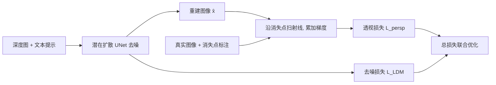

## 一句话总结

在潜在扩散模型的微调中引入一项基于消失点的透视几何损失，让生成图像更符合线性透视规律，从而既提升人眼感知的真实感，又让下游单目深度估计模型在合成数据上训练后取得更好性能。

## 研究背景

- 领域现状：以潜在扩散模型（Stable Diffusion 等）为代表的文生图方法已能从文本生成高质量图像，但训练目标只关注图像质量和文本对齐，并不显式约束物理正确性。
- 核心痛点：生成图像常常违反线性透视——平行线不再汇聚到同一消失点，出现弯曲的直线、扭曲的窗格与墙角。这不仅降低真实感，也让这些图像不适合作为对透视精度敏感的下游任务（如深度估计、三维重建、SLAM）的合成训练数据。
- 本文 idea：透视正确性由消失点几何决定。作者设计一个可微的透视损失，强制生成图像沿消失点方向的边缘梯度分布与真实图像一致，把"透视先验"显式注入扩散模型的训练过程。

## 方法

整体框架：在深度条件版 Stable Diffusion V2 的基础上微调，训练损失在原有去噪损失之外增加一项透视损失。透视损失从每个消失点向图像扫射一束射线，统计每条射线沿线的图像梯度强度，要求重建图像的这一"边缘分布"逼近真实图像的分布。

关键设计：

1. **消失点射线扫描**：对每个消失点 $$v$$，在其到图像四角所张的角度范围 $$[\phi_{\min}, \phi_{\max}]$$ 内均匀取 $$N$$ 条射线 $$l_i(v)$$。每条射线方向对应一个垂直向量 $$d_i(v)$$，用于投影梯度。直觉是：若透视正确，沿消失点方向延伸的边缘应当集中且连贯。

2. **边缘强度度量**：用 3×3 Sobel 算子求图像梯度 $$G_{\mathbf{x}}$$，沿射线积分梯度在垂直方向上的分量绝对值，得到该射线的"边缘似然"：
$$D_i(v, \mathbf{x}) = \int_{k_0}^{k_1} \lvert d_i \cdot G_{\mathbf{x}}(l_i(v,k)) \rvert \, dk$$
实现中该积分退化为对射线穿过的像素求和。

3. **透视损失定义**：比较重建图像 $$\hat{\mathbf{x}}$$ 与真实图像 $$\mathbf{x}$$ 在所有消失点上的边缘分布差异：
$$L_{\text{persp}}(\hat{\mathbf{x}}, \mathbf{x}, v_{\mathbf{x}}) = \frac{1}{\lvert v_{\mathbf{x}} \rvert} \sum_{v \in v_{\mathbf{x}}} \lVert D(v, \hat{\mathbf{x}}) - D(v, \mathbf{x}) \rVert^2$$
整个损失用 PyTorch 实现，端到端可微。总损失为去噪损失加权重 $$\lambda$$ 的透视损失。

4. **训练与数据**：在 HoliCity 数据集（5 万张伦敦实拍图，带消失点标注）上微调，用 MiDaS 估计深度作条件、BLIP 生成图注。分辨率 512×512，$$\lambda = 0.01$$，学习率 1e-6，约 20 万步 4 个 epoch，4 张 RTX3090 训练约 12 小时。该透视约束还可零额外训练地迁移到图像修复（inpainting）任务。

## 实验结果

下游单目深度估计是本文核心验证之一。将 DPT-Hybrid 分别在基线扩散模型与增强模型生成的 vKITTI 合成图上微调，并与原始模型对比（KITTI Eigen split 测试）：

| DPT-Hybrid 训练数据 | RMSE ↓ | AbsRel ↓ | SqRel ↓ | SiLog ↓ | δ1 ↑ |
|------|--------|----------|---------|---------|------|
| 原始模型 (MIX 6) | 5.0287 | 0.1328 | 0.9705 | 18.6320 | 0.8385 |
| vKITTI 基线生成 | 4.7680 | 0.1286 | 0.8104 | 17.8890 | 0.8401 |
| vKITTI 增强生成（本文） | **4.6749** | **0.1250** | **0.7827** | **17.4836** | **0.8496** |

相对原始模型，RMSE 提升约 7.03%、SqRel 提升约 19.3%。PixelFormer 上也有一致结论，在 DIODE Outdoor 上全指标领先原始模型、基线生成模型以及在真实 KITTI 上训练的模型。

其余实验以文字概述：人类主观测试中，50 名参与者对 80 组图像按真实感排序，增强模型的图像被判为比基线更真实的比例为 69.6%，比消融（无透视损失）模型更真实为 67.5%。图像修复任务上，增强模型的 LPIPS 相比基线改善 7.1%、相比消融改善 3.6%。FID 指标上增强模型也优于基线与消融模型。消融显示深度模型在增强图上训练相比"无损失"模型 RMSE 最多提升 16.11%。

## 亮点与局限

- 亮点：
  - 把线性透视这一经典几何先验以可微损失形式显式注入扩散模型，思路简洁且不改动网络架构。
  - 双重验证——既用人类主观测试证明感知真实感提升，又用下游深度估计的定量指标证明"更好的合成数据"这一实用价值，是缩小 Sim2Real gap 的数据侧尝试。
  - 透视约束可零成本迁移到 inpainting，泛化到自然、动物、室内等非城市场景仍保持质量。
- 局限：
  - 依赖带消失点标注的数据（HoliCity），标注主要来自城市/建筑场景，对缺乏明显平行直线的自然场景约束较弱。
  - 透视损失基于 Sobel 梯度与消失点射线，本质是边缘统计代理，并非严格的几何投影约束；消失点需预先给定。
  - 深度估计在 DIODE Outdoor 上的增益较小（部分指标仅微弱领先），主要收益体现在 KITTI 这类结构化驾驶场景。

## 延伸思考

- 该工作把"物理先验注入生成模型"落在透视这一维度，同样思路可推广到阴影、光照一致性、反射等其他物理约束，构成更系统的"物理正确生成"研究线。
- 用生成模型合成带 ground-truth 的训练数据来缩小 Sim2Real gap，是一条与"改进网络架构"正交的路径；若能联合消失点/相机参数一并生成标注，将进一步降低下游任务对真实标注的依赖。
- 值得追问：消失点必须外部提供，能否让模型在生成的同时联合估计透视结构，实现无标注的自监督透视约束？这将大幅扩展其适用数据范围。
