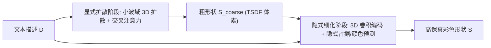

## 一句话总结

提出一种显式-隐式混合的 3D 表示 EXIM，用显式扩散阶段生成可控拓扑的粗形状、再用隐式细化阶段补细节并上色，实现无需逐形状优化、无需人工文本标注的高保真文本引导 3D 形状生成与局部编辑。

## 研究背景

- 领域现状：文本引导 3D 形状生成分两条路线。一条是测试时优化（如 Dream Fields、DreamFusion），借助 CLIP 或文生图模型优化单个形状；另一条是前馈式生成，从形状集合（如 ShapeNet）学习 3D 先验，一次前向即可出结果。
- 核心痛点：优化路线极慢（单个形状要 72~90 分钟），且缺乏 3D 先验导致结构不真实；前馈路线的表示各有短板——显式表示（体素、点云）细节能力差，隐式表示编码全局特征、难做空间解耦从而难以局部编辑，且颜色生成往往与形状并行预测、二者不一致。此外配对的文本-形状数据依赖昂贵的人工标注，难以扩展到新类别。
- 本文 idea：把显式与隐式表示的优势拼起来，做成两阶段由粗到细的管线；显式阶段负责拓扑与可局部修改，隐式阶段负责细节与"以形状为条件"的颜色生成，从而保证形状-颜色一致；并用视觉-语言基础模型自动生成伪文本标注来免除人工标注。

## 方法

整体框架分两阶段。给定文本描述 $$D$$，显式扩散阶段在紧凑小波域用 3D 扩散模型生成粗形状 $$S_{\text{coarse}}$$，确定拓扑；隐式细化阶段以 $$S_{\text{coarse}}$$ 和 $$D$$ 为条件，用神经隐式函数补高频细节并预测表面颜色，得到最终结果 $$S$$。

关键设计：

1. **显式扩散阶段（拓扑生成）**：不在昂贵的原始 $$256^3$$ TSDF 空间做扩散，而是借用双正交小波把 TSDF 压成 $$46^3$$ 的低频小波体 $$C_0$$，在该紧凑域训练 3D 扩散模型。去噪网络是带三层下/上采样的 3D U-Net，训练目标为预测噪声的 $$L_2$$ 损失

$$\mathcal{L}_{\text{coarse}} = \mathbb{E}_{t,C_0,\epsilon}\big[\lVert \epsilon - \epsilon_\theta(C_t, t, D)\rVert^2\big], \quad \epsilon \sim \mathcal{N}(0, I)$$

    文本以 CLIP 文本编码器映射为词级特征 $$f_D$$，通过交叉注意力融入 U-Net 的空间特征，使文本信息局部嵌入到高相关的空间位置，既保证文本-形状一致，又为后续局部编辑提供支撑。

2. **隐式细化阶段（细节 + 颜色）**：小波压缩丢弃了高频，粗形状细节不足。用 3D 卷积编码器从 $$S_{\text{coarse}}$$ 抽取多尺度特征，对查询点 $$p_i$$ 拼接各尺度特征后过三层全连接，预测占据概率，用交叉熵损失 $$\mathcal{L}_{\text{fine}}$$ 监督，恢复细长结构等高频细节。颜色分支另用 3D U-Net 抽多尺度颜色特征并注入词级文本特征，拼接全局文本特征 $$f_D$$ 与随机噪声 $$z$$ 后回归 RGB；用可微渲染下的回归损失 $$\mathcal{L}_c$$ 与对抗损失 $$\mathcal{L}_{\text{adv}}$$ 训练，鼓励颜色真实且与文本一致。颜色以形状为条件，保证形状-颜色一致。

3. **局部编辑（形状与颜色解耦）**：形状修改主要发生在显式阶段。因小波体与原始形状局部对应，改小波域等价于改原始域。给定形状 $$S$$、文本 $$D$$ 和掩码 $$M$$，把扩散模型输入扩展两个通道（掩码 $$M$$ 和去掉被编辑区域的原形状 $$S'$$），微调成文本引导的形状 inpainting，从而在保持无关区域不变的前提下按文本重绘目标区域；颜色可独立地把新文本特征注入掩码区域，实现不改形状的颜色编辑。

4. **伪标注与场景生成**：用 BLIP-v2 对渲染图做 captioning，为形状自动生成伪文本描述，免人工标注地把数据集扩展到新类别；再借 2D 房间布局图把生成的家具形状按位置、朝向、尺寸摆放，用相似文本提示促成风格一致的室内场景。

## 实验结果

在 ShapeNet 的 chair 类上与已有方法定量对比（CLIP-S 衡量文本-形状一致性，越高越好；FPD、FID 衡量形状/颜色生成质量，越低越好），EXIM 在全部指标上均显著领先：

| 方法 | CLIP-S ↑ | FPD ↓ | FID ↓ |
|------|----------|-------|-------|
| CLIP-Forge | 26.34 | 825.96 | N.A. |
| TITG3SG | 38.88 | 1566.76 | N.A. |
| AutoSDF | 48.92 | N.A. | N.A. |
| ShapeCrafter | 52.43 | N.A. | N.A. |
| TAPS3D | N.A. | 342.23 | 43.7 |
| EXIM（本文） | 71.75 | 192.17 | 36.8 |

（"N.A." 表示原对比文献未报告该指标。）此外，消融显示词级交叉注意力比直接注入全局文本特征更贴合描述；隐式细化阶段用 COV、MMD 指标验证能有效恢复细长部件等高频细节；编辑对比中本文能精确改动目标区域而不影响无关部分，优于 ShapeCrafter 与 TITG3SG。

## 亮点与局限

- 亮点：
  - 显式管拓扑与可编辑、隐式管细节与颜色，取两者之长，前馈生成无需逐形状优化，速度与保真度兼得。
  - 颜色以形状为条件生成，形状-颜色天然一致；形状与颜色空间解耦，支持局部、独立的编辑。
  - 用 BLIP-v2 自动生成伪文本标注，免除人工标注即可扩展新类别，并演示了风格一致的室内场景合成。
- 局限：
  - 每个类别单独训练一个模型，未做统一的跨类别生成。
  - 依赖 ShapeNet 这类形状集合学习 3D 先验，泛化到开放域/复杂真实物体的能力有限。
  - 场景生成依赖外部房间布局图，尚属"组合已生成资产"的初步尝试，非端到端。

## 延伸思考

混合显式-隐式表示的思路本质是"用显式结构管全局可控性、用隐式场管局部连续细节"，这与后续把显式高斯/体素与隐式场结合的工作一脉相承。EXIM 用小波压缩把扩散搬到紧凑域的做法，对降低 3D 扩散的显存与算力开销很有借鉴意义；而"颜色以形状为条件"的解耦设计，对追求可编辑性的生成式 3D 建模是一个值得推广的范式。值得追问的是：单类别训练的限制能否用更大规模数据 + 类别条件统一模型来突破，以及伪标注的语义粒度是否足以支撑更精细的文本控制。
