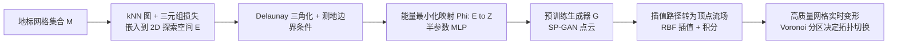

## 一句话总结

给定一组同类别的高质量网格，本文借助一个预训练的 3D 点云生成模型，构造一个易于交互的二维探索空间，让用户像在平面上游走那样平滑地在这些网格之间插值变形，并把变化实时迁移回原始高质量网格。

## 研究背景

- 领域现状：深度生成模型（VAE、GAN、归一化流、扩散模型）能学到 3D 形状的连续隐空间，原则上可以用来探索形状变化；一批工作也在研究如何数据驱动地学习网格变形（cage、meta-handle、Jacobian 场、ShapeFlow 等）。
- 核心痛点：直接用生成模型的隐空间做探索有四个问题——隐空间包含整个训练分布而非用户关心的少数几个形状；两点之间的线性插值往往产生带噪、带多余特征的中间形状（如凭空长出扶手）；隐空间维度高（如 $$R^{128}$$ 甚至更高）难以可视化和交互；最好的生成模型输出的是点云或隐式场，网格化后质量远不及艺术家制作的原始网格。
- 本文 idea：不去探索整个隐空间，而是抽取一个只覆盖给定"地标形状"（landmark shapes）的低维子空间。先构造一个二维探索空间到生成模型隐空间的映射，使其插值平滑；再把子空间里的隐空间变化转化为变形场，迁移到原始高质量网格上。

## 方法

整体框架分两大部分：先构造一个从二维探索空间 $$E$$ 到生成器隐空间 $$Z$$ 的能量最小化映射 $$\Phi$$，让在 $$E$$ 中平面游走对应生成形状的平滑变化；再把在该子空间上的插值解释为网格顶点上的流场，把点云层面的变化"搬运"到高质量网格上，并处理不同网格拓扑之间的离散切换。

关键设计有以下几点：

1. **测地路径代替线性插值。** 隐空间里两点的线性插值会产生带噪、含多余特征的中间形状。本文改为在"原空间"（生成器的几何输出空间 $$X$$）里求测地线，即最小化 Dirichlet 能量 $$J_{\text{1-D}}(p) = \tfrac{1}{2}\int_0^1 \lVert \nabla G(p(t)) \rVert^2 dt$$。测地线是局部最短路径，沿途形状变化尽可能平缓，避免多余抖动。

2. **能量最小化的二维子流形。** 一维测地线不能告诉我们如何走到区域内部的任意点。本文把问题升级为：在探索空间三角形区域内求解使 $$G \circ \Phi$$ 的 Jacobian 的 Dirichlet 能量 $$\tfrac{1}{2}\int_E \lVert J(x) \rVert_F^2 \, dA$$ 最小的曲面，并在边界 $$\partial E$$ 上以测地线作为硬约束（Dirichlet 边界条件）。为避免软约束正则项（类似薄板样条）导致曲面塌缩或梯度爆炸，作者采用半参数化写法：边界点直接"钉"在测地边界值 $$b(x)$$ 上，内部由一个 MLP 参数化，即 $$\Phi(x) = b(x)$$ 若 $$x \in \partial E$$，否则 $$\Phi(x) = \text{MLP}_\theta(x)$$。

3. **推广到散乱地标。** Laplace 方程在散乱边界条件下病态，直接用凸包做边界会出现"帐篷杆"式的尖峰。作者改为对地标点做 Delaunay 三角化，把每个三角面片当成独立的插值子问题，只要相邻面片共享同一边界条件（每条边映射为连接对应隐码的测地线），拼接后的整张曲面 $$S$$ 就连续。二维嵌入本身用三元组间隔损失（triplet margin loss）在 kNN 图上得到，并加入面积与内角正则以保证三角化质量。

4. **从子空间到网格变形。** 把探索空间里的一条连续路径解释为网格顶点上的瞬时流场 $$f_t: S_t \to S_{t+\epsilon} - S_t$$。由于选用的 SP-GAN 天然在生成点云之间提供稠密对应，无需显式计算点对应。流场在空间上离散，用径向基函数（RBF）插值到所有顶点位置，再逐步积分 $$v_{t+\epsilon}^i = v_t^i + \text{RBF}_{f_t}(v_t^i)$$，从而实时地把变化搬到高质量网格上。

5. **拓扑感知与最优切换点。** 集合中网格拓扑各异，游走时需要离散地切换网格。作者在 $$E$$ 上建立 Voronoi 分区，任意点的拓扑由最近地标决定。朴素地在 $$t = 0.5$$ 切换并非最优；本文计算使切换处网格变化最小的最优切换点 $$t^*$$，并通过重映射边界条件把 $$t^*$$ 对准到 $$t = 0.5$$，从而在最终空间里切换点恰好落在 Voronoi 边界上。生成器采用 SP-GAN（在 ShapeNet 上训练），其映射为 $$G: Z \in R^{2048 \times 128} \mapsto X \in R^{2048 \times 3}$$。

## 实验结果

主实验是椅子形状的"形状到形状"变形质量对比：用 PointNet++ 特征空间下的 Fréchet Distance（FD，衡量与 ShapeNet 分布的相似度）和 Earth Mover's Distance（EMD，衡量与目标形状的贴合度）评估，对比对象为 ShapeFlow 和 SP-GAN 网格化输出。

| 方法 | FD（$$t=0.5,1.0$$）↓ | EMD（$$t=1.0$$）↓ |
|------|------|------|
| 本文 | 31.6 | 0.082 |
| ShapeFlow | 78.4 | 0.069 |
| SP-GAN（网格化） | 79.2 | - |

本文在 FD 上大幅领先，说明变形结果分布更接近真实形状、更自然；ShapeFlow 的 EMD 略优，但作者指出这是因其过拟合到 Chamfer 距离损失，导致表面出现不自然的凹陷。此外，作者还验证了两点：其一，在 chairs-100 空间中随机路径的平均能量（1.071）低于隐空间线性插值（1.267）和优化过的一维测地线（1.144），说明二维方法的局部支撑比一维插值更平滑；其二，最优切换点重映射把切换处网格的平均 Chamfer 距离从 285 降到 262，减少了拓扑切换时的几何跳变。

## 亮点与局限

- 亮点：
  - 只需少量地标形状即可构造出可视化、可交互的二维探索空间，规避了高维隐空间难以导航的问题。
  - 把点云生成器的语义变化迁移到原始高质量网格，兼顾了生成模型的多样性与艺术家网格的细节。
  - 半参数化 MLP 把边界条件转成硬约束，稳定地解决了软约束正则带来的塌缩问题。
  - 变形与探索可实时交互，并配有图形界面。
- 局限：
  - 网格之间的离散切换会带来视觉不连续，尤其当地标排布紧密时。
  - 与其他基于流的变形方法一样，刚性部件被非刚性变形时会产生扭曲。
  - 映射 $$\Phi$$ 的训练仍然耗时，虽然推理是实时的。
  - 依赖 SP-GAN 提供的稠密点对应，难以直接迁移到没有此性质的生成模型（如扩散模型，因其 Jacobian 计算昂贵）。

## 延伸思考

- 作者指出构造 $$E$$ 的流程并不局限于 3D 形状隐空间，理论上可用于图像等其他视觉数据集合的探索空间构造，这是一个通用的隐空间"再参数化"思路。
- 把方法推广到扩散模型是自然方向，但需要解决多步生成过程中 Jacobian 的高成本问题，训练一个近似多步扩散的代理前向模型是可能的出路。
- "分摊训练"（amortization）值得追问：若能学到"给定一组地标即预测探索空间"的模型，就能支持由粗到细、逐层下钻的交互式探索，这是当前方法难以实现的。
- 对刚性部件的扭曲问题，引入 ARAP 之类的正则能量约束流场，可能是提升几何合理性的直接手段。
