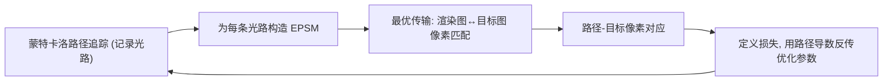

## 一句话总结

提出"扩展路径空间流形"（EPSM），把光路顶点与场景参数放到同一空间并施加几何约束，从而计算"路径几何随场景参数变化"的稠密几何导数，再配合最优传输匹配的损失，鲁棒地解决含反射、折射、焦散、阴影、高光等复杂光效、且初始与目标相距较远的长程逆渲染优化难题。

## 研究背景

- 领域现状：物理基础可微渲染近年发展迅速，一般流程是计算光路或像素颜色对任意场景参数的"局部颜色导数"，再用梯度下降最小化渲染图与目标图的差异来优化/恢复场景参数（如 Mitsuba 2/3、PRB 等）。
- 核心痛点：现有方法难以鲁棒处理反射、折射、焦散、阴影、高光这类复杂光效，尤其当这些光效在初始图与目标图中的位置相距较远（图像空间中不重叠）时。原因在于颜色导数本质上是局部且稀疏的——只有物体边界附近才有非零值，无法提供长程的优化信号。
- 本文 idea：借鉴前向渲染里用于高效采样困难镜面光路的"路径空间流形（PSM）"思想，把它扩展到可微渲染场景。核心是构造一个定义在"路径顶点 + 场景参数"联合空间上的流形，用几何约束让顶点位置由场景参数隐式且唯一确定，从而得到稠密的几何导数以支撑长程优化。

## 方法

整体框架：在每一轮迭代中，先用蒙特卡洛路径追踪做前向渲染并记录采样光路；为每条光路关联感兴趣的场景参数、构造相应类型的 EPSM；用最优传输在渲染图与目标图之间建立像素级匹配，进而建立"路径—目标像素"对应；最后依据对应关系定义损失，用 EPSM 求得的路径导数做反向传播来优化场景参数。

关键设计：

1. **EPSM 的定义与隐式映射**。把长度为 $$n$$ 的光路 $$\boldsymbol{x} = \boldsymbol{x}_0 \boldsymbol{x}_1 \cdots \boldsymbol{x}_n$$ 与场景参数 $$\boldsymbol{\theta} = [\theta_1, \cdots, \theta_m]$$ 拼成扩展路径 $$(\boldsymbol{x}, \boldsymbol{\theta})$$，其扩展路径空间是 $$\mathbb{R}^{2(n+1)+m}$$。对其施加与顶点数目相同的 $$n+1$$ 个二维向量值约束函数，堆叠成 $$\boldsymbol{C}(\boldsymbol{x}, \boldsymbol{\theta}) = 0$$，则 EPSM 为满足约束的扩展路径集合。由隐函数定理，在当前扩展路径邻域内，所有顶点位置都被场景参数 $$\boldsymbol{\theta}$$ 隐式且唯一地决定——扰动参数后，镜面路径依然是镜面路径，光效被"跟踪"住。

2. **四类约束函数**。半向量约束固定局部坐标系下入射/出射方向的半向量（不同于原 PSM 强制半向量平行法线，这里改为"局部半向量保持不变"，因而对镜面与光泽面都适用）；固定位置约束通过固定顶点在所在三角形上的重心坐标，锁住漫反射顶点与两端点；固定方向约束锁住光源出射方向（处理焦散）；共线约束强制阴影射线保持直线（处理阴影）。约束个数始终等于顶点数，保证映射可解。

3. **三种 EPSM 类型**。通用 EPSM 在镜面顶点上用半向量约束、在漫反射顶点与两端点上用固定位置约束，覆盖反射/折射/高光等大多数效果；焦散 EPSM 针对 $$ES^*DS^+L$$ 形式的焦散光路，额外对光源出射方向加固定方向约束、并去掉漫反射顶点的位置约束，从而跟踪移动的焦散图案；阴影 EPSM 针对直接光照的阴影射线（4 个顶点），对遮挡顶点与两端点加固定位置约束、对阴影射线加共线约束，而对着色顶点不加约束，以捕捉移动的阴影。

4. **路径导数与损失**。对约束函数做隐式微分 $$\frac{d\boldsymbol{C}}{d\boldsymbol{\theta}} = \frac{\partial \boldsymbol{C}}{\partial \boldsymbol{\theta}} + \frac{\partial \boldsymbol{C}}{\partial \boldsymbol{x}} \cdot \frac{\partial \boldsymbol{x}}{\partial \boldsymbol{\theta}} = 0$$，即可通过求解稀疏线性系统得到路径导数 $$\frac{\partial \boldsymbol{x}}{\partial \boldsymbol{\theta}} = -\left(\frac{\partial \boldsymbol{C}}{\partial \boldsymbol{x}}\right)^{-1} \cdot \frac{\partial \boldsymbol{C}}{\partial \boldsymbol{\theta}}$$。损失定义为路径首两顶点决定的射线 $$\boldsymbol{x}_0 \boldsymbol{x}_1$$ 与像平面交点 $$P$$ 到目标像素 $$\boldsymbol{t}$$ 的平方距离 $$L(\boldsymbol{\theta}) = (P(\boldsymbol{x}_0, \boldsymbol{x}_1, \boldsymbol{\theta}) - \boldsymbol{t})^2$$，因此只需计算与前两个顶点相关的导数即可用链式法则反传。由于损失只依赖前两顶点、且漫反射处的固定位置约束切断了前后关系，通用 EPSM 可简化到首个漫反射顶点为止，显著减小线性系统规模。

实现上整套方法在 GPU 上用 Mitsuba 3 与 PyTorch 联合完成，约束函数的雅可比借助 PyTorch 与 Dr.Jit 的自动微分混合计算；像素匹配采用 Sinkhorn 散度近似的最优传输（$$\epsilon = 0.01$$），因其能捕捉长程关系。

## 实验结果

在 NVIDIA RTX 3090 上、以 $$128 \times 128$$ 分辨率、32 spp 记录光路，每个场景跑 500 次迭代（每次迭代约 4.3–7.2 秒，约 70% 时间花在求解路径导数的线性系统上），Adam 优化。在四个代表性场景上与三种 SOTA 基线对比：带重参数化的 Path Replay Backpropagation（PRB）、多尺度版 PRB（PRB.mul.res）、以及 Plateau-reduced Differentiable Path Tracing（PRDPT）。

| 场景（光效类型） | 优化目标 | PRB / PRB.mul.res / PRDPT | 本文 EPSM |
|------|------|------|------|
| Bathroom（嵌套反射+折射） | 8 个标本物体的 2D 平移 | 均未能正确恢复 | 成功恢复，+hybrid 进一步细化 |
| Shadow（阴影） | 400 个遮挡球的 2D 平移 | 未能鲁棒收敛（多尺度略缓解） | 成功收敛 |
| CornellBox（焦散） | 6 个面光源的旋转角 | 未能收敛 | 成功收敛 |
| Highlight（光泽高光） | 平面旋转 + 发射体平移 | 参数增多后迅速失效 | 成功收敛 |

结论：基线因依赖局部颜色导数（或高维空间采样方差过大）无法处理长程、多参数的逆渲染，而 EPSM 的几何导数在物体内部稠密、优化更稳定，能在全部场景鲁棒收敛。对于已大致对齐、但最优传输匹配在末段不够精确的场景（如 Bathroom、Shadow），可选地在跑完 500 次本文迭代后再用 PRB 跑 100 次做混合细化，得到更贴合的结果。附加实验还展示了通过焦散优化光源平移、相机位姿估计、经折射恢复法线图、以及从弯曲阴影恢复 72 参数 SMPL 人体模型等任务。

## 亮点与局限

- 亮点：
  - 把前向渲染中的路径空间流形思想创造性地扩展到可微渲染，得到"路径几何对场景参数"的稠密几何导数，而非稀疏的逐像素颜色导数，天然适合长程优化。
  - 用统一的约束框架（四类约束、三种 EPSM）覆盖反射、折射、焦散、阴影、高光等多种困难光效，且半向量约束的改法让方法同时适用于镜面与光泽面。
  - 与最优传输损失自然结合，能建立初始与目标不重叠时的长程匹配，恢复能力显著优于 SOTA。

- 局限：
  - 计算时间与显存开销较大，瓶颈在于为每条路径求解小线性系统（用 `torch.linalg.inv` 直接法），且当前把所有采样光路全部存下。
  - 无法处理"镜中阴影"效果，因为它不契合已定义的任何一类 EPSM。
  - 效果高度依赖匹配质量，最优传输在图像已对齐时匹配可能不准，需要混合方案兜底。

## 延伸思考

- 作者指出的加速方向很自然：雅可比 $$\nabla \boldsymbol{C}$$ 稀疏，可用迭代法替代直接求逆解线性系统；显存上可改为按 batch 计算、只存一批光路。这类工程优化对将方法推向更高分辨率、更多参数的真实逆渲染任务是关键。
- 该方法把"几何导数"和"颜色导数"清晰区分开来，提示可微渲染中或许应把长程对齐（几何/匹配驱动）与末段精修（颜色导数驱动）分工协作，混合方案已初步验证了这一思路。
- 目前只处理表面交互，体积效果留待未来；把 EPSM 推广到参与介质、以及探索比最优传输更强的匹配算法，都是值得追问的方向。
