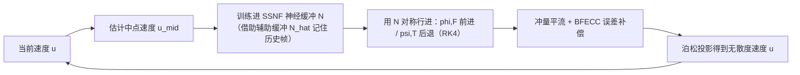

## 一句话总结

用一种空间稀疏的混合神经场（SSNF）把长时段的时空速度场紧凑地存下来，从而以可承受的显存代价实现"双向对称行进"的高精度流图，做出低耗散、能量守恒、涡结构丰富的无粘不可压流体仿真。

## 研究背景

- 领域现状：隐式神经表示（INR，如 NeRF、Instant NGP）在渲染与重建中大放异彩，靠"随信号复杂度而非分辨率增长"的记忆效率优势见长；而流图（flow map）方法通过跟踪长时段映射、大幅减少插值次数来抑制数值耗散，是降低数值粘性的一条重要路线。
- 核心痛点：一方面 INR 直接塞进仿真管线一直"能用但无优势"，因为传统仿真在纯空间的稠密场上运作，用不上 INR 的自适应稀疏；另一方面流图方法要往回行进反向映射，必须缓存整段时空速度场，显存开销近乎不可承受，逼得现有方法（如 BiMocq、CF+BiMocq）对反向映射改用半拉格朗日式插值。正向映射用无插值的高阶 Runge-Kutta 精确求解、反向映射却用有插值的半拉格朗日——这种**机制上的不对称**使得正反向映射相互矛盾，无法满足"往返回到原点"的理论性质。
- 本文 idea：把 INR "小显存存高维时空信号"的能力，与流图仿真"存下速度缓冲即可对称行进"的需求精确对齐。用一个专门设计的混合 INR 作为速度缓冲，让正反向映射用**完全相同**的无插值 RK4 方案对称行进，从根上消除不对称误差。

## 方法

整体框架：核心是把仿真里的时空速度场交给一个神经缓冲 N（SSNF）来存储。每个仿真步先估计中点速度并训练进 N，然后用 N 里的速度场分别向前、向后行进出正向映射 $$\phi$$、反向映射 $$\psi$$ 及它们的雅可比 $$\boldsymbol{F}, \boldsymbol{T}$$，再用基于冲量（impulse）的平流配合 BFECC 误差补偿更新速度、投影回无散度场。

关键设计：

1. **双向对称行进（Bidirectional March）**。既然正反向流图本质都是对速度场沿时间轴的积分，就对二者采用同一套无插值 RK4：正向用 $$+\Delta t$$、反向用 $$-\Delta t$$。$$\phi, \psi$$ 由 $$\partial\phi/\partial\tau = \boldsymbol{u}(\phi,\tau)$$ 积分，雅可比由 $$D\boldsymbol{F}/Dt = \nabla\boldsymbol{u}\,\boldsymbol{F}$$、$$D\boldsymbol{T}/Dt = -\boldsymbol{T}\,\nabla\boldsymbol{u}$$ 积分。理想流图应满足往返恒等 $$\boldsymbol{X} = \psi\circ\phi(\boldsymbol{X})$$ 与 $$\boldsymbol{I} = \boldsymbol{F}\,\boldsymbol{T}$$。在单涡稳态实验里，对称行进的往返位置误差比现有非对称方案低约 5 个数量级，雅可比一致性低约 3 个数量级。

2. **空间稀疏神经场 SSNF**。用一座多分辨率、相互重叠的规则网格金字塔存可训练特征向量，稀疏性用位掩码显式管理。是否在细层激活某个 cell，由从速度雅可比算出的"尺寸场" $$S$$ 决定：当 $$S_{\max} > \sigma \cdot \tfrac{1}{dx_l}$$ 时激活。它可看作 Instant NGP 的"无哈希碰撞"版本——不靠哈希让多体素抢参数，而是把自由度**显式**分配到高频涡区独占，因此在更少参数下反而精度更高、噪声更小。查表时对未激活节点按零向量处理，实现活跃/非活跃区的连续过渡。

3. **时间维与动态时间戳归一化**。每个空间查得的特征向量被切成 4 段、绑定到时间戳 $$0, \tfrac{1}{3}, \tfrac{2}{3}, 1$$，用三次 Lagrange 多项式随 $$t$$ 插值（实验证明三次比线性关键得多）。由于仿真是逐帧到来、总时长事先未知，作者用动态时间戳归一化：始终把已有帧压进 $$[0,1]$$，用"至今时长倒数"这一时间乘子 $$\lambda$$ 归一化；新帧到来时 $$\lambda$$ 减小、旧帧被相应压缩。

4. **训练与冲量平流**。为在新帧到来时不丢历史帧的监督，维护主缓冲 N 与辅助缓冲 $$\hat{N}$$：训练 N 拟合新帧时，历史帧的样本从 $$\hat{N}$$ 查得，训完再把 N 硬拷贝回 $$\hat{N}$$。采样按偏向高复杂度区域的分布进行，还会随流动变复杂而"生长"激活更多 cell。速度更新采用冲量形式 $$\boldsymbol{m}(\boldsymbol{x},t) = \boldsymbol{T}^{T}\boldsymbol{m}(\psi(\boldsymbol{x}),0)$$，配合中点法与 BFECC；仿真每 $$n$$ 步重初始化一次流图（$$n$$ 需在拟合能力与长程累计误差间权衡）。

## 实验结果

主实验取 2D 稳态点涡：无粘无外力时孤立点涡应保持速度场不随时间变，考验方法抑制数值耗散、长时间维持稳态的能力。下表为 1300 帧后仿真速度相对稳态场的平均绝对误差（越低越好），NFM 比次优方法低约一个数量级。

| 方法 | 1300 帧后稳态场平均绝对误差 ↓ |
|------|------|
| NFM（本文） | 1.589E-4 |
| MC+R | 21.56E-4 |
| CF+BiMocq | 30.92E-4 |
| BiMocq | 488.9E-4 |

其余结果用文字补充：在 SSNF 表示能力的对比中，相比 Instant NGP、KPlanes、SIREN，SSNF 在 2D 把平均 RMSE 较最优基线（KPlanes）降低约 73.7%，3D 较最优基线（INGP）降低约 73.5%，且显存与训练时间都有竞争力。在 3D 相互追逐涡环（leapfrogging）实验中，NFM 的动能守恒明显更好，涡环在第 5 次穿越后仍保持分离，而各基线最多 3 次后就并合。涡环对撞、斜向对撞、三叶结（trefoil knot）、四涡重联、旋转平移桨叶、墨滴（Rayleigh-Taylor 失稳）等场景都复现了与真实实验/参考仿真吻合的精细涡丝结构。重初始化步数 $$n$$ 的影响呈 U 形，在该稳态测试中约 $$n=17$$ 时误差最小。

## 亮点与局限

- 亮点：
  - 找准了 INR 与流图仿真的"需求-能力"契合点，把长时段流图行进的显存瓶颈用神经缓冲化解，让对称双向行进变得可行，精度提升显著（相对解析解误差降低 90% 以上）。
  - SSNF 作为通用时空 INR 本身即有价值：显式稀疏、无哈希碰撞、拟合精度高、训练快，适用范围不限于流体。
  - 把长期存在的仿真难题"改写成"机器学习问题，为后续借力神经技术的进步留出空间。
- 局限：
  - 速度慢：整体墙钟时间比 BFECC/MC+R/CF 等传统方法高约一个数量级（单步约 9s vs 约 0.5s），其中 90% 以上耗在神经相关运算，不适合实时应用。
  - 目前只处理烟雾仿真；扩展到水体需要额外缓冲与界面表示来处理粘性与表面张力。
  - $$n$$ 等超参数目前靠经验按场景选取。

## 延伸思考

- 论文把"神经技术加速仿真"从"模仿已有非神经方法"推进到"拓展已有方法达不到的前沿"，这个定位值得关注：神经网络在这里不是代理模型，而是作为一种高效数据基元（data primitive）嵌进第一性原理仿真。
- 性能瓶颈几乎全在训练/查询上，后续若能减少 INR 训练时间或设计"更稀疏训练"的时间积分方案，是把该路线推向实用的关键。
- 流图 + 冲量的框架天然不止于流体，作者也点出向固体、多物理耦合系统推广的可能，SSNF 这类稀疏时空神经缓冲或可成为一类通用的高维场存储原语。
