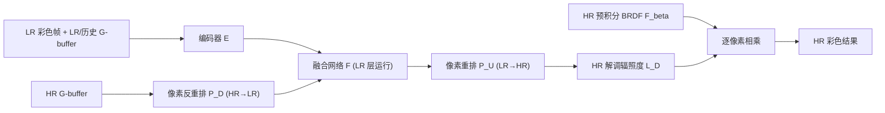

## 一句话总结

FuseSR 用"廉价的高分辨率 G-buffer + BRDF 解调 + H-Net 多分辨率融合"这套组合，把实时渲染的超分辨率做到了 4×4 甚至 8×8 的高倍率，且在质量和速度上都明显超过已有方法。

## 研究背景

- 领域现状：为缓解高分辨率、高刷新率、高真实感带来的实时渲染压力，主流做法是低分辨率（LR）渲染再上采样到目标分辨率，即超分辨率（SR）。工业界的 DLSS / FSR / XeSS 已广泛应用，学术界的 NSRR、MNSS 也在探索更高倍率的重建。
- 核心痛点：现有方法主要依赖 LR 输入（如历史帧）来恢复细节。LR 输入本身就缺失高频信息，导致难以还原精细纹理。理论上 4×4 重建至少需要 16 帧历史才能覆盖 HR 目标的每个像素，如此长的时间窗在动态场景里基本不可行；而单纯提高特征分辨率又会让网络推理时间迅速膨胀——"提分辨率"与"降带宽"是一对难以调和的矛盾。
- 本文 idea：额外引入获取成本极低的 HR G-buffer 作为逐像素线索；再通过预积分 BRDF 解调把"彩色图超分"转化为更平滑、更易学习的"解调辐照度超分"；并设计 H-Net 在 LR 层做主干计算、用像素重排无损对齐 HR 特征，从而同时兼顾质量与实时性能。

## 方法

整体 pipeline 是：先对渲染方程做预积分 BRDF 解调，把彩色帧拆成"高频的预积分 BRDF 项"和"平滑的解调辐照度项"；用神经网络只预测 HR 解调辐照度图，再逐像素乘回可低成本获取的 HR BRDF 图得到最终 HR 彩色结果。网络核心是 H-Net，用像素反重排（unshuffle）把 HR G-buffer 无损降到 LR 空间与其它 LR 输入拼接，在 LR 主干里融合，最后用像素重排（shuffle）升回 HR。

关键设计：

1. **预积分 BRDF 解调**：把出射辐射 $$L_o(\boldsymbol{\omega}_o)$$ 分解为预积分 BRDF 项 $$F_\beta(\boldsymbol{\omega}_o)=\int_\Omega f_r(\boldsymbol{\omega}_i,\boldsymbol{\omega}_o)\cos\theta_i \, d\boldsymbol{\omega}_i$$ 与解调辐照度项 $$L_D(\boldsymbol{\omega}_o)=L_o(\boldsymbol{\omega}_o)/F_\beta(\boldsymbol{\omega}_o)$$。这样超分任务变成预测 HR 的 $$L_D$$ 再乘回 HR 的 $$F_\beta$$。为什么这么做：$$F_\beta$$ 承载了高频材质细节，可用 split-sum 近似查一张 2D LUT 以近乎零成本在任意分辨率获取；而 $$L_D$$ 比原始颜色平滑得多，网络学起来更容易、泛化更好。
2. **HR G-buffer 作为线索**：G-buffer（深度、法线、纹理等）是渲染副产品，1080p 每帧仅需几毫秒，成本随分辨率仅次线性增长。它提供了 LR 输入里缺失的逐像素 HR 信息，把病态的纯 LR 超分变得可解。
3. **H-Net 的无损多分辨率对齐**：对齐可以在 HR 层（上采样）或 LR 层（池化）做。上采样会让卷积在 HR 跑、拖慢速度；普通最大/平均池化又会丢失 HR 边缘和纹理。作者改用像素反重排：把 $$[C, H\!\cdot\!r, W\!\cdot\!r]$$ 的 HR 图按 $$r\times r$$ 块拼接通道，无损变成 $$[C\!\cdot\!r\!\cdot\!r, H, W]$$ 的 LR 图，把逐像素空间信息转成逐通道深度信息。既保住了 HR 细节，又让主干融合网络全程在 LR 运行。网络两端是 HR、中间是 LR 瓶颈，形状像"H"，故名 H-Net。
4. **训练与损失**：编码器输入当前帧加前 2 帧的 LR 辐照度与 G-buffer 以增强时序一致性。端到端训练，损失为 $$L_1$$ 颜色损失、VGG 感知损失与 SSIM 结构损失的加权和，权重取 $$\lambda_p=0.5$$、$$\lambda_s=0.05$$。此外提供性能导向的 Ours E 版本：去掉历史复用、融合网络通道减半、卷积换成深度可分离卷积。

## 实验结果

在自建的 4 个 UE4/UE5 场景（Kite、Showdown、Slay、City，目标 4K）上与多种基线对比 4×4 超分的 PSNR。FuseSR 在全部场景上均领先。

| 场景 | Ours PSNR↑ | NSRR | MNSS | LIIF | FSR | XeSS |
|------|-----------|------|------|------|-----|------|
| Kite | 32.33 | 27.74 | 28.00 | 26.47 | 29.12 | 28.30 |
| Showdown | 36.32 | 30.27 | 29.17 | 30.33 | 26.29 | 29.31 |
| Slay | 37.02 | 35.42 | 35.39 | 31.12 | 32.39 | 34.94 |
| City | 28.94 | 27.65 | 28.23 | 26.56 | 26.63 | 27.15 |

性能方面（RTX 3090，TensorRT 16-bit）：4K 下 Ours 总运行 33.93 ms、Ours-8x 仅 16.20 ms、Ours E 仅 7.82 ms，而 NSRR 高达 149.20 ms；HR G-buffer 生成 4K 仅 2.35 ms。由于融合网络跑在 LR 层，倍率越高相对越快，8×8 版本在高分辨率下反而比 4×4 更省时。在极具挑战的 8×8 任务上，现有方法基本失效，FuseSR 仍能产出高保真结果。消融实验证实：HR G-buffer 融合与 BRDF 解调各自都带来明显增益（两者齐用 PSNR 34.67 / SSIM 0.952，均为最优）；像素反重排对齐也优于最大池化、平均池化乃至更慢的 HR 上采样对齐。

## 亮点与局限

- 亮点：
  - 首次在实时约束下把 8×8 超分做到高保真，倍率越高越省时的特性很反直觉但很实用。
  - BRDF 解调把难学的彩色超分转成平滑的辐照度超分，配合近乎免费的 HR G-buffer/BRDF LUT，思路优雅且工程可落地。
  - H-Net 用像素重排/反重排实现"HR 无损对齐 + LR 低带宽计算"，直接化解了分辨率与速度的矛盾。
- 局限：
  - 强依赖高质量 HR G-buffer 与预积分 BRDF，需要定制着色器配合，接入现有引擎有一定改造成本。
  - 数据集仅 4 个 UE 场景，跨引擎、跨材质体系的泛化性尚待验证。
  - 解调假设可用 split-sum 近似表达 BRDF，对复杂/多层材质或强透明、次表面散射等可能不完全适用。

## 延伸思考

方法把"渲染先验（G-buffer、BRDF 分解）注入神经重建"这条路走得很实：相比纯图像域超分，利用渲染管线内部信号往往事半功倍，这与去噪领域的 albedo 解调、帧外插里的解调思路一脉相承。后续 CVPR 2025 已有工作把 G-buffer 引导进一步解耦用于视频超分，说明这一方向仍在演进。值得追问的是：当 G-buffer 本身带噪（如低采样光追）或 BRDF 无法良好预积分时，解调收益会衰减多少；以及能否把 H-Net 的像素重排对齐范式迁移到帧生成、光追去噪等其它实时重建任务上，形成统一的多分辨率融合骨架。
