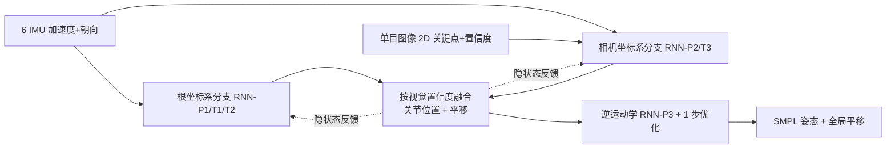

## 一句话总结

融合单目图像与 6 个稀疏 IMU，用"双坐标系策略 + 隐状态反馈"让视觉与惯性信号互补，实现即便在遮挡、极端光照乃至人物走出画面时依然鲁棒准确的实时人体动作捕捉。

## 研究背景

- 领域现状：人体动作捕捉正从笨重昂贵的多相机系统，转向手机、手表、眼镜等日常设备里已有的 RGB 相机和惯性测量单元（IMU）。单目视觉方法在深度学习加持下越发有效，稀疏 IMU 方法（如 TransPose、PIP、TIP）也能实时估计姿态与全局平移。
- 核心痛点：两种模态各有硬伤。纯视觉方法在极端光照、严重遮挡、人物出画时会失效；纯惯性方法虽不受这些限制，但由于传感器误差累积，全局平移会产生严重漂移，且稀疏 IMU 存在姿态歧义（如久坐与久站的 IMU 读数几乎一致）。已有的单目 RGB + IMU 融合工作要么只估平移、要么需要密集 IMU、要么是离线方法，且大多在视觉不可用时同样失败。
- 本文 idea：把两种模态视为互补——视觉可用且可信时用它做在线校准来消除惯性漂移；视觉不可用（遮挡/极端光照/出画）时主要靠 IMU 追踪。关键在于设计一套能在两种情形间平滑切换、并让两个分支互相纠错的融合机制。

## 方法

整体框架：输入是单目图像经现成 2D 关键点检测器（MediaPipe）得到的 2D 关键点序列，以及戴在左右前臂、左右小腿、头部、盆骨上的 6 个 IMU 的加速度与朝向；输出是基于 SMPL 模型的实时 3D 人体姿态与平移。核心是一个"双坐标系策略"分别在人体根坐标系和相机坐标系下估计关节位置与全局运动，再按视觉置信度融合两路结果；并用"隐状态反馈机制"让两个分支互相更新隐状态、彼此纠错。

关键设计：

1. **双坐标系策略**：核心观察是视觉信号同时携带全局位置与局部姿态信息（在相机坐标系下），而惯性信号主要携带局部运动、全局部分则随误差累积漂移。因此当两模态都可用时，把 IMU 变换到相机坐标系与视觉结合（"第三人称"视角，全局绝对姿态表达充分）；当只有 IMU 时，切换到人体根坐标系（"第一人称"视角），因为同一动作从不同相机视角看差异很大、但从局部看完全相同（如朝不同方向直走），这样问题被简化、局部姿态估计更准。局部姿态先估关节 3D 位置（根坐标系 RNN-P1、相机坐标系 RNN-P2）再融合，最后用逆运动学（RNN-P3）估计 6D 表示的关节旋转。

2. **置信度驱动的融合**：用所有关键点的平均视觉置信度 $$\sigma_{\text{mean}}$$ 决定融合方式——高于上界（实验设 0.8）取相机坐标系结果，低于下界（0.7）取纯 IMU 结果，之间做线性插值平滑过渡。全局平移则用互补滤波融合 IMU 速度积分与相机坐标系下直接估计的绝对位置：$$\boldsymbol{t}_c^{(k)} = (1-\alpha_k)\boldsymbol{t}_c^{(k-1)} + (1-\alpha_k)\boldsymbol{v}_c^{(k)}\Delta t + \alpha_k \boldsymbol{t}_c^{e(k)}$$，其中 $$\alpha_k = 0.05\,\sigma_{\text{mean},k}$$ 随视觉置信度动态调整。

3. **隐状态反馈机制**：两个分支独立做时序建模，各自的隐状态会偏离最优。对 RNN-P1，用视觉分支估出的关节位置 $$\boldsymbol{p}_c^e$$ 在追踪中途重新初始化其隐状态，从而区分 IMU 读数相同的歧义姿态（如弯腰 vs 久坐）。对相机分支的 RNN-T3，当视觉不可用时用合成的 2D 关键点 $$\boldsymbol{p}_{2d} = \Pi(\text{FK}(\boldsymbol{\theta}_c) + \boldsymbol{t}_c)$$ 更新其隐状态，这样人物走出画面后再从不同位置回到画面时，网络能立即恢复出合理且连续的平移，而不是"记住"出画位置。反馈用的是最终融合结果（优于任一单分支），形成闭环；且只在检测到需要时才动态触发更新，保证效率。

## 实验结果

在 3DPW（野外）、3DPW-OCC（野外遮挡）、AIST++（高难舞蹈动作）、TotalCapture（含出画场景）四个数据集上与视觉方法（ROMP、PARE）、IMU 方法（TIP、PIP）及融合方法（HybridCap、VIP）比较。下表摘取姿态精度（MPJPE，mm）与平移精度（TE，cm）的核心对比：

| 方法 | 3DPW MPJPE↓ | AIST++ MPJPE↓ | TotalCapture MPJPE↓ | TotalCapture TE↓ |
|------|-------------|---------------|---------------------|------------------|
| ROMP（视觉） | 91.3 | 90.3 | 145.4 | 60.31 |
| PARE（视觉，离线） | 82.0 | 83.7 | 143.5 | - |
| TIP（IMU） | 82.5 | 85.1 | 69.3 | 56.18 |
| PIP（IMU） | 78.0 | 87.1 | 49.1 | 43.77 |
| HybridCap（融合） | 72.1 | 33.3 | - | - |
| 本文 | **55.0** | **33.1** | **48.7** | **23.52** |

本文在姿态与平移精度上全面领先：出画严重的 TotalCapture 上纯视觉方法基本失效，而本文平移误差比最好的 IMU 方法 PIP 再降近一半；即便未在野外数据上训练，在 3DPW/3DPW-OCC 上也更优。消融实验（TotalCapture / 3DPW-OCC）表明：去掉双坐标系策略后 TotalCapture 平移误差从 23.52 恶化到 37.09；去掉隐状态反馈后平移误差升到 23.82 且在人物重入画面位置不同时会失败；末端 1 步优化主要改善 2D 贴合。系统在 i7-8700 + GTX 2080Ti 上实时运行。

## 亮点与局限

- 亮点：
  - 首个在视觉不可用/严重污染时仍鲁棒的单目 RGB + 稀疏 IMU 实时动捕系统，把两模态做成"至少一路好就能救另一路"的互补关系。
  - 双坐标系策略切中要害——按模态是否含全局信息选择第三人称/第一人称坐标系，让网络在不同情形下都能充分利用惯性信号。
  - 隐状态反馈用最终融合结果闭环纠正两个分支，巧妙化解久坐/弯腰歧义与重入画面漂移，且按需触发保证效率。

- 局限：
  - 当两分支同时陷入各自困境时（如长时间出画，视觉无输入且 IMU 漂移变大）系统同样会失效；长时间惯性追踪易受磁干扰影响。
  - 忽略了个体体型，统一使用成人平均体型，未做完整的形状重建。

## 延伸思考

- 该方法把"模态可用性"显式编码进坐标系选择与置信度融合，这一"按信息内容切换表示空间"的思路可迁移到其他多模态融合任务（如视觉-触觉、视觉-音频动捕）。
- 作者已指出可用融合模态建模磁干扰、并利用视觉线索估计体型；结合近年扩散模型做运动先验（本领域已有 DiffCap 等后续工作沿此方向）或许能进一步缓解长时出画时的漂移与歧义。
- 隐状态反馈本质是"用高置信分支的输出为低置信分支重置记忆"，这种跨分支状态校准对更一般的多路时序网络（多传感器 SLAM、跟踪）也具有借鉴意义。
