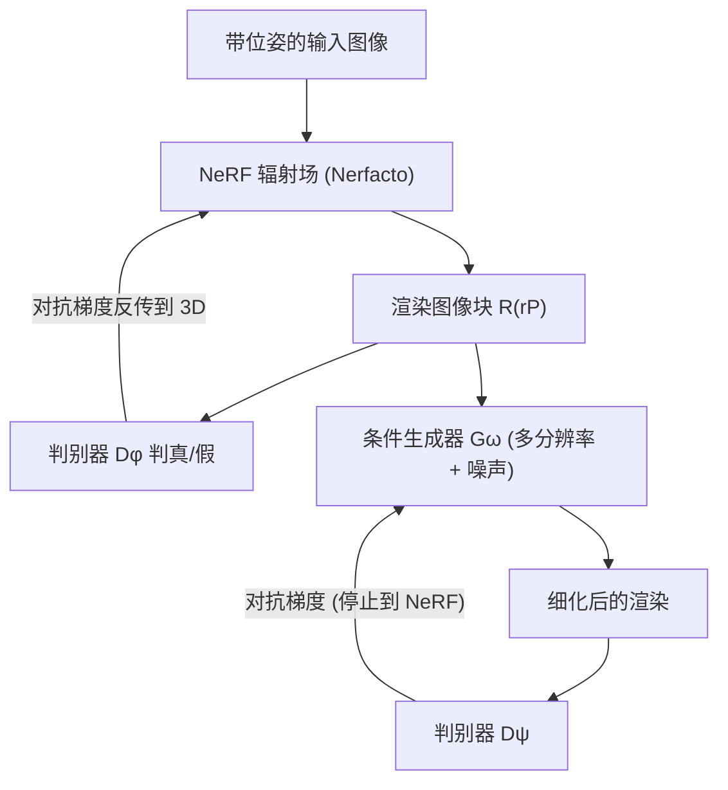

## 一句话总结

GANeRF 用一个逐场景的对抗判别器把"图像块是否真实"的梯度反传进 NeRF 的三维表示，再叠加一个条件生成器细化渲染结果，从而在观测不足、光照变化等困难区域显著修复渲染瑕疵。

## 研究背景

NeRF 在新视角合成上表现出色，但即便采集充分，重建结果仍会因观测稀疏、轻微光照变化、反射或弱纹理区域而产生瑕疵。其根源之一是形状-辐射歧义（shape-radiance ambiguity）：一组训练图像可以在不尊重真实几何的前提下被完美重现，代价是新视角质量急剧下降，出现典型的"云雾状漂浮物"（floater）伪影。

已有工作大多依赖启发式正则（促进峰值密度、注入噪声、表面平滑）或外部先验（预训练深度/法向、扩散模型、跨场景泛化模型）。但几何先验在稠密覆盖场景中收益有限，而跨场景先验受训练数据分布约束，往往缺乏细节或对场景内容与轨迹施加强假设。本文提出用 GAN 的图像生成能力，在**逐场景**、**不依赖外部数据**的前提下直接修复三维表示中的瑕疵。

## 方法

核心思想有两点：一是让 2D 图像块判别器通过对抗训练把梯度反传到 3D 辐射场，使 NeRF 渲染出的图像块贴近场景真实图像块分布；二是在此之上用一个条件生成器对 2D 渲染进行多尺度细化。

**NeRF 基础。** 方法建立在 Nerfacto 上（融合 Instant-NGP 的哈希网格场与 MipNeRF-360 的多级提议采样），也可换成 Instant NGP 等其他骨干。辐射场对空间点给出密度 $$\sigma_\theta(\boldsymbol{x})$$ 与依赖视角方向的颜色 $$\xi_\theta(\boldsymbol{x}, \boldsymbol{d})$$，沿射线积分得到像素颜色：

$$
R_\theta(\boldsymbol{r}) = \int_{0}^{\infty} \sigma_\theta(\boldsymbol{r}_t)\, \exp\!\left(-\int_{0}^{t} \sigma_\theta(\boldsymbol{r}_s)\, ds\right) \xi_\theta(\boldsymbol{r}_t, \boldsymbol{d})\, dt
$$

基础颜色损失为逐射线的均方误差：

$$
\mathcal{L}^{N}_{\mathrm{rgb}}(\theta) = \mathbb{E}_{p}\, \lVert R_\theta(\boldsymbol{r}) - \boldsymbol{c} \rVert_2^2
$$

**判别器优化 NeRF。** 利用场景中重复元素与相似表面的先验，判别器 $$D_\phi$$ 学习图像块分布，对抗目标（带 $$R_1$$ 梯度惩罚）为：

$$
\mathcal{L}^{N}_{\mathrm{adv}}(\theta, \phi) = \mathbb{E}_{q}\left[ f\!\left(D_\phi(R_\theta(\boldsymbol{r}_P))\right) + f\!\left(-D_\phi(\boldsymbol{c}_P)\right) - \lambda^{N}_{\mathrm{gp}} \lVert \nabla D_\phi(\boldsymbol{c}_P) \rVert_2^2 \right]
$$

其中 $$f(x) = -\log(1 + \exp(-x))$$。再加上基于 VGG19 的感知损失 $$\mathcal{L}^{N}_{\mathrm{perc}}$$，NeRF 的总损失为：

$$
\mathcal{L}^{N}(\theta) = \mathcal{L}^{N}_{\mathrm{rgb}}(\theta) + \lambda^{N}_{\mathrm{perc}} \mathcal{L}^{N}_{\mathrm{perc}}(\theta) + \lambda^{N}_{\mathrm{adv}} \max_{\phi \in \Phi} \mathcal{L}^{N}_{\mathrm{adv}}(\theta, \phi)
$$

训练时交替更新 NeRF 与判别器以应对鞍点问题；关键在于把对抗梯度**直接反传到 3D 表示**，从而以多视角一致的方式修复几何与外观。

**条件生成器。** 借鉴 StyleGAN2 但改为条件式并去掉映射网络。输入 NeRF 渲染块经 6 次 2 倍下采样，从 $$4\times4$$ 起逐级用卷积提取特征、上采样并注入随机噪声 $$\boldsymbol{z}$$，最终输出 $$256\times256$$，充当随机去噪器。生成器用独立的第二判别器 $$D_\psi$$ 训练（因为 NeRF 与生成器引入的误差类型不同），并停止到 NeRF 的梯度（记为 $$\perp\theta$$）。生成器损失结合对抗损失、感知损失与 $$L_1$$ 颜色损失：

$$
\mathcal{L}^{G}(\omega \mid \theta^{\star}) = \lambda^{G}_{\mathrm{perc}} \mathcal{L}^{G}_{\mathrm{perc}}(\omega \mid \theta^{\star}) + \lambda^{G}_{\mathrm{rgb}} \mathcal{L}^{G}_{\mathrm{rgb}}(\omega \mid \theta^{\star}) + \max_{\psi \in \Psi} \mathcal{L}^{G}_{\mathrm{adv}}(\omega, \psi \mid \theta^{\star})
$$

推理时生成器可全卷积地作用于高分辨率图像。

## 实验结果

在 ScanNet++ 五个室内场景与 Tanks and Temples 四个大尺度进阶场景上评估，指标含 PSNR、SSIM、LPIPS、KID。下表为 Tanks and Temples 结果（测试视角为空间外分布）：

| 方法 | PSNR↑ | SSIM↑ | LPIPS↓ | KID↓ |
| --- | --- | --- | --- | --- |
| Mip-NeRF 360 | 18.5 | 0.709 | 0.327 | 0.0277 |
| Instant NGP | 19.3 | 0.700 | 0.369 | 0.0466 |
| 4K-NeRF | 19.4 | 0.656 | 0.356 | 0.0353 |
| Nerfacto | 19.5 | 0.716 | 0.329 | 0.0432 |
| Nerfacto + extra capacity | 19.6 | 0.733 | 0.291 | 0.0314 |
| Nerfacto + pix2pix | 20.6 | 0.739 | 0.242 | 0.0115 |
| Nerfacto + ControlNet | 19.6 | 0.706 | 0.213 | 0.0085 |
| Ours w/o discriminator | 20.6 | 0.745 | 0.192 | 0.0102 |
| Ours w/o generator | 19.9 | 0.739 | 0.251 | 0.0130 |
| **Ours** | **20.9** | **0.776** | **0.169** | **0.0065** |

本方法在感知指标上提升最大（跨场景 LPIPS 相对下降 28–48%），同时 PSNR、SSIM 也一致更优。消融显示：去掉判别器（退化为纯 2D 后处理）在所有指标下降，证明把梯度反传到 3D 的重要性；去掉生成器则渲染变糊。视角一致性评估表明，先反传到 NeRF 再优化能把生成器引入的额外不一致减少一半以上，而 ControlNet 精修虽视觉质量高却高度不一致。在把最大场景图像从 800 减到 25 张的极稀疏设置下，本方法仍以相近幅度稳定超过 Nerfacto。

## 亮点与局限

亮点：
- 首次提出把 2D 判别器的对抗梯度**直接反传进 3D 辐射场**，以多视角一致的方式修复瑕疵，而非停留在 2D 后处理。
- 条件生成器多尺度细化进一步提升细节；渲染速度与 Nerfacto 基本持平（生成器前向仅约 13ms）。
- 逐场景优化，无需任何外部训练数据，可灵活替换 NeRF 骨干（Instant NGP 亦获相近提升）；在低覆盖区域相对提升约为高覆盖区域的两倍。

局限：
- 判别器逐场景训练，缺乏更通用的跨场景先验；朴素的泛化判别器易退化为"场景分类器"。
- 仅针对静态场景，尚未扩展到可变形/动态 NeRF。
- 生成式方法存在幻觉风险，尤其重建文字/铭文时可能产生错误字符；训练耗时（约 2 天 10 小时）明显长于 Nerfacto。
- 从训练位姿附近高斯采样"未见视角"给判别器的尝试未带来提升，需更精细的采样策略。

## 延伸思考

- 把逐场景判别器换成跨场景的可泛化先验，同时避免"场景分类器"塌缩，是提升数据效率的关键方向——或可与大规模场景语料上的扩散/生成先验结合。
- 对抗梯度反传到 3D 的思路天然可迁移到 3D Gaussian Splatting 等更新的显式表示，判别器约束或能缓解其在稀疏观测下的伪影。
- 幻觉与视角一致性的权衡在文字、反射等结构化区域尤为突出，如何在生成先验与几何忠实之间设计可控约束值得深入。
