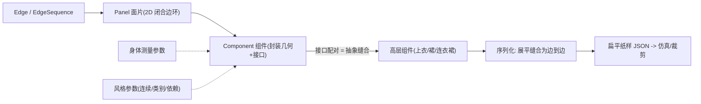

## 一句话总结

提出首个面向服装建模的领域特定语言（DSL）GarmentCode，把面向对象编程的封装与抽象思想引入缝纫纸样构造，让人们以分层、组件化、可参数化的方式设计并复用可交换的服装部件，并据此搭建了一个参数化服装配置器。

## 研究背景

- 领域现状：服装建模是数字人和服装工业的核心任务，工业级工具（如 Clo3D）依赖设计师手工绘制与调整纸样，能做复杂服装但过程繁琐；已有研究要么从 3D 模型/草图/图像反推单件纸样，要么用参数化模板采样生成合成数据集。
- 核心痛点：几乎没有工具能弥合"高层构造目标"与"底层纸样几何编辑"之间的鸿沟——难以做组件的组合/替换、语义化编辑，以及在保持纸样合法性的前提下做设计探索；已有参数化框架只支持有限的连续参数，不支持离散/类别参数、参数依赖，也缺少省道、抽褶等高级特征。
- 本文 idea：既然服装设计空间复杂度高，就借用面向对象编程管理复杂系统的经验，用"组件—接口—抽象缝合"的层级表示来描述参数化纸样；相同语义接口的组件可以互换，从而实现真正的模块化拼装，同时自动维护纸样合法性。

## 方法

整体框架：GarmentCode 以 Python 为宿主语言，用五类基本类型描述纸样——边（Edge）、边序列（EdgeSequence）、面片（Panel，作为特殊的组件）、组件（Component）、接口（Interface）。一个组件封装自己的几何，只对外暴露抽象的语义接口；两个组件的接口相连即"抽象缝合"，从而组合出更高层的组件。配套一系列辅助算子（省道、投影、拷贝、法线判定、对齐等）自动化底层构造，最终把层级结构序列化成扁平纸样交给下游仿真。

关键设计：

1. **层级化组件与面片**：面片是"叶子"组件，定义为有向边组成的闭合分段光滑曲线（支持直线、圆弧、二/三次贝塞尔），控制点用边局部坐标系表示，因而对平移旋转不变、均匀缩放保曲率。面片、面片的缝合体、更高层的组合都统一为组件对象，天然支持封装与复用。

2. **抽象缝合与接口互换性**：缝合不绑定到具体面片的边，而是定义在组件暴露的"接口"（一组边的集合）之间。只要两个组件实现同名接口，无论内部几何如何不同都能互换——例如"上衣底边接下装顶边"这条抽象缝合，既能连合身上衣与喇叭裙（1950 年代连衣裙），也能连直筒上衣与裤子（连体衣）。缝合在声明时被"展平"：因两侧接口边数/总长可能不等，算法把边长表示为占接口总长的比例，再把一侧的比例投影到另一侧生成新顶点，双向重复，得到一一对应的边到边缝合（可处理抽褶等长度不匹配情形）。

3. **投影算子**：为了让一个面片上的接口形状与另一面片几何对应（如袖子开口对应衣身袖窿），又不破坏封装，GarmentCode 提供"投在角上""投在边上"两类投影，均formulate为在曲线参数空间里的优化问题：在角上投影求解

$$\arg\min_{t_1,t_2}\; \lVert (e_1(t_1)-e_2(t_2)) - \text{proj\_vec}\rVert^2,\quad \text{s.t.}\; 0\le t_1,t_2\le 1$$

其中 $$e_1,e_2$$ 是目标角的两条边，$$\text{proj\_vec}=\text{proj.end}-\text{proj.start}$$ 是投影形状开口向量；在边上投影则寻找关于注入点 $$e(t)$$ 等距、能容纳投影形状开口的两个点。找到点后把目标边在该处切开、注入投影形状、删去多余"切口"。这让袖型、领型可即插即换。

4. **参数化与辅助算子**：把参数分为身体测量参数与风格参数两组，风格参数还带取值范围与类型（数值/布尔/类别），支持设计采样；部分身体参数可由公式派生，风格参数可依赖身体参数（如裙长取腿长的比例），从而天然支持身体重定向并保证纸样合法。辅助算子还包括三角省道生成、按目标性质定义贝塞尔曲线、镜像/沿线或沿圆的智能拷贝、由重心叉积自动判定面片正反面法线、以及按接口 3D 重心对齐组件位置等。

## 实验结果

论文以定性展示为主，通过若干应用案例验证 DSL 的表达力与复用性；下表汇总其主要评估维度与结论：

| 评估维度 | 做法 | 结论 |
|----------|------|------|
| 元件参数化 | 同一袖子组件仅改几个参数 | 生成从现代街头到复古气球袖等多种廓形 |
| 复杂度管理 | 复用基础裙（铅笔/喇叭/抽褶）搭复合多层裙 | 新增复合裙组件仅约 50 行代码即无缝接入库 |
| 身体重定向 | 取 SMPL 多种体型手工测量后套用 | 合身廓形（沙漏形、上窄下宽铅笔裙）在大幅体型变化下保持 |
| 复现真实纸样 | 参数化复现 MoodFabrics"Birch dress" | 整体 3D 形状与设计意图吻合，细节因架构限制有偏差 |

与已有系统的能力对比（相对 Clo3D 与 Korosteleva & Lee 2021）：GarmentCode 同时支持纸样定义、构造工具、模块化拼装，以及连续/类别/依赖三类参数，而两个基线在模块化与参数化类型上均只有部分或不支持。

## 亮点与局限

- 亮点：
  - 首个服装建模 DSL，把 OOP 的封装/抽象引入纸样构造，组件按语义接口即插即换，新增一个组件即让设计空间指数增长。
  - 全程工作在"纸样空间"，每个实例都是合法、可仿真、可裁剪的纸样；参数化直接绑定身体测量，重定向能力内建于建模阶段而非后处理。
  - 抽象缝合展平、投影算子、法线自动判定等把大量底层繁琐操作自动化，配置器可让终端用户在可控范围内调整设计。

- 局限：
  - 面片定义被简化为单一闭合边环，不支持内部环，因而无法表示带孔洞的面片（如菱形省道），复现真实纸样时腰部出现多余缝合。
  - 不支持折叠线与多层面料缝合，导致袖片要拆成两片、克夫/翻领只能做单层。
  - 编程范式偏离传统设计流程，需显式指定面片顶点坐标，对行业采用是门槛；诸多辅助算法作者自陈只求简单可用、非最优。

## 延伸思考

- 这项工作把"参数化模板 + 可交换组件"作为合成服装数据集的天然生成器，为数据驱动的虚拟试衣、服装重建、神经仿真提供了廓形丰富且带合法纸样的训练来源，可与后续从图像/文本生成纸样的工作（如基于大模型的程序合成方法）形成上下游关系。
- 作者提出的"编程式构造 + 可视化面片/边几何编辑"结合是值得跟进的方向：既保留 DSL 的可复用与算法化能力，又降低指定顶点坐标的门槛，可能是让此类工具真正走向设计师的关键。
- 抽象缝合的"按接口而非按边"思想，本质是给几何建模引入了类型化的可替换接口，这一模式或可迁移到其他需要模块化拼装的几何/CAD 领域。
