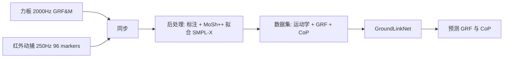

## 一句话总结

本文构建了 GroundLink——首个把标准动作捕捉与实验室级地面反作用力（GRF）和压力中心（CoP）真实测量同步配对的公开数据集，并用一个简洁的神经网络 GroundLinkNet 证明：仅凭人体运动学就能准确预测出物理接触力。

## 研究背景

- 领域现状：人体运动的物理合理性对动画、机器人、生物力学、运动科学等都至关重要。但绝大多数动捕数据集只记录运动学（关节位置、姿态），缺少与之配对的物理量；生物力学界虽有力板测量的 GRF 数据，却往往只针对单一运动类型（步态、平衡、跑步）且规模有限。
- 核心痛点：现有含接触信息的动捕数据集（如 UnderPressure、PSU-TMM100）大多只用鞋垫压力传感器，仅能得到竖直方向 GRF 的大小（vGRF），既缺水平分量也缺 CoP；同时运动类型单一，难以支撑对细微、平衡类动作的物理理解。
- 本文 idea：把"完整模拟人体物理"这件难事当成黑盒，只要聚焦地面接触、并有足够多真实世界的物理+运动观测，就能用数据驱动方式学出来。为此在生物力学实验室里用嵌地力板+红外动捕，采集 3D GRF、2D CoP 与全身运动学同步的数据集。

## 方法

整体分为两条主线：一是数据的采集与后处理管线，二是验证数据价值的基准模型 GroundLinkNet。数据侧在实验室用高采样率力板和红外动捕同步采集力与运动，再经标注和 MoSh++ 拟合得到统一的运动参数；模型侧用一个简单时序卷积网络，从姿态和体型预测 GRF 与 CoP。

关键设计：

1. **采集协议**：邀请 7 名体型各异的参与者（身高 1.53–1.95m），完成 19 种动作，重点覆盖瑜伽、太极、芭蕾、网球挥拍等细微与重心转移类运动。用 20 台 Qualisys 红外相机（250 Hz）捕运动学、5 块嵌地力板（2000 Hz，后处理低通滤波至 20 Hz）捕力。每只脚需踩在独立力板上以区分左右脚。最终得到 368 条处理后的运动序列、约 159 万帧。
2. **CoP 的物理定义**：压力中心是 GRF 的作用点，恒在地面（z=0），由力和力矩解析求得：
   $$\text{CoP}_x = -\frac{M_y}{F_z}, \quad \text{CoP}_y = \frac{M_x}{F_z}$$
3. **两种人体表示**：一是从 41 个关节标记重建的骨架（关节位置 $$\boldsymbol{p} \in \mathbb{R}^{23\times 3}$$，仅用于与前作对比），二是用 MoSh++ 从 26 个标记拟合 SMPL-X 得到姿态 $$\theta$$ 与体型 $$\beta$$ 参数（用于训练与评测），后者能提供带体型的网格表面。
4. **GroundLinkNet 与角色空间表示**：网络输入为关节相对旋转 $$\theta \in \mathbb{R}^{k\times 3}$$、盆骨轨迹与可选的 16 维体型参数 $$\beta$$，输出 3D GRF 与 CoP。为避免全局坐标缺乏平移旋转不变性的问题，作者以投影到地面的盆骨为原点做变换：$$\boldsymbol{x}_{\text{character}} = T^{-1}\cdot \boldsymbol{x}_{\text{pelvis}}$$，$$\text{CoP}_{\text{character}} = T^{-1}\cdot \text{CoP}_{\text{global}}$$。网络由 4 层跨 7 帧的 1D 时序卷积 + 3 层逐帧全连接组成，ELU 激活，末层用 softplus 保证 vGRF 非负；训练用 MSE 损失 $$L = \frac{1}{N}\sum_{i=1}^{N}\lVert \boldsymbol{F}_i - \hat{\boldsymbol{F}}_i \rVert^2$$。

## 实验结果

主实验是与 UnderPressure 的 vGRF 预测对比（误差为按体重归一化的 MSE，左脚/右脚）。尽管 GroundLinkNet 承担的是更难的完整 3D GRF+CoP 预测任务，其 vGRF 预测精度仍全面优于只做 vGRF 的 UnderPressure。

| 动作 | UnderPressure（左/右） | GroundLinkNet（左/右） |
|------|------------------------|------------------------|
| Chair | 0.94 / 0.19 | 0.08 / 0.02 |
| Tree (arm down) | 0.78 / 0.10 | 0.14 / 0.03 |
| Dog | 0.69 / 0.13 | 0.04 / 0.07 |
| Jumping Jack | 0.60 / 0.50 | 0.08 / 0.08 |
| Stationary Hopping | 0.80 / 0.27 | 0.23 / 0.03 |
| Total | 0.44 / 0.23 | 0.18 / 0.07 |

此外，跨参与者交叉验证给出了各动作在 $$F_x, F_y, F_z$$ 及 CoP 上的误差报告；对无力数据的纯运动学数据集（如 ACCAD）做定性测试，模型对站姿、武术出拳等静态姿势能给出可信 GRF；体型测试也验证了体型越大 vGRF 越高的预期趋势。

## 亮点与局限

- 亮点：
  - 图形学社区首个包含实验室级 3D GRF + 2D CoP 且与全身运动学同步的公开动捕数据集，力数据为真实测量而非模拟，精度高。
  - 覆盖瑜伽、太极、网球、芭蕾等大量细微与重心转移类动作，而非单一步态，填补了此前数据集的空白。
  - 证明了简洁网络仅凭运动学（+体型）即可泛化预测接触力，为物理感知的数字人应用提供了可行路径；数据、代码、模型全部公开。
- 局限：
  - 以投影盆骨为角色空间原点，导致 CoP 预测存在明显偏移，作者建议改用投影足部作参考系。
  - 行走仅采集最多三步的短距离数据，模型难以泛化到其他类型的运动（locomotion）。
  - 模型对上肢姿态（如手部旋转）的小变化过于敏感，反映训练数据在孤立上肢动作等分布外场景上仍不足。

## 延伸思考

数据稀缺是本工作最根本的瓶颈——7 名参与者、159 万帧对深度模型而言并不充裕，这也解释了模型在分布外动作上的脆弱性。两个自然的方向：一是设计更善于从少量数据学习物理的表示与学习范式；二是用物理仿真扩充数据，同时把已采集的真实物理量作为监督或校准信号，形成"真实测量 + 仿真增强"的闭环。此外，把角色空间原点从盆骨换成投影足部这类看似工程性的改动，实际触及了接触力预测中"以何处为参考系"的本质问题，值得后续在 GRF/CoP 估计任务中系统研究。该数据集也已成为后续 GRF 估计工作（如物理引导的接触动力学估计）的常用基准。
