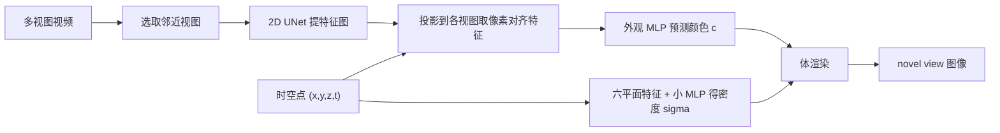

## 一句话总结

Im4D 用"全局网格几何 + 多视图图像外观"的混合表示，把动态多视频重建成既跨视角一致、又保留精细纹理的 4D 模型，训练几小时即可，并在单张 RTX 3090 上达到 79.8 FPS 的实时渲染。

## 研究背景

- 领域现状：动态视角合成（从多视频重建可自由视角、自由时刻渲染的 4D 场景）主要有两条路线。一条是基于网格/显式特征的全局表示（如 K-Planes、DyNeRF），把时间当作额外维度塞进隐式场，渲染跨视角一致；另一条是基于多视图图像的渲染（如 IBRNet、ENeRF），用邻近输入图像的特征直接推断颜色，纹理细节好、训练快。
- 核心痛点：网格类方法在复杂动态场景（衣物褶皱、大幅运动）里抓不住外观细节，画面发糊；想变清晰就得堆模型体积或把序列切段用多个模型，训练时间和存储随之线性膨胀。图像类方法虽细节好，但本质是"逐视角重建"而非全局重建，无法保证视角间一致，会出现闪烁、鬼影。
- 本文 idea：两者优势互补——几何用全局表示保证一致性，外观用多视图图像保证细节。于是提出混合表示 Im4D：几何是一个网格化的 4D 密度函数（全局、连续），外观则不靠网络"记住"每个时空点每个方向的辐射，而是学会从邻近视图的图像特征里"推断"颜色，从而大幅降低网络的学习负担。

## 方法

Im4D 把场景拆成两块：一个全局的网格化 4D 几何（只管密度 $$\sigma$$），一个基于多视图图像的外观模型（只管颜色 $$c$$），再用体渲染把二者合成像素。

- **网格化 4D 几何（全局、保一致）**：把静态场景常用的 3D 密度函数扩展成 4D，输入 $$(x,y,z,t)$$ 输出密度 $$\sigma = F_\sigma(x,y,z,t)$$。为了省存储，仿照三平面思路，把 4D 体积分解成六个正交平面 $$\lbrace P_i \mid i \in xy,xz,yz,xt,yt,zt \rbrace$$，每个平面插值得到特征后拼接，再喂给小 MLP $$m_\sigma$$ 得到密度：$$\sigma = m_\sigma(p_{xy}\oplus p_{xz}\oplus p_{yz}\oplus p_{xt}\oplus p_{yt}\oplus p_{zt})$$。因为几何是一个全局连续函数，配合体渲染天然保证跨视角一致，这正是逐视角图像方法做不到的。关键点是：只有几何做成全局函数，外观不这么做。
- **多视图图像外观（推断而非记忆）**：渲染某个时空视角时，先按相机位置远近选出 $$N_v$$ 张邻近输入图，用 2D UNet 提特征图 $$M_i$$。把时空点 $$(x,y,z)$$ 投影到各视图取像素对齐特征 $$f_i$$ 与像素颜色 $$c_i$$，用方差与均值聚合成融合特征 $$f = \mathrm{VAR}(\lbrace f_i \rbrace)\oplus \mathrm{MEAN}(\lbrace f_i \rbrace)$$。颜色用一个对输入顺序不变的 pointnet 式结构加权得到：$$c = \dfrac{\sum_i^{N_v} m_c(f, f_i, \mathrm{diff}(d, d_i)) \cdot c_i}{\sum_i^{N_v} m_c(f, f_i, \mathrm{diff}(d, d_i))}$$，其中 $$\mathrm{diff}(d, d_i)$$ 是目标视线与第 $$i$$ 个视图视线的归一化夹角。这样网络只需学"如何从图像特征推断颜色"，而不用在 $$R^6$$ 空间里死记每个点每个方向的辐射。
- **高效训练策略**：外观模型是"推断型"，可以少训。先把图像特征网络与几何联合训练 $$N_j$$ 步（默认 5000），之后每隔 $$N_f$$ 步（默认 20）才微调一次特征网络，其余迭代冻结外观分支以省掉反传时间，从而加速单次迭代。实验里 100K 步的图像外观模型已超过不用图像外观、训练 480K 步的版本。
- **高效渲染**：利用全局几何，预先算一个体素占用/空置的二值场来引导采样、跳过空区。二值场极小（ZJU-MoCap 300 帧 64×64×128 仅 18.75MB，可无损压到 1.1MB）。这比 ENeRF 更省——全局粗几何只算一次，而 ENeRF 每次渲染都要重估逐视角深度。用 NerfAcc 实现，加速后画质仅轻微下降（PSNR 降 0.09）。

## 实验结果

在最具挑战性的 DNA-Rendering 数据集上与主流方法对比（衣物纹理复杂、运动大）。训练时间为 0 表示用官方预训练模型直接测试。可见 Im4D 在极短训练时间下就取得最好的 PSNR/SSIM/LPIPS，兼顾质量与效率。

| 方法 | 训练时长(h) | PSNR ↑ | SSIM ↑ | LPIPS ↓ |
|------|------------|--------|--------|---------|
| K-Planes | 8 | 27.45 | 0.952 | 0.118 |
| IBRNet | 3.5 | 27.85 | 0.967 | 0.081 |
| ENeRF | 3.5 | 28.07 | 0.968 | 0.066 |
| Im4D | 0.51 | 27.14 | 0.961 | 0.083 |
| Im4D | 3.33 | 28.99 | 0.973 | 0.062 |

其余实验结论：在 ZJU-MoCap、NHR、DyNeRF 上均取得或持平最优指标，且训练时间显著短于全局方法（DyNeRF/MLP-Maps 需 24 小时以上）。消融显示，去掉图像外观模型会丢失细节、去掉全局网格几何会出现大量漂浮物，二者缺一不可；专门的训练策略约省 1 小时训练时间。渲染时间上，加速策略把 512×512 从 2.22 FPS 提升到 79.8 FPS。

## 亮点与局限

- 亮点：
  - "几何全局 + 外观图像"的分工设计切中要害——既解决网格法糊、又解决图像法闪，思路清晰且可解释。
  - 训练效率高（几小时 vs 竞品一天以上），得益于外观模型"只推断不记忆"和冻结外观分支的训练策略。
  - 全局二值场引导采样实现真正实时（79.8 FPS），且几何只需算一次，比逐视角深度估计的 ENeRF 更省。
  - 外观直接复用原始视频，可借成熟视频压缩把图像序列压得很小（NHR 上 300MB 压到 11MB），存储友好。
- 局限：
  - 渲染时仍需访问原始多视图图像并过特征网络，属于依赖输入图像的 IBR 范式，部署时要携带视频数据。
  - 几何用离散时间步的六平面表示，面向输入帧的离散时刻，对任意连续时刻的插值/外插能力文中未充分展开。
  - 主要针对多视角密集采集的可控场景（人体、物体），对单目或极稀疏视角、超大规模室外长序列的适用性有限（作者也提到长复杂序列是难点）。

## 延伸思考

- 与同期"把长序列切段"的思路（如自适应分段）相比，Im4D 靠全局几何 + 图像外观避免了分段带来的存储线性增长，二者可否结合：分段管理长时序、段内用 Im4D 保细节？
- 外观走 IBR、几何走网格的解耦，与后来 3D Gaussian Splatting 的显式点表示形成对照——若把几何换成动态高斯、外观仍走图像特征推断，是否能进一步提速并去掉体渲染采样开销？
- "让网络推断而非记忆"是降低学习负担的通用范式，值得迁移到其他 4D/大场景重建任务；聚合用方差+均值也提示了对视角数量与遮挡更鲁棒的特征聚合设计空间。
