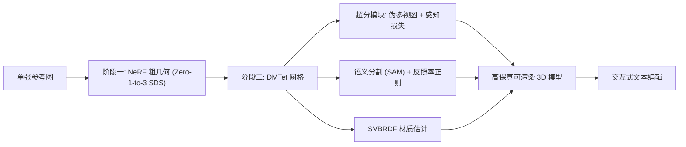

## 一句话总结
HyperDreamer 从单张图像生成 360° 可看、可重渲染、可局部编辑的高保真 3D 模型，靠超分监督、语义感知的材质估计和交互式文本编辑，把生成结果推向"生成后可用"。

## 研究背景
- 领域现状：单图 3D 生成近年借助 2D 扩散先验（DreamFusion、Magic3D、Zero-1-to-3 等）取得显著进展，能从一张图或一段文本得到大体合理的 3D 内容。
- 核心痛点：现有方法"生成后不可用"。一是普遍用隐式表示，用户没法自由缩放、重渲染或编辑；二是 2D 扩散模型训练数据里带着光照/阴影，会把这些效果"烘焙"进纹理，导致重光照失真（例如泰迪熊背面被生成成全黑）。
- 本文 idea：围绕"可看、可渲染、可编辑"三个目标重构 pipeline——用超分模块补高频纹理细节，用语义先验+去渲染先验约束反照率与材质，用交互式分割配合法线引导的扩散实现局部文本编辑。

## 方法
整体框架分两阶段生成：第一阶段用 Instant-NGP 加速的 NeRF 做粗几何，由 Zero-1-to-3 的 SDS 损失引导；第二阶段切换到 DMTet 显式网格表示，在这一阶段接入超分、语义分割和材质三个模块，产出高分辨率纹理网格与可分解的 PBR 材质。

关键设计：

1. **360° 高分辨率纹理生成**：Zero-1-to-3 只在 256×256 上训练，直接高分辨率做 SDS 会模糊。作者对若干新视角先用 Zero-1-to-3 各生成多张图，再用超分网络放大成伪多视图监督。由于这些图并非严格 3D 一致，用逐像素损失会不稳定，因此改在特征空间用感知损失，只对齐内容与风格而不要求像素级对齐。

2. **语义感知的反照率正则**：先用 SAM 对参考图过分割，再按特征相似度阈值聚成少数几个独立语义区域，并训练一个 MLP 分支把这套语义标签一致地贯穿到整个网格与新视角。基于"同一语义区域反照率相近"的假设，维护一个随训练更新的语义反照率库 $$A_s$$，对每个新视角预测的分割区域做高斯加权平均后逼近库值：

$$L_a=\sum_{i=1}^{N_s}\lVert F_{gaussian}(A^i_{pred})-A^i_s\rVert_2^2$$

同时引入单图去渲染框架估计参考图的反照率作为额外监督，缓解扩散偏置与参考视角光照被烘焙进反照率的问题。

3. **SVBRDF 外观建模**：引入基于物理的渲染，用球面高斯闭式近似渲染方程。环境光表示为多个球面高斯之和 $$L_i(\omega_i)=\sum_{k=1}^{M}G(\omega_i;\xi_k,\lambda_k,\mu_k)$$，材质拆成漫反射与镜面项 $$f_r(\omega_o,\omega_i;x)=f_d(x)/\pi+f_s(\omega_o,\omega_i;x)$$，其中漫反射用哈希编码的 MLP，镜面项用半程向量 $$h$$ 表达。并假设同语义区域材质相近，对粗糙度与镜面通道施加一致性约束，从而做出空间可变但不退化的材质。

4. **交互式局部编辑**：用两张 UV 图分别缓存正/负点提示掩码，在目标视角用 patch 采样生成正负提示喂给 SAM，得到细化分割后经反渲染投影回 UV 掩码，实现网格上的交互分割。文本编辑用基于 ControlNet 的法线到图像模型，把每个视角划成 $$M_{new}$$、$$M_{keep}$$、$$M_{refine}$$ 三块，用 blended diffusion 只在目标区域重绘并refine 视角交界处，保证局部编辑且全局一致。

## 实验结果
在自采 20 张网络图与 10 个 DTU 实例上，与 Shap-E、NeuralLift-360、RealFusion、Zero-1-to-3 对比三个指标（Contextual 距离、CLIP-Score、Perceptual/LPIPS）。下表为自采数据上的主对比：

| 方法 | Contextual ↓ | CLIP ↑ | Perceptual ↓ |
|------|--------------|--------|--------------|
| Shap-E | 4.95 | 0.68 | - |
| NeuralLift-360 | 4.71 | 0.78 | 0.67 |
| RealFusion | 2.25 | 0.79 | 0.17 |
| Zero-1-to-3 | 3.36 | 0.74 | 0.13 |
| 本文 | 2.11 | 0.86 | 0.10 |

HyperDreamer 在三项指标上均领先，DTU 数据上结论一致。消融显示：超分模块显著增强高频纹理细节、支持放大观看；参考视角反照率损失能把光照/阴影从反照率里剥离；交互分割中同时输入正负 patch 提示比只用随机正提示在复杂离散区域更鲁棒。

## 亮点与局限
- 亮点：
  - 首次把"生成后可用"三要素（可看/可渲染/可编辑）统一进单图 3D 生成框架。
  - 语义感知的反照率与材质正则很巧妙地缓解了 2D 扩散先验的光照烘焙偏置，产出可重光照的 PBR 材质。
  - 交互式编辑只需几次点击 + 文本，把 SAM 的 2D 分割能力提升到 3D 网格上的局部编辑。
- 局限：
  - 依赖 Zero-1-to-3 等外部先验，新视角一致性仍不完美，才需要用感知损失回避像素对齐。
  - "同语义区域材质/反照率相近"是简化假设，对材质高度非均质的物体可能失真。
  - 生成走两阶段优化 + 多个大模型（SAM、去渲染、ControlNet），流程较重，未报告端到端耗时。

## 延伸思考
把 SAM 的语义先验用作材质分组约束是一条值得延展的思路，可推广到后续以 3D Gaussian Splatting 或大重建模型为骨干的生成方法中，用语义把材质/反照率约束得更物理合理。交互式"点选 + 文本"的编辑范式也预示了 3D 内容创作从"一次性生成"走向"可迭代精修"的工作流；后续若能把重光照质量做实验化验证（而非主要靠 Blender 定性展示），会更有说服力。
