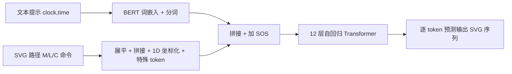

## 一句话总结

IconShop 把 SVG 图标的路径序列与文本描述统一拼接、离散化成一个可唯一解码的 token 序列，用自回归 Transformer 做"预测下一个 token"训练，从而实现高质量、可控且灵活的文本引导矢量图标合成。

## 研究背景

- 领域现状：文本到栅格图像的生成已相当成熟，人们希望在矢量图形（SVG）领域复现类似能力。现有做法分两条路——图像式（文本→栅格图→矢量化）借助 Stable Diffusion 等模型再做图像矢量化；语言式（文本→SVG 脚本）直接用 GPT-4 等大语言模型输出 SVG 代码。
- 核心痛点：图像式方法因为底层模型是在栅格图上训练的，很难生成简洁几何、平涂色块的图标风格，矢量化后路径粗糙、有尖角和交叉；语言式方法受限于 SVG 语法复杂，朴素 tokenization 会产生冗长序列，GPT-4 只能拼几个基本几何形状，复杂度和多样性都不足；优化式方法（如 CLIPDraw、VectorFusion）逐图优化，慢到无法实时。
- 本文 idea：SVG 本身就是序列化的——一个脚本是若干路径，每条路径又是若干绘制命令。把这一序列特性直接暴露给自回归 Transformer，并把文本也作为前缀序列拼进去，就能用标准的"预测下一个 token"训练同时支持无条件生成和文本条件生成。

## 方法

整体框架：先把每个 SVG 图标简化为仅由三种基本命令（Move To、Line To、Cubic Bézier）构成的路径集合，再把所有路径展平、拼接、离散化成一个可唯一解码的 token 序列；文本经预训练 BERT 词嵌入编码后作为前缀拼在 SVG 序列之前；两段拼成的序列交给一个 12 层自回归 Transformer 解码器学习联合分布。

关键设计：

1. **命令简化与 tokenization**：借鉴 DeepSVG，去掉所有属性，只保留 M、L、C 三种命令，复杂形状（矩形、圆）用它们的组合逼近。展平时在每条路径前加 `<BOP>` 保证可逆还原；把 2D 坐标 $$(x_0, y_0)$$ 用 $$x_0 \times w + y_0$$ 压成 1D（$$w$$ 为边界框尺寸），使参数序列长度减半；序列末尾加 `<EOS>`。这样一张 100×100 的图标只需 $$100^2 + 6$$ 个离散 token 类别。

2. **因果掩码实现双向填充（FIM）**：普通自回归只能从左到右生成，无法做图标编辑这类需要双向上下文的任务。作者借鉴 CM3/InCoder 的 causal masking：把序列切成 $$[\text{Left} : \text{Span} : \text{Right}]$$，重排成 $$[\text{Left} : \langle\text{Mask}\rangle : \text{Right} : \langle\text{Mask}\rangle : \text{Span} : \langle\text{EOM}\rangle]$$。训练时对 50% 数据施加该掩码，并把 `<Mask>` 排除在损失外。这样同一个模型既能从左到右生成，也能在中间"填空"，无需改动架构。

3. **模型架构与嵌入**：SVG 嵌入模块用可学习矩阵把 one-hot token 映射到 $$d_{\text{model}}$$ 维，并额外用两个矩阵 $$\boldsymbol{W}_x, \boldsymbol{W}_y$$ 增强坐标信息，再加位置编码；文本嵌入模块直接取预训练 BERT 的词嵌入层并冻结。Transformer 是 12 层标准解码器块。

4. **训练目标**：文本和 SVG token 分别 padding 到固定长度（50 与 512）后拼接，输入右移一位。对文本和图标 token 分别算交叉熵并加权求和 $$\ell_{\text{total}} = \lambda_t \ell_{\text{text}} + \lambda_i \ell_{\text{icon}}$$，取 $$\lambda_t = 1.0$$、$$\lambda_i = 7.0$$，偏重图标重建。训练时文本以 60% 打乱关键词、30% ChatGPT 生成的自然语句、10% 空文本三种形式混合出现。

数据方面用 FIGR-8-SVG（约 150 万张单色图标），过滤序列过长者后取 30 万样本，按 90%/5%/5% 划分训练/验证/测试；用 ChatGPT 把离散关键词改写成自然语句以支持句子级输入。

## 实验结果

主实验是文本引导生成任务上与各类基线的定量对比。IconShop 在 FID 与 CLIP Score 上均明显领先，说明生成质量和文本对齐都最好；DeepSVG+GAN 虽然 Uniqueness/Novelty 很高，但作者指出那是抖动曲线带来的"虚假多样性"。

| 方法 | FID ↓ | Uniqueness% ↑ | Novelty% ↑ | CLIP Score ↑ |
|------|-------|---------------|------------|--------------|
| IconShop | 4.65 | 68.29 | 68.60 | 25.74 |
| DeepSVG+GAN | 12.01 | 97.59 | 99.01 | 21.78 |
| BERT | 35.10 | 14.41 | 50.30 | 22.03 |

无条件随机生成任务上 IconShop 的 FID 同样最低（6.08，对比 DeepSVG+GAN 的 11.95、BERT 的 43.61）。与最新方法的定性对比显示：GPT-4 只能拼基本几何形状、缺乏复杂重叠；Stable Diffusion+LIVE 矢量化后路径粗糙、结构混乱且慢；IconShop 视觉质量与文本对齐最佳。79 人参与的用户研究中，IconShop 在随机生成质量、文本引导质量和文本对齐三项上均获最高选择率（文本任务达 96% 左右，ANOVA p 值均小于 0.001）。此外模型平均 1.38 秒生成一张图标，并支持图标编辑、插值、语义组合、设计自动补全四种应用。

## 亮点与局限

- 亮点：
  - 抓住 SVG 天然的序列特性，用最朴素的"预测下一个 token"范式即可端到端训练，简单且高效（单张约 1.38 秒）。
  - 因果掩码让同一个自回归模型无缝支持双向填充，一套模型解锁编辑、插值、语义组合、自动补全等多种任务。
  - 直接生成命令序列，能保持垂直、平行、对称等几何关系，避免了矢量化路径的锯齿和杂乱。
  - 质量与文本对齐在客观指标（FID/CLIP）和主观用户研究上都全面领先。
- 局限：
  - 用 ChatGPT 从关键词改写的自然语句可能与图标不匹配，需高质量标注或人工筛选缓解。
  - 语义组合能力不如文生图，原因是 FIGR-8-SVG 多为居中的单一物体，缺乏组合样本。
  - 目前只做单色图标，扩展到多色图标和 clip art 仍是未来工作。

## 延伸思考

- 把矢量内容当"序列语言"来建模的思路，与后续 SVG 生成工作（如组件化彩色 SVG 生成）一脉相承，核心分歧在于如何 tokenization 才能既紧凑又表达力强；坐标 1D 化和三命令简化是很务实的工程折中。
- 因果掩码复用 NLP 的 fill-in-the-middle 技巧到图形序列，是"一次训练、多任务复用"的漂亮范例，值得迁移到其他有序结构（如字体、CAD 草图、动画关键帧）的生成中。
- 单色和居中单物体的数据偏置直接决定了颜色与组合能力的天花板，说明这类离散序列生成方法的表现高度依赖数据质量与增强策略，而非单纯堆模型规模。
