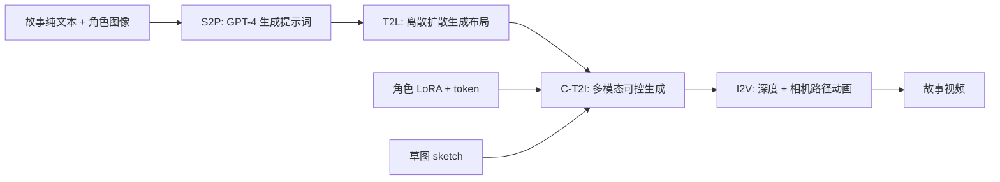

## 一句话总结

本文提出 TaleCrafter，一个通用的交互式故事可视化系统，借助大语言模型与预训练文生图模型的先验，从纯文本故事和少量角色图像出发，生成能保持多个新角色身份一致、支持布局与局部结构编辑的系列图像并进一步动画化。

## 研究背景

- 领域现状：故事可视化（visual storytelling）此前多依赖在特定数据集（如卡通风格的 PororoSV、FlintstonesSV）上训练 GAN/VAE 或扩散模型，把文本投影到潜空间再解码生成图像，靠图像级与故事级判别器维持质量与一致性；近期的 AR-LDM、Make-A-Story 等引入潜扩散/自回归记忆模块提升跨帧一致性。
- 核心痛点：一是这些方法难以泛化到训练集之外的新角色与新场景，只能"记住"训练数据里的角色；已有的零样本尝试仅支持单张人脸替换，无法处理多角色或非人脸物体。二是几乎都不考虑图像布局与局部物体结构的可控性——所有信息都被文本隐式控制，用户无法交互式调整。
- 本文 idea：不再从零训练一个专用模型，而是把大语言模型与大规模预训练 T2I 模型的先验组合起来，搭成一个由四个模块串联的系统，同时满足身份一致、图文对齐、合理布局三项要求，并支持对布局和局部结构的交互式编辑。

## 方法

整体上，系统把"故事 → 视频"拆成四个可交互衔接的模块：故事转提示词（S2P）、文本转布局（T2L）、可控文生图（C-T2I，核心）、图像转视频（I2V）。前两步准备语义提示与空间布局，核心的 C-T2I 融合多模态条件渲染出角色一致的图像，最后 I2V 让静态图动起来。

关键设计：

1. **S2P：用 GPT-4 弥合文学描述与 T2I 提示词之间的鸿沟。** 给定故事 $$S$$、指令 $$R$$、风格 $$F$$ 和数量 $$K$$，输出 $$[p_1, p_2, ..., p_K] = S2P(S, R, F, K)$$。指令形如"从故事生成 K 条用于 Stable Diffusion 的提示词，描述事件、角色、场景"，并用风格后缀（如"in oil painting style"）控制画风。

2. **T2L：用离散扩散模型生成布局。** 沿用 LayoutDM 的思路，把布局表示为 $$N$$ 个物体 $$L = \{B_i\}_{i=1}^{N}$$，其中 $$B_i = (\boldsymbol{b}_i, l_i)$$，边界框 $$\boldsymbol{b}_i = (x_i, y_i, w_i, h_i)$$ 坐标归一化量化，$$l_i$$ 为类别。前向过程对每个离散标量 $$q(z_t \mid z_{t-1}) = \boldsymbol{v}(z_t)^T Q_t \boldsymbol{v}(z_{t-1})^T$$，反向由双向 Transformer 估计。用语言工具从提示词抽名词作为目标物体，映射到 Object365 类别并在该数据集上训练，使布局可由文本驱动、也支持用户交互式微调。

3. **C-T2I：核心的多模态可控生成。** 在 LDM 潜空间中工作，改造 UNet 的自注意力/交叉注意力并加入加法模块，接收提示词、布局框、草图三类条件。身份保持上，不整体微调，而是对自/交叉注意力层的 Query/Key/Value 映射施加 LoRA 低秩权重 $$\boldsymbol{h} = W\boldsymbol{x} + BA\boldsymbol{x}$$（其中 $$A \in \mathbb{R}^{d \times r}$$、$$B \in \mathbb{R}^{r \times k}$$、$$r \ll \min(d,k)$$），每个角色单独学一个 token 与一组 LoRA 权重，缓解过拟合与概念遗忘。物体定位借鉴 GLIGEN 的门控自注意力，把文本嵌入与坐标的 Fourier 嵌入拼接后注入：$$\boldsymbol{f} \leftarrow \boldsymbol{f} + \tanh(\alpha) \cdot TS(SA([\boldsymbol{f}, \boldsymbol{e}_g]))$$。局部结构控制用草图编码器 $$E_S$$（四个残差块）提特征，按框平移缩放后以加法注入 $$\boldsymbol{f} \leftarrow \boldsymbol{f} + \beta \boldsymbol{f}_s$$，$$\beta$$ 可在推理时调节（$$\beta = 0$$ 即不用草图）。训练目标为 LDM 的变分下界 $$L_{\text{C-T2I}} = \mathbb{E}\left[\lVert \epsilon - \epsilon_\theta(z_t, t, C) \rVert_2^2\right]$$。

4. **多角色的迭代式生成。** 由于每个角色的 LoRA 权重是单独训练的（联合训练两个相似外观角色成功率低），推理时逐角色迭代应用：先用角色 A 的 token 和权重生成图像（如把"dog"改写为"\<sks\> dog"），再用 C-T2I 的 9 通道 inpainting 变体（拼接噪声图、原图、框区域掩码）把角色 B 的框区域重绘为"\<yty\> cat"，从而把多个角色和谐地组合进同一张图。

5. **I2V：让画面动起来。** 用 3D photography 方法从图像估计深度并在新视角下合成，设定相机路径实现拉近、环绕、摇摆等运动效果，增强立体细节。

## 实验结果

在 5 个故事、35 条提示词、每条 20 个样本共 700 张生成图上，用 CLIP 特征空间的图文相似度（衡量文本对齐）与图像-图像相似度（衡量身份保持）评估。与 Custom-Diffusion、Paint-by-Example 对比（统一 DDIM 50 步、classifier-free guidance 为 6）：

| 方法 | text-image sim.↑ | image-image sim.↑ |
|------|------------------|-------------------|
| Custom-Diffusion | 0.7422 | 0.6323 |
| Paint-by-Example | 0.7087 | 0.6104 |
| 本文 (Ours) | 0.7676 | 0.6758 |

本文方法在两项指标上均领先。另有 50 名参与者、9 个故事的用户研究，从"文本对齐/身份一致/图像质量"三方面 1–3 分打分，本文在三项上分别得 2.873 / 2.651 / 2.725，均显著高于两个基线。定性对比中，本文在保持角色身份（如头巾等细节）、和谐组合相似外观的多角色、以及生成 FlintstonesSV 之外的新场景上都优于 Make-a-Story、Custom-Diffusion 与 Paint-by-Example。

## 亮点与局限

- 亮点：
  - 用"组合大模型先验 + 分工模块"取代"从零训练专用模型"，天然支持零样本泛化到新角色、新场景与新风格。
  - 首次在故事可视化中同时提供身份、布局、局部结构三级可控与交互式编辑，草图强度 $$\beta$$ 可调，用户可干预布局。
  - 迭代式 personalized inpainting 有效解决了多角色（尤其相似外观）组合难题，回避了联合训练成功率低的问题。

- 局限：
  - 多角色需逐角色训练独立 LoRA 权重并迭代 inpainting，角色越多流程越长，难以即时扩展到大量角色。
  - 系统由四个模块串联，误差会逐级传递（如 S2P 提示词或 T2L 布局不当会直接影响成图），整体依赖 GPT-4 与 Stable Diffusion v1.4 的能力上限。
  - I2V 仅靠单图深度 + 相机路径做新视角合成，本质是"伪动画"，缺乏真正的时序内容变化与角色动作。
  - 定量评估规模有限（5 个故事），主要靠 CLIP 相似度与用户主观打分，缺少更细粒度的一致性度量。

## 延伸思考

该系统体现了"编排式生成"（把 LLM 规划、布局生成、可控扩散、动画分层解耦）的思路，与后续把故事可视化推向端到端视频扩散的工作形成对照——分层可控带来了可编辑性，但也牺牲了时序连贯与角色动态。逐角色 LoRA + inpainting 的组合策略，可以和后来的多概念定制（如统一 token 空间、注意力隔离）方法对比，思考如何在不牺牲成功率的前提下实现真正的联合多角色生成。此外，把 I2V 从单图深度扭曲替换为视频扩散或可控运动模块，是让"故事"真正动起来、包含角色交互动作的自然演进方向。
