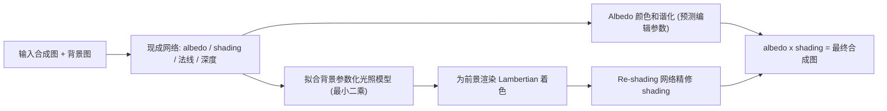

## 一句话总结

本文提出一种在本征图像（albedo/shading）域中进行的自监督图像和谐化方法，把"配图和谐化"拆成颜色和谐与重打光两步，从而让插入的前景物体不仅颜色贴合、还能匹配背景的光照环境。

## 研究背景

- 领域现状：图像和谐化（image harmonization）主要被建模成一个自监督问题——在自然图像的某个区域上施加全局颜色/色调编辑（曝光、饱和度、色相等），再训练网络去"撤销"这些编辑。这类方法能对齐颜色，但基本不处理光照。
- 核心痛点：训练用的"编辑对"只反映图像级差异，而真实合成图中前景与背景往往存在光照不一致。真正的重打光（relighting）需要准确的光照环境估计和精细几何，因此现有重打光方法大多局限在人像、户外建筑等特定域，且依赖难以采集的数据集，无法用于通用的野外合成。
- 本文 idea：借助本征图像分解 $$I = S \cdot A$$，把颜色藏在 albedo、光照藏在 shading。于是可把和谐化拆成两个子问题：在 albedo 域做颜色和谐化，在 shading 域做重打光。重打光被重新定义为"对一个简单 Lambertian 着色的精修"，从而能用普通分割数据集做自监督训练。

## 方法

整体框架分三步：先对场景的估计 albedo 做颜色和谐化；再用背景的法线和 shading 拟合一个简单的参数化光照模型；最后用该光照模型为前景渲染 Lambertian 着色，交给一个精修网络生成真实 shading，与和谐化后的 albedo 相乘得到最终结果。

- **本征域拆分**：用 Careaga 与 Aksoy 的现成方法对前景、背景各做本征分解，得到单通道 shading 与 RGB albedo。合成在两个域分别进行：$$A_c = \alpha A_f + (1-\alpha)A_b$$、$$S_c = \alpha S_f + (1-\alpha)S_b$$，其中 $$\alpha$$ 是前景掩码。所有 albedo/shading 运算都在线性 RGB 下进行（对 sRGB 输入按 2.2 反 gamma）。这样颜色和光照可以被独立处理。
- **Albedo 颜色和谐化**：沿用参数化和谐化思路，预测一组编辑参数（曝光、饱和度、色彩曲线、白平衡）来调整前景 albedo。训练用自监督：对分割数据集里的物体施加随机编辑制造失配，再让网络（沿用 Miangoleh 等人的编辑网络）预测能还原原始外观的参数，用 albedo 上的 MSE 监督。
- **参数化光照模型**：把背景光照建模为一个方向光 $$\vec{l} \in \mathbb{R}^3$$ 加常量环境光 $$c$$，Lambertian 着色为 $$\tilde{S}^b_i = \vec{n}^b_i \cdot \vec{l} + c$$。通过最小二乘让渲染着色去逼近估计的背景 shading 来求解光照参数，并约束 $$\vec{l}$$ 与 $$c$$ 为正（使光源落在朝外半球），用 Adam 优化。求得的光照模型再为前景渲染初始 Lambertian 着色 $$\tilde{S}^f$$，合成进背景 shading 得到初始复合着色 $$\tilde{S}_c$$。
- **Shading 精修网络**：把重打光定义为把 $$\tilde{S}_c$$ 精修为真实 shading $$S_c$$。输入是前景掩码、带 Lambertian 着色的 RGB 合成图、Lambertian 着色本身，以及法线和深度（提供几何上下文），通道拼成 $$h \times w \times 9$$。监督用 shading 与重建 RGB 上的 MSE 加多尺度梯度损失（作为边缘感知平滑项），总损失 $$\mathcal{L} = \mathcal{L}_s + \mathcal{L}_i + \mathcal{L}_{sg} + \mathcal{L}_{ig}$$ 等权重相加。由于 ground-truth 就是原图的 shading，整个流程可在普通分割数据集上自监督训练。网络采用 ResNext101 编码器 + RefineNet 解码器，在 COCO、SA-1B 子集与 Multi-Illumination Dataset 上训练。

## 实验结果

作者做了一项两选一强制选择（2AFC）的用户研究：用 Unsplash 图像制作 50 组光照与颜色都失配的困难合成图，将本文方法与朴素合成、三个先前方法以及本文去掉重打光的版本两两对比，共 250 组图对、70 名受试者、3500 次比较，用 Bradley-Terry 模型计算全局排名分。

| 方法 | Bradley-Terry 分数 ↑ |
|------|------|
| 朴素合成 | 0.0933 |
| Bhattad 与 Forsyth (2022) | 0.0893 |
| Ke 等 (2022) | 0.1727 |
| Wang 等 (2023) | 0.2078 |
| 本文 (无重打光) | 0.1906 |
| 本文 (完整) | 0.2485 |

完整模型以明显优势拿到最高分；去掉重打光后仅与 Wang 等人相当，说明光照和谐化对野外合成图的真实感贡献很大。定性对比中，本文能衰减前景原有户外阴影、估计背景强光、软化不匹配的直射光，并反映窗户来光方向，这些都是先前方法难以做到的。

## 亮点与局限

- 亮点：
  - 把和谐化在本征域拆成颜色和谐与重打光两个独立子问题，各自用专门模型解决，思路清晰。
  - 将重打光重定义为"Lambertian 着色的精修"，绕开了难以采集的重打光数据集，可直接用大规模分割数据集自监督训练，能同时处理室内外、野外场景。
  - 光照模型参数少且可解释，用户可手动调节以获得更满意的合成，天然适合交互式编辑/GUI。
- 局限：
  - 依赖多个现成网络（本征分解、法线、深度），这些估计不准会传导到光照模型和 Lambertian 着色（反之它们进步也能带来同步提升）。
  - 光照模型过于简化，无法表达彩色光照，只能靠 albedo 和谐化网络间接补偿；遇到多个彩色光源等复杂场景会失效。
  - 不建模插入物体在新环境中产生的投射阴影，这需要对背景几何的详细理解，留作未来工作。

## 延伸思考

- 该方法把"重打光"从常见的图像到图像翻译范式转向"物理近似 + 网络精修"，用现成中层视觉表示替代昂贵的光照/几何采集，这一"简单物理先验打底、网络补真实感"的模式对其他缺乏 ground-truth 的逆问题（如材质编辑、去光照）有借鉴意义。
- 投射阴影缺失是感知真实感的一大短板，可结合背景深度/几何估计或近期的扩散生成先验来补齐；彩色光照的表达也可以用更丰富的球谐或神经光照表示替换当前的单方向光加环境光模型。
