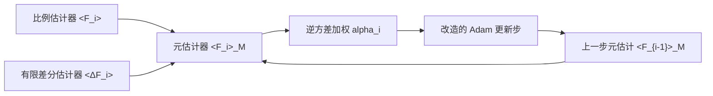

## 一句话总结

本文提出一种"元估计（meta-estimation）"框架，把采样与优化交织起来：用低方差的有限差分估计器描述相邻迭代间梯度的变化，从而无偏地复用历史样本，持续降低反向渲染中蒙特卡洛梯度的方差，并把它稳定地嵌入 Adam，使收敛速度大幅提升。

## 研究背景

- 领域现状：基于物理的可微渲染（如 Mitsuba 3、Path Replay Backpropagation）让人们能对光传输求导，从而通过梯度下降从目标图像反推场景参数（几何、材质、纹理等）。
- 核心痛点：蒙特卡洛估计出的梯度噪声极大。为了压噪，通常每像素要追踪几十到上百条光线，而反向渲染又往往需要成百上千次迭代收敛，每次迭代都重新估计梯度的开销高得惊人。简单地在每次迭代内多采样求平均能降方差，但计算成本随迭代次数线性膨胀。
- 本文 idea：不要每次迭代都从零重新估计梯度，而是把"上一次的梯度估计"加上"这次相对上次的变化量"来更新当前梯度。变化量由一个方差很低的有限差分估计器提供，于是历史样本得以无偏复用，梯度方差随优化进程不断累积下降。

## 方法

整体框架：作者组合两类独立估计器——比例估计器 $$\langle F_i \rangle$$（任意常规蒙特卡洛梯度估计器，逐迭代独立采样）与有限差分估计器 $$\langle \Delta F_i \rangle$$（估计相邻两次迭代间梯度的变化）。因为 $$\Delta F_i = F_i - F_{i-1}$$，把上一次的估计加上变化量即可无偏地得到当前估计。元估计器再用逆方差加权把两条信息与全部历史递归融合，最后改造 Adam 的更新规则来消费这个已经平均过的低方差梯度。

关键设计：

- **无偏的递归元估计器**：定义 $$\langle F_i \rangle_M = \alpha_i(\langle F_{i-1} \rangle_M + \langle \Delta F_i \rangle) + (1-\alpha_i)\langle F_i \rangle$$。由于有限差分项的期望恰为 $$F_i - F_{i-1}$$，"旧估计 + 变化量"这一步不引入任何偏差。所有 $$\langle F_i \rangle$$ 与 $$\langle \Delta F_i \rangle$$ 独立采样，故方差最优的权重由逆方差加权给出：$$\alpha_i = \mathrm{Var}[\langle F_i \rangle] / (\mathrm{Var}[\langle F_i \rangle] + \mathrm{Var}[\langle F_{i-1} \rangle_M] + \mathrm{Var}[\langle \Delta F_i \rangle])$$。这条递归式一举囊括了所有历史样本的最优组合。

- **方差的实用近似**：三个方差项都用零中心的指数滑动平均（EMA）来近似，避免额外估计均值。比例项方差 $$\mathrm{Var}[\langle F_i \rangle]$$ 用大系数 $$\beta_F$$ 求得一个稳定的大值（类似 Adam 的二阶矩）。关键难点在有限差分项：它的方差依赖上一步走多大，因此作者把步长 $$\lVert \Delta \pi_i \rVert_2$$ 从方差里解耦出去，先估计"解耦方差" $$\mathrm{Var}[\langle \Delta F_i \rangle]_D$$（对步长平方不敏感、更平稳），再乘回 $$\lVert \Delta \pi \rVert_2^2$$ 还原。这样滑动平均才在迭代间分布均匀、可靠。

- **Alpha 裁剪**：EMA 在优化初期样本不足，容易低估 $$\mathrm{Var}[\langle F_i \rangle_M]$$，导致元估计器过度自信、迟迟不肯纠正。作者用 $$\alpha_i = \min(\alpha_i, 1-1/(i+1))$$ 及其推广 $$\alpha_i = \min(\alpha_i, 1/(2-\alpha_{i-1}))$$ 把 alpha 约束在"完美平均"之下，任何超过该值的都必是高估，从而保证稳健。

- **与 Adam 的稳定结合**：直接把已平均的元估计梯度喂给 Adam 会出问题——Adam 假设每步输入梯度独立，且它自己的二阶矩与本文的方差估计重复。作者改写更新步为 $$\Delta \pi_{i+1} = -\eta \, \langle F_i \rangle_M / (\sqrt{\mathrm{Var}[\langle F_i \rangle_M]} + \epsilon)$$，用元估计器方差直接定步长。由于该方差比 Adam 默认 $$\beta_2 = 0.999$$ 的二阶矩响应快得多，优化在低噪声时自然加速、逼近极小值时自然减速。

## 实验结果

作者在 Mitsuba 3 中实现，基于 Path Replay Backpropagation 采样梯度，用简化的 shift mapping（仅考虑 BRDF 采样）构造有限差分估计器，并在多变量材质、纹理、体积等任务上与 Adam 对比。下表取 NeRF 式发射-吸收体优化实验（500 次迭代，MAPE 越低越好）为主实验：

| 方法 | 每迭代采样 | MAPE↓ | 说明 |
|------|-----------|-------|------|
| 本文 | 1 差分 + 2 比例 spp | 0.189 | 收敛快、无孔洞与模糊伪影 |
| Adam | 2 spp | 0.199 | 计算成本略低于本文 |
| Adam | 4 spp | 0.194 | 计算成本略高于本文 |

本文方法的计算成本介于 Adam 2 spp 与 4 spp 之间，却在收敛速度与最终质量上明显胜出。在多变量材质优化（同时优化底色、金属度、粗糙度）中，即便为 Adam 针对性调参，它也要在约 20 倍计算成本下才能勉强追平本文。在极噪的 Veach Ajar 纹理优化中，Adam 3 spp 退化为随机游走、64 spp 只能走几步大步，而本文在 1+2 spp 下即取得良好收敛。

## 亮点与局限

- 亮点：
  - 从控制理论的比例-微分思想切入，给出一个无偏、方差最优的递归梯度组合框架，理论清晰且与逆方差加权自然契合。
  - 有限差分方差的"步长解耦"是关键工程洞见，使 EMA 近似真正可用；alpha 裁剪进一步保证初期稳健。
  - 与 Adam 深度整合而非简单叠加，避免了矩估计冗余与相关性带来的失稳，实测在困难任务上把计算成本降低数个数量级。
- 局限：
  - 强依赖有限差分估计器 $$\langle \Delta F_i \rangle$$，而这类估计器并非对所有问题都现成可得（本文借助 path tracing 的 shift mapping）；元估计器方差被 $$\mathrm{Var}[\langle \Delta F_i \rangle]$$ 的累加所下界约束。
  - 有限差分与比例估计器都缺乏专门的差分重要性采样策略，粗糙度等参数的梯度估计本就困难（如 Chalice 场景表现变差）。
  - 有限差分样本在稀疏体积上分布过散时收益下降；论文未涉及深度神经网络训练。

## 延伸思考

本文与并行工作 Nicolet 等人的递归控制变量（Recursive Control Variates）思路相邻却不同：控制变量依赖一对相关估计器并需处理协方差项，而本文用独立的有限差分估计器，权重公式里得以省去协方差。它也与参数空间 ReSTIR（Chang 等）同样瞄准降低梯度方差，但走的是时间维度的样本复用路线。一个值得追问的方向是：随着蒙特卡洛梯度估计在机器学习中愈发普遍，若能构造出通用、低方差的有限差分估计器，这套元估计能否推广到神经网络训练——作者自己也把这视为最有前景也最具挑战的后续。此外，把 shift mapping 做全（含几何变化）以及为差分项设计专门的重要性采样，可能是进一步释放该框架潜力的关键。
