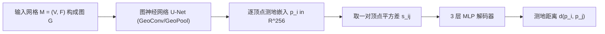

## 一句话总结

提出 GeGnn，用图神经网络把网格嵌入到高维空间，配合一个轻量 MLP 解码器，实现网格上任意两点测地距离查询的常数时间复杂度（单次前向作为预计算），比现有方法快几个数量级且精度相当。

## 研究背景

- 领域现状：单源到全体点的测地距离已有大量算法（波前传播、求解 Eikonal 方程、离散测地图等），部分甚至能达到近线性时间。但对"任意两点测地距离查询"（GDQ）这一需求，这些方法每次查询仍至少是线性代价，太贵。
- 核心痛点：现有专门做 GDQ 的方法要么精度低，要么预计算太慢。它们通常要预先计算大量顶点对的精确测地距离（至少平方级空间与时间开销），再用 Metric MDS 之类的非线性优化把网格嵌入高维空间，用高维欧氏距离近似测地距离——优化过程动辄几分钟到几小时，且高度依赖网格质量，对含噪声或破损的网格无能为力。
- 本文 idea：与其靠昂贵的优化求嵌入，不如训练一个图神经网络直接"预测"测地嵌入。训练后每个网格只需一次前向传播作为预计算，之后用一个可学习的解码函数把任意一对顶点的嵌入向量映射为测地距离。网络还从数据中学到了形状先验，因而对破损、含噪网格具有鲁棒性。

## 方法

整体框架分两步：预计算与查询。预计算阶段把输入网格构成的图喂给一个 U-Net 结构的图神经网络，为每个顶点输出一个 256 维的测地嵌入向量，每个网格只做一次；查询阶段把两个顶点嵌入向量的逐元素平方差送入一个固定大小的 3 层 MLP，输出即两点测地距离，每次查询仅需固定次数的矩阵运算，故复杂度为 $$O(1)$$，且可在 GPU 上大规模并行。

关键设计：

1. **GeoConv 图卷积**：作者观察到局部几何结构对测地嵌入至关重要，于是把相邻顶点间的距离显式塞进消息传递。更新公式为

$$F'_i = W_0 \boldsymbol{F}_i + \max_{j \in \mathcal{N}(i)} \left( W_1 [F_j \Vert v_{ij} \Vert l_{ij}] \right)$$

其中 $$v_{ij} = v_i - v_j$$，$$l_{ij}$$ 是其长度。聚合算子刻意选 $$\max$$ 而非 sum/mean——这呼应 Dijkstra 类算法在波前上传播最短距离的思想，实验证明对测地嵌入远比其他聚合有效。GeoConv 不使用绝对坐标等全局信息，天然具备平移与置换不变性，且比把 $$\phi/\gamma$$ 设成 MLP 的做法更简单也更有效。

2. **GeoPool 图池化**：普通基于体素网格的池化只看欧氏距离，会把桌面两侧几何上很近、测地上很远的顶点错误合并。GeoPool 改在坐标+法向构成的 6 维空间里建规则网格，用两个尺度因子 $$\sigma_c$$、$$\sigma_n$$ 控制不同维度的网格大小；法向的引入能阻止薄板两侧的顶点被合并。对应的 GeoUnpool 缓存池化前后的映射关系、反向还原以支持 U-Net 解码。

3. **可学习的测地解码器**：直接用高维欧氏距离近似测地距离在原理上不可行——文中用单位圆举例说明，无论嵌入维度多高，欧氏距离都无法准确表达圆上的测地距离。于是改用一个 3 层 MLP 学习解码函数，输入是两个嵌入向量的逐元素平方差 $$s_{ij}$$（平方操作保证了函数关于两顶点的对称性），输出即测地距离。

4. **网络与训练**：以 GeoConv、GeoPool、GeoUnpool 搭建 U-Net，顶点初始信号为 6 通道（归一化坐标+法向），特征通道统一 256，具有全局感受野的同时保留局部几何感知，多分辨率结构也提升了对破损网格的鲁棒性。损失函数用平均相对误差（MRE），训练时对每个网格随机采样若干已预计算的精确测地距离对做监督。把损失里的测地距离换成双调和距离，同一框架即可学习预测双调和距离。

## 实验结果

在 ShapeNet 子集（约 24,807 个网格、13 类）上训练，用 MMP 计算精确测地距离作为参考。评测分三组：ShapeNet-A（训练类别内）、ShapeNet-B（训练外类别）、Common（ShapeNet 之外的常见网格）。主实验比较各方法的预计算时间（PC）、100 万次查询时间（GDQ）与平均相对误差（MRE）：

| 方法 | 复杂度 | 指标 | ShapeNet-A | ShapeNet-B | Common |
|------|--------|------|-----------|-----------|--------|
| MMP（参考/精确） | $$O(N^2 \log N)$$ | GDQ | 15.85h | 18.00h | 25.41h |
| HM | $$O(N)$$ | GDQ / MRE | 2345s / 2.41% | 2406s / 2.04% | 3506s / 1.46% |
| DGG | $$O(N)$$ | GDQ / MRE | 1163s / 0.27% | 1157s / 0.27% | 1626s / 0.50% |
| EEM | $$O(1)$$ | PC / GDQ / MRE | 45.02s / 0.134s / 8.11% | 30.87s / 0.120s / 8.78% | 41.21s / 0.136s / 5.64% |
| FPGDC | $$O(1)$$ | PC / GDQ / MRE | 5.64s / 2.75s / 2.50% | 6.28s / 2.37s / 2.30% | 8.23s / 2.56s / 2.30% |
| GE | $$O(1)$$ | PC | 225.5s | 297.8s | 387.8s |
| GeGnn（本文） | $$O(1)$$ | PC / GDQ / MRE | 0.089s / 0.042s / 1.33% | 0.091s / 0.040s / 2.55% | 0.104s / 0.041s / 2.30% |

结论：GeGnn 在预计算上比 GE 快约 3200 倍、比 EEM 快约 410 倍、比 FPGDC 快约 71 倍；相比单源方法（MMP/HM/DGG）做查询至少快 3.2 万倍。精度上显著优于同为 $$O(1)$$ 的 EEM，在 ShapeNet-A 上甚至超过 Heat Method，仅略逊于 DGG，但 MRE 均在 3% 以内足以支撑纹理映射、形状分析等应用。

其余实验用文字概括：对随机删掉 15% 三角面并加标准差 0.06 高斯噪声的网格仍得 2.76% MRE，对被切成两块的网格也能给出合理结果，体现鲁棒性；把监督换成双调和距离即可高精度预测该距离；在指定网格上微调 2,500 次迭代可将 MRE 从 4.1% 降到 1.0%；网络全卷积、可扩展到顶点数远超训练规模（约 1.8 万、2.4 万乃至更大细分球）的网格。

## 亮点与局限

- 亮点：
  - 把"求测地嵌入"从昂贵的逐网格非线性优化，转化为一次网络前向，预计算提速几个数量级，查询做到真正的常数时间且高度并行。
  - GeoConv（max 聚合 + 显式局部距离）与 GeoPool（6 维坐标-法向网格池化）针对测地问题量身设计，简单却比通用图卷积/池化有效。
  - 用可学习 MLP 解码器绕开欧氏嵌入的理论不可行性；从数据学到的形状先验带来对噪声、破损、拓扑分离网格的鲁棒性；框架通用，可迁移到双调和距离等其他度量。
- 局限：
  - 精度仍略逊于 DGG 这类精确性更高的方法，属于用少量精度换巨大速度。
  - 需要在 ShapeNet 上预先用 MMP 计算大量精确测地距离作训练数据，训练成本高（4 块 3090 训练 64 小时）。
  - 泛化到与训练分布差异很大的网格时误差上升（ShapeNet-B/Common 的 MRE 高于 A），对个别网格需微调才能达到理想精度。

## 延伸思考

- 该方法把"离散几何量的查询"重构为"神经嵌入 + 轻量解码"，这一范式或可推广到扩散距离、通勤时间距离、推土机距离等其他流形上的度量，甚至有向/各向异性距离。
- max 聚合与 Dijkstra 波前传播的类比很有启发：它把经典算法的归纳偏置注入到消息传递中，提示在几何学习里"让网络结构呼应经典算法"可能比堆通用模块更有效。
- 依赖 MMP 生成监督是瓶颈，若能用自监督或物理约束（如满足 Eikonal 方程）减少对精确标签的依赖，将更易扩展到大规模真实网格。
- 常数时间 GDQ 对交互式应用（纹理映射、形状对应、实时形状分析）价值很大，值得探索与下游任务端到端联合训练。
