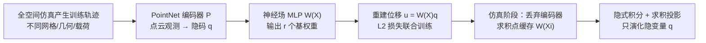

## 一句话总结

把传统线性降阶模型（ROM）里离散的位移基向量替换成由神经隐式场表示的连续位移场，得到一个不依赖任何具体离散化（网格分辨率、连通性、类型）的线性降阶模型 LiCROM，从而支持在训练中未见的几何体、运行时改变拓扑（切割、打孔）等场景下的快速仿真。

## 研究背景

- 领域现状：线性降阶建模用一组由仿真样本学出的低维基去近似可变形物体的位移空间，只演化少量隐变量（reduced coordinates），可把仿真加速几个数量级。经典做法通常用 POD（等价于 PCA）从训练数据里提取基。
- 核心痛点：经典线性 ROM 的基 $$\boldsymbol{U}$$ 的"结构"被死死绑定在初始离散化上——它的第 $$j$$ 行就对应网格第 $$j$$ 个自由度。于是训练数据、力的积分、输出动画都必须用同一套网格。这导致无法混用不同分辨率/连通性/类型的训练网格，无法在训练时未见的网格上加速，也无法支持运行时自适应改变离散化（重网格、切割、打孔）。
- 本文 idea：把离散映射 $$\boldsymbol{u}_i(t) = \boldsymbol{\mathsf{W}}_i \boldsymbol{\mathsf{q}}(t)$$ 中"顶点下标 $$i$$"这个离散量，换成"参考域上的连续坐标 $$\boldsymbol{X}$$"，得到连续位移场 $$\boldsymbol{u}(\boldsymbol{X}, t) = \boldsymbol{\mathsf{W}}(\boldsymbol{X})\, \boldsymbol{\mathsf{q}}(t)$$。基仍是线性组合（保留线性 ROM 的所有好处），但每个基是一个从参考域到位移向量的连续场，用神经隐式场表示，因此"忘记"了训练时用的离散化。

## 方法

整体框架：训练阶段用全空间仿真产生若干位移场样本（可以来自不同网格、不同几何体、不同载荷），用一个 PointNet 编码器把每一帧的点云观测压成隐码 $$\boldsymbol{\mathsf{q}}$$，再用一个 MLP 神经场 $$\boldsymbol{\mathsf{W}}(\boldsymbol{X})$$ 输出该点的 $$r$$ 个基权重；两者联合优化以重建位移。仿真阶段抛弃编码器，只保留连续基场 $$\boldsymbol{\mathsf{W}}$$，在选定的求积（cubature）点上缓存 $$\boldsymbol{\mathsf{W}}(\boldsymbol{X}_i)$$，此后每步只需线性子空间方法惯用的矩阵-向量乘法。

关键设计：

- **连续线性基（LiCROM 核心）**：位移场写成时不变的连续基场与时变的空间不变权重的线性组合 $$\boldsymbol{u}(\boldsymbol{X}, t) = \boldsymbol{\mathsf{W}}(\boldsymbol{X})\,\boldsymbol{\mathsf{q}}(t)$$。相比 CROM 的非线性解码器，线性性带来一个关键计算优势：把全空间增量投影回隐空间只是最小化一个二次型 $$\Delta \boldsymbol{\mathsf{q}} = \arg\min_{\Delta \boldsymbol{\mathsf{q}}} \sum_i w_i \lVert \boldsymbol{\mathsf{W}}(\boldsymbol{X}_i)\Delta \boldsymbol{\mathsf{q}} - \Delta \boldsymbol{u}_i \rVert^2$$，即解一个对称正定线性系统，可预分解（Cholesky）后反复回代复用。

- **离散化无关的训练**：训练集是一堆无序的 $$(\tilde{\boldsymbol{X}}_j, \tilde{\boldsymbol{u}}_j)$$ 观测对，不假设不同帧之间点云结构一致，采样位置和数量都可不同。用对输入置换不变的 PointNet 编码器 $$P$$（去掉了会破坏位移意义的特征变换网络）保证与输入离散化无关；神经场 $$\boldsymbol{\mathsf{W}}$$ 用 5 层、宽 60、ELU 激活的 MLP。训练用 $$L_2$$ 重建损失，对大点集额外下采样（约 2500 点）喂给 PointNet 以控制开销。

- **求积与状态解耦**：隐式时间积分把每步能量写成域积分（动能项 + 弹性能密度，弹性用 stable neo-Hookean），再用求积近似为在若干求积点上的加权求和。关键在于求积网格不携带状态——状态完全由隐变量 $$\boldsymbol{\mathsf{q}}$$ 跨步携带。因此求积网格既不必与训练数据一致，也不必跨时间步保持一致。

- **拓扑/连通性变化变得平凡**：因为状态与求积解耦，切割、断裂、打孔只需换一套反映新拓扑和新边界条件的求积网格（或跳过落在空洞里的求积点），无需在网格间转移状态变量。部分切割等"训练中未见"的中间构型，就像所有线性子空间方法一样，由预计算基场的加权和自然涌现。求积采样用了简单的随机等权方案（随机选点 + 其邻接顶点）。

## 实验结果

主实验为性能统计：在多个例子上对比全空间仿真与 LiCROM 降阶仿真的单步耗时。所有例子隐空间维度 $$r = 20$$，泊松比 0.25，硬件为 Intel Core i7-10750H。

| 例子 | 全空间单步 (ms) | 降阶单步 (ms) | 加速比 |
|------|------|------|------|
| 多形状联合训练 | 142 | 8 | 17× |
| 运动学撕裂 | 323 | 11 | 29× |
| 打孔 | 288 | 13 | 22× |
| 下落动物 | 350 | 8 | 43× |
| 交互式应用 | 335 | 6 | 56× |
| Dragon | 307 | 9 | 34× |
| Bunny | 267 | 9 | 29× |

整体加速约 20–50×。其余实验以定性方式呈现：单个神经基可同时张成从立方体到球体五种不同形状的形变；可在训练中未见的新几何体上重建整体形变（有时会缺失未见过的表面细节）；可完成运行时打孔生成空洞、动物滚落与斜面的碰撞摩擦、以及基于 Wasserstein 距离的动物网格插值。交互式应用里，仅在 Armadillo 上训练即可在仿真中途换入未见几何体而不重置运动学状态，展示了"一次性泛化"（one-shot generalization），且物理响应由当前几何体决定（如更细手臂的高频摆动）。与非线性的 CROM 相比，LiCROM 的线性投影只需在预分解矩阵上回代，而 CROM 每次投影都要多次昂贵的网络 Jacobian 计算。

## 亮点与局限

- 亮点：
  - 首个既是线性又与空间离散化无关的降阶模型，把线性 ROM 经典的 $$\boldsymbol{\mathsf{W}}(\boldsymbol{X})\boldsymbol{\mathsf{q}}(t)$$ 因子结构搬到连续神经场上。
  - 线性性让隐空间投影退化为可预分解复用的正定线性系统，隐式积分中的反复投影只需回代，远比非线性 CROM 的 Jacobian 计算便宜。
  - 求积与状态解耦，使切割、打孔、重网格、换网格等传统子空间方法难以处理的场景变得平凡；能在 CPU 上达到交互帧率，并展示对未见几何体的一次性泛化。

- 局限：
  - 神经隐式场会在训练数据稀疏的参考域区域"幻觉"外推：在薄几何上训的基不适用于厚几何；载荷条件或几何尺寸差异过大时泛化会失败。
  - 子空间对几何"一无所知"，在未见新几何上可能丢失表面细节；作者设想用显式"几何编码"缓解。
  - PointNet + 神经场的联合训练比 POD 昂贵，需数小时；这是换取置换不变性的代价。
  - 继承线性子空间方法的通病：子空间维度通常高于非线性方法；且未用 POD 训练、不显式要求正交性（虽未观察到投影困难）。

## 延伸思考

- 与 CROM（非线性连续 ROM）是同源的对偶思路：LiCROM 用线性换来可预分解的廉价投影，CROM 用非线性换更低维但投影昂贵；作者提出可用 LiCROM 去正则化 CROM，把两者优势结合。
- "状态与求积解耦"是这套方法能优雅处理拓扑变化的根本，这一思想或可迁移到其他需要运行时自适应离散化的仿真（如流体的 ALE、自适应重网格）。
- 由于线性性，精确 Newton 所需的隐空间 Hessian 可写成 $$\boldsymbol{\mathsf{W}}(\boldsymbol{X})^T \operatorname{Hess}_{\boldsymbol{u}} \Psi\, \boldsymbol{\mathsf{W}}(\boldsymbol{X})$$，无需对神经网络反向传播即可通过求积组装——这为后续用 (L-)BFGS 或精确 Newton 加速、以及 GPU 重实现留下了明确空间。
- 数据感知的求积采样（沿 An 等人的思路）有望进一步减少求积点数，但需要在运行时对未见几何自适应，是值得追问的开放问题。
