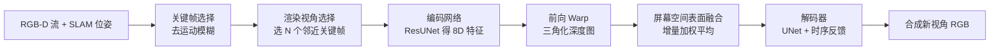

## 一句话总结

LiveNVS 在实时 RGB-D 流上做神经新视角合成：把源关键帧编码成神经特征、前向 warp 到目标视角并在屏幕空间融合，再用一个可泛化的解码网络译成高质量 RGB 图像，从而在扫描过程中就能低延迟地自由漫游并预览重建质量。

## 研究背景

- 领域现状：以 KinectFusion 为代表的实时 RGB-D 重建能即时给出几何和带色预览，但受限于噪声、过平滑、纹理模糊，预览质量远达不到照片级；另一方面，Mip-NeRF 360、Stable View Synthesis 等神经渲染方法画质极高，却几乎都是离线优化，无法嵌进在线采集流水线。
- 核心痛点：主流 NVS 方法有几个硬伤——预处理/场景专属优化耗时长、渲染非交互、依赖稠密高质量输入、不支持数据集持续增长与位姿的后期修正（如回环闭合）。这导致采集时用户拿不到即时反馈，也堵死了远程呈现等对延迟敏感的应用。
- 本文 idea：放弃任何全局场景表示，回到（深度）图像的基础渲染思路——只用少量邻近关键帧，把它们编码成神经特征后前向 warp、在屏幕空间融合，再由一个训练一次即可泛化的网络解码出照片级图像。因为不依赖全局模型，天然支持数据增长和位姿更新。

## 方法

整体框架：输入是带位姿的 RGB-D 流（位姿来自实时 SLAM）。系统先做关键帧选择，渲染某个目标视角时挑选若干邻近关键帧，用编码网络转到隐空间特征，前向 warp 到目标视角，在屏幕空间做表面融合得到融合特征图，最后由带时序反馈的解码器还原成 RGB 图像。整条链路无全局数据结构，因此对增长数据集和迟到的位姿修正都很友好。

关键设计：

1. **屏幕空间表面融合**：warp 后得到贴着源图特征的三角形被光栅化进目标视角，每个像素维护当前线性深度、权重与神经特征。用一个随距离衰减的深度误差函数 $$\Delta(d) = \frac{1}{ad^2 + bd + c}$$ 判定新片元与当前表面的关系：明显更近则覆盖、明显更远则丢弃、落在误差带内则用增量平均 $$w \leftarrow w + w_f$$、$$f \leftarrow \alpha f + (1-\alpha) f_f$$ 融合进去。这样无需全局模型也能稳定合并任意数量的 warp 特征。

2. **特征加权**：每个源特征的权重要贴合它在该 3D 点的成像质量，写成 $$w_f = (w_d w_v w_i)^5$$。其中深度精度权 $$w_d = \Delta(d_f)$$，视角方向权 $$w_v = \max(0, v_s \cdot v_t)$$（源视角与目标视角方向越一致越可信），渐晕系数 $$w_i = 1 - \frac{c}{c_{\max}}$$ 按到图像中心的距离降权，兼顾镜头畸变残差并平滑拼接边界。逐像素平均权还能叠成一张"置信图"，引导操作者去补扫弱重建区域。

3. **延迟 warp 模式**：观察到融合深度图受源视角选择影响大、导致时序抖动，于是把表面融合与特征融合拆成两阶段——先用尽量多的深度图算出目标视角深度，再据此重投影采样特征，此时深度权改为 $$w_d = 1 - (\lvert d - d_f \rvert / \Delta(d))^2$$。这样深度融合可以用全部视图（代价极低），特征聚合只用少量视图，既提稳定性又几乎不增开销。

4. **带时序反馈的解码**：解码器基于 UNet，在每个分辨率层把上一帧的中间特征与当前帧线性混合以增强时序稳定；对无视频的训练数据则用轻微空间变换模拟"上一帧"。编码器是基于 ImageNet 预训练的改版 ResUNet，输出 4D 特征加自遮罩置信值，与 RGB-D 拼成 8D 特征用于 warp，并用 LRU 缓存复用已编码视图。

## 实验结果

主实验是在不需场景专属优化的可泛化方法之间，于完整数据集上比较渲染质量（LPIPS，越低越好）。LiveNVS 在几乎零预处理、实时渲染的前提下，画质与需重预处理的 SOTA 相当。

| 方法 | Scannet ↓ | Motorcycle ↓ | Sofa ↓ | 预处理 |
|------|-----------|--------------|--------|--------|
| LiveNVS（本文） | 0.274 | 0.303 | 0.234 | < 1 s |
| FWD | 0.428 | 0.451 | 0.295 | < 50 s |
| SVS | 0.316 | 0.247 | 0.237 | ∼4 h |
| IBRNet | 0.248 | 0.179 | 0.149 | < 1 min |
| NPBG++ | 0.396 | 0.500 | 0.366 | ∼1 h |
| DIBR | 0.325 | 0.290 | 0.313 | < 1 min |

IBRNet 在质量上略优，但其渲染要约 2 分钟一帧、且需重预处理；LiveNVS 在 1296×968 分辨率下约 46 ms 渲染一帧（RTX 2080Ti），是唯一能跑在实时 RGB-D 流上的方案。此外消融显示：去运动模糊的关键帧选择让本文和 SVS 的 LPIPS 都明显下降（本文 0.34→0.27），延迟 warp 模式则以极小性能代价换来更好的时序稳定。

## 亮点与局限

- 亮点：
  - 首次把照片级神经渲染与实时 3D 重建整合进同一在线流水线，采集过程中即可自由视角预览。
  - 无全局场景表示，只用少量关键帧，天然支持数据增长和回环闭合等迟到位姿修正，时间/内存开销小。
  - 网络训练一次即可泛化到未见场景，甚至未参与训练的 Zed 相机模态；置信图还能主动引导补扫。
- 局限：
  - 若开启"warp 所有可用特征图"来提质，需要能缓存全部源视图特征的超大缓存，随场景规模膨胀不可持续。
  - 质量仍略逊于 IBRNet 等离线可泛化方法；依赖 SLAM 位姿与传感器深度，深度或位姿劣化会影响结果。
  - 关键帧运动分数忽略了快门速度等因素，运动模糊补偿是经验性的。

## 延伸思考

- 本质是"编码-warp-聚合-解码"范式在实时约束下的工程化取舍：用屏幕空间融合替代全局体素/隐式场，是拿可扩展性和延迟换极致画质的一种务实折中。
- 与近来 3D Gaussian Splatting 的在线/流式重建路线形成对照——后者维护显式全局图元、增量优化，而 LiveNVS 干脆不建全局模型；把两者的置信引导与前向融合思路结合，或能兼顾实时反馈与更高保真。
- 置信图作为采集时的主动引导是很实用的方向，可进一步用于"下一最佳视角"规划，闭环指导操作者高效完成扫描。
