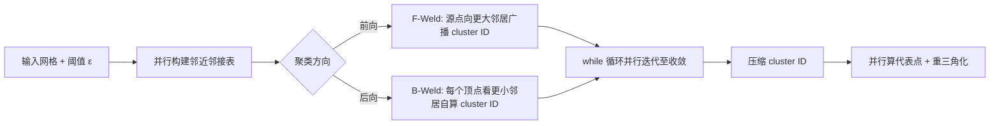

## 一句话总结

本文提出两个无锁（lock-free）多核并行顶点聚类算法 F-Weld 与 B-Weld，它们在数学上被证明能生成与串行顶点聚类算法完全一致的聚类结果（不做任何近似），其中数据并行的 B-Weld 在最大数据集上比最快的串行实现（Open3D）快 7.7–10.9 倍。

（说明：本篇解读基于第一作者 Nima Fathollahi 的同名硕士学位论文《Lock-free Parallel Mesh Reduction》，University of Victoria, 2023——即该 SIGGRAPH Asia 2023 论文的扩展版本，非会议正文本身。）

## 研究背景

- 领域现状：网格简化（mesh simplification）是降低三角网格复杂度、以便高效存储/传输/渲染/编辑的关键手段。顶点聚类（vertex clustering）是其中应用面很广的一类方法，它只依赖顶点及其空间邻近关系，把邻近顶点合并为一个代表点。
- 核心痛点：经典的串行顶点聚类算法（本文称 S-Weld，即 Open3D 中的实现）天然是顺序的——它按顶点 ID 从小到大处理，每次只让"最小的未聚类顶点"成为质心并吸纳其未聚类邻居，迭代之间存在强依赖，难以并行化。现有的并行方案普遍采用体素化（把空间切成等大网格、每个体素一个线程），这引入了近似：落在不同体素里的邻近顶点无法被合并，聚类结果与串行版本不一致。因此工业软件里仍在用串行版本。
- 本文 idea：不借助任何启发式近似，把 S-Weld 真正并行化。核心洞察来自并行前缀和（all-prefix-sums）——同样是"看似顺序、实则可并行"的问题。关键工具是无锁并行：不用锁/互斥量，仅靠原子操作或数据并行的所有权划分来避免数据竞争，同时保证每一步与串行结果严格相同。

## 方法

整体框架上，两个算法都沿用 S-Weld 的三大阶段——先并行构建"基于邻近的邻接表"（用 KDTree/FLANN 找半径 $$\epsilon$$ 内的邻居），再进入迭代式聚类的 while 循环并行分配 cluster ID，最后做压缩（把 cluster ID 归一到 $$0 \ldots c-1$$）、计算每簇代表点（取簇内顶点均值）并并行重三角化。二者的根本区别在于聚类阶段"往哪个方向看邻居"。

关键设计分为以下几点：

1. 前向算法 F-Weld：保持 S-Weld 的"前向"语义——每个顶点只存储 ID 比自己大的邻居（有向依赖图，边从小指向大）。为每个顶点维护 numRSN（更小邻居中尚未处理的数量）。当某顶点 numRSN 变为 0，说明它的所有更小邻居都已确定，此时它可以广播自己的 cluster ID：若它是质心，就把 cluster ID 更新到更大邻居上，取 $$\text{clusterID}[n] = \min(\text{clusterID}[n], u)$$。为处理多线程竞争，对 numRSN 递减用 fetch_and_add 原子操作、对 cluster ID 更新用 CAS 循环（这里因为共享值只会单调递减，不会出现 ABA 问题）。单线程运行时，F-Weld 恰好退化为 S-Weld，且一轮迭代即收敛。作者用归纳与反证证明了 while 循环在有限次迭代内终止（迭代上界为邻近图的边数）且终止时 cluster ID 正确。

2. 后向算法 B-Weld：这是"从前向翻转为后向"的核心创新。每个顶点只存储 ID 比自己小的邻居，且采用数据并行——每个线程临时"拥有"一个顶点，只负责计算这一个顶点的 cluster ID，同一轮内不会有别的线程去改它，从而彻底避免竞争、无需任何原子操作。一个顶点在满足下述条件之一时才被 finalize：(1) 所有更小邻居都已 final 且都不是质心（此时它自立为质心）；(2) 恰有一个已 final 的更小邻居是质心、其余更小邻居都已 final 且不是质心（此时它加入该质心的簇，取 $$\text{clusterID}[u] = \min(\text{centroids})$$）。否则本轮不动、置 shouldContinue 让循环继续。

3. 为什么 B-Weld 更快：F-Weld 的并行度受限于每轮"源点"数量，只有被分配去处理源点的线程能推进聚类；而 B-Weld 让每个顶点独立自算，暴露了远更宽的数据并行度，代价是需要更多轮迭代才收敛。作者进一步用 Lemma/Theorem 证明 B-Weld 生成的簇与质心和 S-Weld 完全一致（Theorem 4）。

4. 两个降本变体：Shrinking Candidates（动态维护"仍需处理"的活跃任务列表，避免每轮都遍历已 final 顶点，但需要一次并行归约来合并各线程的局部列表，有开销）；Batch Processing（B-Weld 专用，把顶点按固定 batchSize 分批、批间串行批内并行，人为引入偏序以提高每次访问的"成功率"、减少无效迭代）。

## 实验结果

在 Stanford Bunny / Vellum manuscript / Thai Statue / Lucy 四个数据集（顶点数从 3.6 万到 1400 万）上，与 Open3D 的 S-Weld（最快的公开串行实现）对比。主实验为最大数据集 Lucy 上 B-Weld 相对 S-Weld 的最大加速比（12 核），按邻近阈值 $$\epsilon$$ 分层：

| ϵ | 相对 S-Weld 加速↑ | 相对单线程 B-Weld 加速↑ | Amdahl 理论上界 |
|------|------|------|------|
| 0.01 | 10.90× | 1.82× | 2.57× |
| 0.10 | 10.70× | 1.78× | 2.70× |
| 1.00 | 7.70× | 2.85× | 10.67× |

其余观察（文字补充）：数据集越大、B-Weld 越占优——在最小的 Bunny 上所有并行算法都不敌 S-Weld，但在 Lucy 上 B-Weld 在所有 $$\epsilon$$ 下都胜过 S-Weld，甚至单核也更快。原因是缓存局部性：B-Weld 全程用数组 + 静态调度，在 Lucy（$$\epsilon = 1$$）上末级缓存（LLC）缺失率仅 4.1%，而 Open3D 用哈希表映射顶点到簇、缺失率高达 12.4%，约为前者三倍。F-Weld 在所有场景中单核性能最差，但随核数增加具备可扩展性。Shrinking 变体在大数据集上因收敛迭代数暴增（F-Weld shrink 在 Lucy 上需约 14465 轮，而其他算法平均约 5 轮）而出现性能抖动与退化。

## 亮点与局限

- 亮点：
  - 首个不做近似、可证明与串行结果逐簇一致的并行顶点聚类算法，填补了"并行 = 只能近似"的空白。
  - 完整给出终止性、正确性与工作效率的数学证明，理论扎实。
  - 无锁设计 + 数组/静态调度带来的缓存友好性，使 B-Weld 在大网格上单核即可超越高度优化的串行实现。
  - F-Weld 单线程严格退化为 S-Weld，便于验证与对比。

- 局限：
  - 加速比受串行区间（压缩阶段等）限制，在小 $$\epsilon$$ 下离 Amdahl 上界还有距离，扩展性并非线性。
  - 实验仅在一台 12 核笔记本（4 性能核 + 8 能效核）上进行，核数与硬件多样性有限。
  - $$\epsilon > 1$$ 被认为不现实故未测；重三角化阶段虽"易并行"却因哈希表内存受限而未在 S-Weld 侧并行。
  - 降本变体（尤其 shrink）在大数据上收敛不稳定，收益不确定。

## 延伸思考

- 这条"把顺序算法证明性地并行化、而非用启发式近似"的思路可迁移到其他图形/几何中带强依赖的贪心流程（如边收缩简化、区域生长、并查集式合并）。
- B-Weld 的胜出很大程度来自缓存局部性而非纯算法并行度，提示在超大网格处理里"数据布局 + 静态调度"可能比一味堆线程更关键；能效核/性能核异构调度也值得深挖。
- 目前实现在 CPU 多核；若移植到 GPU（顶点聚类与前缀和都天然契合 GPU），无原子操作的 B-Weld 数据并行模式可能进一步放大优势，是自然的下一步。
