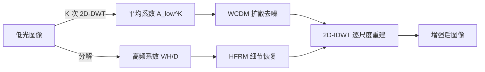

## 一句话总结

提出 DiffLL：把扩散过程放到小波变换的低频平均系数上进行，配合"训练阶段同时做前向扩散和去噪"的稳定采样策略与高频细节恢复模块，实现又快又稳、视觉质量更好的低光图像增强。

## 研究背景

- 领域现状：低光图像增强（LLIE）从传统的直方图均衡、Retinex 方法发展到深度学习方法（监督/无监督），近年扩散模型凭借强大的生成能力在图像修复上表现亮眼。
- 核心痛点：直接把标准扩散模型用于 LLIE 存在三个问题——(1) 逐步去噪在原图空间上计算量大、推理慢（600×400 图像常需 10 秒以上）；(2) 反向过程从随机高斯噪声起步，采样多样性导致修复结果出现混乱内容、色彩失真或伪影；(3) 监督类回归方法优化 PSNR/SSIM 却缺乏感知保真度，无监督方法又难以控制增强程度、容易过曝或放大噪声。
- 本文 idea：既然小波变换能在无信息损失的前提下把空间维度逐次减半，就把扩散操作转移到低频"平均系数"上（它承载全局光照信息），大幅降低计算量；再用一个改造过的训练策略消除采样随机性，用专门模块补回高频细节。

## 方法

整体框架：先用 $$K$$ 次 2D 离散小波变换（2D-DWT，Haar 小波）把低光图像分解出一个平均系数 $$A^K_{low}$$ 和各尺度的高频系数（垂直 $$V$$、水平 $$H$$、对角 $$D$$）。平均系数走小波条件扩散模型（WCDM）恢复全局光照，高频系数走高频恢复模块（HFRM）补细节，最后用逆变换（2D-IDWT）逐尺度重建回图像。由于扩散只在 $$A^K_{low}$$ 上做，空间维度相比原图缩小 $$4^K$$ 倍。

关键设计：

1. **在小波低频域做扩散（WCDM）**：论文通过"交换系数"实验说明——替换平均系数会显著改变全局光照，而交换高频系数几乎不改变图像内容。因此把生成式扩散只用在承载全局光照的平均系数上最划算。相比 Latent Diffusion 用 VAE 压缩，小波变换是线性操作、无信息损失、不增加参数，也不需在低光数据上重训编码器。
2. **训练即去噪的稳定采样策略**：常规扩散只在训练时做前向扩散、推理时从随机噪声起步去噪，导致内容不一致。本文在训练阶段**同时执行前向扩散和完整的去噪采样**，并用一项约束让去噪得到的 $$\hat{A}^K_{low}$$ 逼近参考的正常光平均系数 $$A^K_{high}$$。扩散目标写为 $$L_{diff} = E_{x_0,t,\epsilon_t}[\lVert \epsilon_t - \epsilon_\theta(x_t, \tilde{x}, t)\rVert^2] + \lVert \hat{A}^K_{low} - A^K_{high}\rVert^2$$ 。这样即便推理从随机噪声起步也能稳定收敛、避免混乱内容。为提效，时间步 $$T$$ 只设 200、隐式采样步 $$S$$ 设 10。
3. **高频恢复模块（HFRM）**：用深度可分离卷积提特征，再用两层交叉注意力让垂直、水平信息去补全对角细节，配合渐进膨胀 Resblock（膨胀率 $$d=\{1,2,3,2,1\}$$）扩大感受野、避免网格效应，最终重建高频系数。
4. **训练损失**：总损失 $$L_{total} = L_{diff} + L_{detail} + L_{content}$$ ，其中 $$L_{detail}$$ 组合高频系数的 MSE 与 TV 损失，$$L_{content}$$ 组合 L1 与 SSIM 损失约束最终图像与参考图的一致性。

## 实验结果

在 LOLv1、LOLv2-real、LSRW 三个真实配对基准上与各类 SOTA 对比（DiffLL 均为最优）：

| 数据集 | 方法 | PSNR↑ | SSIM↑ | LPIPS↓ | FID↓ |
|--------|------|-------|-------|--------|------|
| LOLv1 | SNRNet（次优） | 24.610 | 0.842 | 0.233 | 55.121 |
| LOLv1 | DiffLL | 26.336 | 0.845 | 0.217 | 48.114 |
| LOLv2-real | Restormer/URetinex（次优） | 24.910 | 0.858 | 0.208 | 49.836 |
| LOLv2-real | DiffLL | 28.857 | 0.876 | 0.207 | 45.359 |
| LSRW | UHDFour2×/URetinex（次优） | 18.271 | 0.529 | — | — |
| LSRW | DiffLL | 19.281 | 0.552 | 0.350 | 45.294 |

其中在 LOLv2-real 上 PSNR 领先次优约 3.95dB。效率方面（600×400 图像、RTX 2080Ti），DiffLL 单图约 0.157s、显存 1.85G，比之前的扩散方法（DDIM 12.1s、Palette 168.5s、WeatherDiff 52.7s）快至少 70 倍、省至少 3 倍显存；在 1080P 与 2K 分辨率下多数对比方法直接爆显存，DiffLL 仍可运行。此外在 UHD-LL 高清基准和五个无参考基准（DICM/MEF/LIME/NPE/VV）上均取得领先或可比结果，验证了泛化能力，并在低光人脸检测应用中展示了实用价值。

## 亮点与局限

- 亮点：
  - 把扩散过程搬到小波低频域，是"降计算量而不丢信息"的巧妙切入点，相比 VAE 潜空间压缩更无损、更省参数。
  - "训练阶段就跑完整去噪采样"的策略直击扩散修复的内容不一致/随机性痛点，让扩散在修复任务里变得稳定可控。
  - 效率提升显著（70× 加速、3× 省显存），使扩散式方法首次能实用地处理 2K/UHD 低光图像。
- 局限：
  - 与专门为 UHD 设计并在 UHD-LL 上训练的 UHDFour8× 相比，在超高清指标上仍有差距（论文称"未显著劣势"，但确有落差）。
  - 方法依赖成对低/正常光数据训练，对完全无配对、极端退化场景的适应性未充分探讨。
  - 小波尺度 $$K$$、时间步等超参需人工设定，最优取值可能随分辨率/数据集变化。

## 延伸思考

- 把生成式模型放到"合适的变换域"而非原图/潜空间，是一条通用的提效思路，可迁移到超分、去噪、去雨雪等其他修复任务。
- "训练时执行推理采样"以消除随机性的做法，与后续一致性模型、蒸馏加速扩散的思想有相通之处，值得对比其稳定性与速度权衡。
- 高频与低频分而治之的框架，天然适合与频域/傅里叶引导方法（如后续 CLIP-Fourier 引导的小波扩散）结合，探索更强的细节与语义控制。
