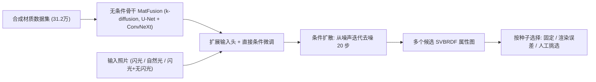

## 一句话总结

把"从照片估计材质 SVBRDF"重新表述成扩散去噪任务：先在 31 万张合成材质上训练一个无条件的 SVBRDF 扩散骨干模型 MatFusion，再针对不同拍摄光照微调出条件扩散模型，从而对同一张照片生成多个候选材质供用户挑选。

## 研究背景

- 领域现状：从单张（或少量）照片估计空间变化材质（SVBRDF：漫反射反照率、镜面反照率、粗糙度、法线）是外观建模的核心问题，近年主流是用神经网络做直接推断或迭代优化。
- 核心痛点：
  - SVBRDF 估计本身是欠约束、有歧义的——多组参数能解释同一张照片，而现有方法对每张照片只给一个解，没有旋钮去产生其它合理替代解。
  - 现有方法都是为某一种特定入射光照训练的，架构和损失都被绑定到该光照，换光照往往要从头重训并配套新的损失。
  - 现成的图像扩散模型是在自然图像分布上预训练的，而 SVBRDF 的分布与自然图像差异很大，不能直接拿来用。
- 本文 idea：训练一个只在反射率属性上算损失、与光照无关的无条件 SVBRDF 扩散骨干（backbone），再通过轻量微调把它变成条件模型来吃不同类型的照片；因为是生成式的，可以换随机种子采样出多个候选材质。

## 方法

整体框架分两阶段：先训一个无条件扩散骨干 MatFusion，学会"凭空生成合理的 10 通道 SVBRDF 属性图"；再在骨干输入端扩展若干条件通道、用目标光照下的照片微调，得到条件扩散模型。推理时从高斯噪声出发，用 20 步 Euler 求解去噪微分方程迭代得到材质。

关键设计：

- **k-diffusion 骨干与 10 通道适配**：采用 Karras 等人的 k-diffusion 变体，网络估计"速度" $$a\boldsymbol{n} - b\boldsymbol{x}$$ 而非直接估噪声，使得同一网络在不同噪声水平下都能同样容易地恢复信号或噪声的期望（利用 $$a^2 + b^2 = 1$$）。骨干是 6 级分辨率的 U-Net，用 $$3\times 3\times 10\times 128$$ 卷积把 10 个 SVBRDF 通道（漫反照率、镜面反照率、单色粗糙度、法线）升到 128 特征；并用 ConvNeXt 块替换常见的残差块，在参数量不变的前提下增加激活数，以更好地建模比自然图像多得多的通道。整个骨干约 256M 参数。

- **只用属性损失、不做渲染反传**：骨干仅对 SVBRDF 参数图算损失，训练时不需要经过可微渲染器反向传播。好处是条件微调时可以放心用更昂贵的渲染方式（如路径追踪、积分法线、考虑材质内部间接光）来生成训练照片，而不受反传开销限制——这对自然光下自阴影、环境遮挡等间接光效应显著的情况尤其重要。

- **直接条件化（direct conditioning）**：受 ControlNet 启发，但不另建并行控制网络，而是把输入头从 $$3\times 3\times 10\times 128$$ 扩展成 $$3\times 3\times (10 + k)\times 128$$（$$k = 3N$$，$$N$$ 为条件照片数），新增权重和偏置全部零初始化，然后微调整个骨干。相比 ControlNet 更易实现、显存开销更小，代价是会"污染"原骨干网络。文中给出三种条件变体：共置闪光、自然光、闪光/无闪光图像对。

- **与直接推断的关系及多解选择**：在 $$t = T$$ 时输入几乎是纯噪声，网络主要依赖条件照片，此时第一步的期望 $$\mathbb{E}_x$$ 就近似一个直接推断网络的结果；但扩散会在后续步继续迭代，减轻高光烧入、补全法线细节、改善漫反射-镜面分离。改变随机种子可生成不同候选，论文用三种选择策略：固定种子、按渲染 LPIPS 误差选、人工挑选。作者发现若直接对输入噪声场做渲染误差优化，反而会把解推向高光烧入。

数据方面，作者在 INRIA 合成数据集（19.9 万）基础上，新增来自 Polyhaven（307）和 AmbientCG（1570）的 CC0 材质，经随机裁剪得到 3 万基础 SVBRDF，再用随机初始化（未训练）的网络把反照率/高度非线性映射为粗糙度或分块掩码，构造 8.3 万分块混合材质，最终合成 312,165 个训练样本；另留 50 个材质作测试集。

## 实验结果

主实验是在 50 个合成测试材质上，与 Zhou 和 Kalantari 的对抗式直接推断（2021）及元学习 look-ahead（2022）方法对比共置闪光条件下的效果。指标为 128 个随机点光渲染下的平均 LPIPS 渲染误差，以及各属性图的 RMSE（越低越好）。

| 方法 | Render LPIPS↓ | Diff. RMSE↓ | Spec. RMSE↓ | Rough. RMSE↓ | Normal RMSE↓ |
|------|------|------|------|------|------|
| Adversarial | 0.2304 | 0.0439 | 0.0859 | 0.1358 | 0.0577 |
| Adversarial (retrained) | 0.2292 | 0.0405 | 0.0795 | 0.1276 | 0.0545 |
| Look-ahead | 0.2647 | 0.0591 | 0.0727 | 0.1424 | 0.0572 |
| MatFusion (固定种子) | 0.2282 | 0.0427 | 0.0691 | 0.1252 | 0.0561 |
| MatFusion (渲染误差选) | 0.2138 | 0.0440 | 0.0657 | 0.1282 | 0.0543 |
| MatFusion (人工挑选) | 0.2056 | 0.0412 | 0.0666 | 0.1265 | 0.0524 |

在感知渲染误差（作者主张的最优比较指标）上，MatFusion 即便固定种子也已与最好基线持平，人工挑选则明显领先。作者强调生成式模型不保证像素级对齐，因此在纹理丰富的属性图上 RMSE 有时偏大，但细节更丰富。消融实验进一步表明 ConvNeXt 块在反照率 RMSE 上比残差块约好 5%，且直接条件化在所有指标上都优于 ControlNet 并更省显存。真实世界拍摄（含手机随手拍的自然光材质）也验证了模型的泛化能力，且比基线更少出现高光烧入。

## 亮点与局限

- 亮点：
  - 首个面向 SVBRDF 分布、从零训练的生成式扩散骨干，把材质捕获统一成去噪任务。
  - 骨干与光照解耦、只用属性损失，微调即可适配不同拍摄光照，无需从头重训，也省去可微渲染反传。
  - 生成式带来"多候选可选"的能力，缓解了 SVBRDF 估计固有的歧义问题；直接条件化比 ControlNet 更轻更省显存。
- 局限：
  - 生成式难以做到像素级精确重建，在基于像素的指标上不一定最低。
  - 更擅长有机、随机结构的材质，对规则直线纹理（常见于美术制作的材质）表现较差，有时会生成"blob 状"的人工法线（失败案例）。
  - 依赖随机种子，需要额外的选择策略（渲染误差或人工）才能稳定拿到高质量结果。

## 延伸思考

- 把外观捕获从"确定性回归一个解"转向"从条件分布中采样多个解"，是扩散模型带给逆向渲染的一个思路转变，值得关注它与后续多视角 / 视频材质捕获、程序化材质生成方法的结合。
- 直接条件化 vs. ControlNet 的对比结论目前只在"照片作条件"下验证，是否推广到草图、文本等更松散的条件仍待考察；这对设计通用可控材质生成器有参考价值。
- 训练数据大量依赖随机初始化（未优化）网络做非线性映射来扩增粗糙度和混合材质，这种"以随机变换换多样性"的数据增强策略，或可迁移到其它数据稀缺的图形属性生成任务。
- 针对规则结构材质的弱点，是否可引入结构先验或与程序化模型混合，是提升实用性的自然方向。
