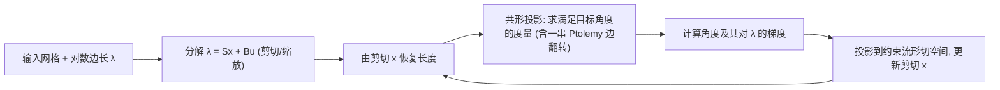

## 一句话总结

本文把网格上的度量优化问题搬到 Penner 坐标这一"无约束的全局坐标系"里求解，从而在允许连通性变化（重网格）的前提下，为一大类参数化/映射问题提供了解存在性保证，同时不再局限于共形映射。

## 研究背景

- 领域现状：几何处理中大量参数化与映射问题都可以看成"度量优化"——在满足约束（如平坦性、指定顶点角度）的前提下，最小化某个失真度量。近年来针对离散共形映射的理论突破（Penner 坐标、离散均匀化）催生了带收敛性和解存在性保证的鲁棒算法。
- 核心痛点：若把三角网格的度量用边长表示，边长要受每个三角形的三角不等式约束，可行域是开集且不含边界；对固定连通性，往往无法判断满足角度约束的解是否存在，很多情况下最优解恰好落在退化（三角形塌缩）的边界上，意味着必须改变连通性才能找到非退化的最优度量。而一旦允许边翻转等连通性变化，几乎所有已知失真度量都不再保持不变，度量表示还会发生频繁的不连续跳变。
- 本文 idea：使用 Penner 坐标——它在固定顶点集与拓扑亏格下，把整个锥度量空间与 $$\mathbb{R}^{\lvert E \rvert}$$ 建立双射（每条边一个对数长度坐标），且完全不受三角不等式约束。于是度量优化变成一个无约束（或仅带平坦性约束）的问题，凸目标下解一定存在，只是可能需要重网格。

## 方法

整体框架：把输入网格的对数边长分解为"剪切（shear）"与"缩放（scale）"分量，以剪切分量作为自由变量在 Penner 坐标空间上做基于梯度的优化；每步先由剪切分量恢复长度、再做一次共形投影把度量拉回满足指定顶点角度的约束流形，随后沿约束流形的切空间更新剪切变量。

关键设计：

1. **全局 Penner 坐标与 Ptolemy 变换**。任一锥度量都有一个（几乎唯一的）本征 Delaunay 三角剖分，对应一个"Penner 胞腔"；相邻胞腔通过边翻转相接，翻转时用 Ptolemy 公式（对数长度下的关系）平滑地衔接坐标。这样整个锥度量空间被拼成一个与欧氏空间同胚的全局坐标系，边翻转不再造成表示的不连续跳变，失真度量得以光滑地延拓到整个度量空间。

2. **约束空间与剪切/缩放分解**。平坦性约束写成"各顶点角度和等于目标值" $$\Theta_i(\ell)=\hat\Theta_i$$。作者把对数长度线性分解为剪切分量 $$x$$ 与缩放分量 $$u$$（$$\lambda=Sx+Bu$$）。缩放方向对应共形变化，用来把度量投影回约束流形；剪切方向张成约束流形的切空间，作为真正的优化自由变量，从而把带约束优化转化为在剪切空间上的（近似）无约束优化。

3. **可延拓到全空间的失真度量**。标准的对称 Dirichlet 能量在三角不等式取等时趋于无穷、无法光滑延拓到整个度量空间。作者转而使用可在 Penner 坐标下良定义的度量：一是逐边对数长度差的二次能量（对小形变与对称 Dirichlet 一致、Hessian 稀疏且常量、几何不变且各向同性），二是面积/缩放失真度量与 $$L_p$$ 版本，可在共形（纯形状失真）与等距（几乎无面积失真）之间自由权衡与插值。

4. **梯度计算与两种求解器**。通过对约束流形做参数化，把角度对对数长度的梯度、各次 Ptolemy 翻转的导数矩阵 $$D_j$$ 与分解矩阵串起来，得到剪切失真能量的梯度，任意基于梯度的方法（梯度下降、BFGS）均可用。为加速，作者进一步提出显式处理约束的坐标投影下降：二次能量下 Hessian 常量，投影 Newton 收敛很快；高阶能量（$$L_p$$ 对数长度、对数缩放）Hessian 非常量，则退回投影梯度下降。求解结果还给出从优化后网格到原网格的映射，可据此做局部细化，使原始顶点处严格满足角度约束。

## 实验结果

在 Myles 等人的数据集（114 个网格）及其被切开、带边界角度约束的高难度变体上测试。该切开版本数值上极具挑战——共形映射的缩放因子范围可高达 $$10^{100}$$。用逐边对数长度失真与初始/结果长度的对称比值来衡量失真（该指标独立于优化所用目标），结论以分布直方图与散点图给出为主：

| 场景 / 对比 | 现象与结论 |
|------|------|
| 三类数据集（闭合 / 带边界 / 切开固定边界角度） | 均能在严格满足角度约束下，把失真降低若干数量级 |
| 不同目标（对数长度 $$L_2$$ / $$L_p$$ / 共形 / 对数缩放） | 都得到视觉相近的近等距参数化，但失真分布差异显著：共形无形状失真却缩放分布很宽，对数缩放几乎零面积失真但各向异性拉伸更强 |
| 与固定连通性 $$uv$$ 对称 Dirichlet 优化对比（含自由边界 Tutte 初始化） | 最终能量与结果视觉相近（能量差约 $$10^{-7}$$），但固定连通性方法不保证有解、许多情形无法产出有效输出 |
| 初值敏感性（对数边长加最高 $$\sigma=2.5$$ 的高斯噪声） | 因 Penner 坐标无约束，任意噪声仍是合法起点，收敛结果高度相似 |
| 收敛性 | 多数改进发生在前 10–20 次迭代；投影 Newton 对二次能量收敛最快，是主用方法 |

## 亮点与局限

- 亮点：
  - 用 Penner 坐标把度量优化转成无约束问题，凸目标下解存在性有保证，突破了固定连通性下"可能无非退化解"的困境。
  - 统一框架不局限于共形映射，支持形状/面积失真之间的连续权衡与度量插值，且天然处理闭合面、带边界、切开固定角度等多种设置。
  - 边翻转经 Ptolemy 变换光滑衔接，失真度量能延拓到整个度量空间，避免了连通性变化带来的不连续。
  - 局部细化只在必要区域加面，比完整叠加细化产生的网格粗得多。

- 局限：
  - 目前较慢：一阶方法收敛慢，共形投影步可能需要上百次线性求解，尚不够实用，需要更高效的优化或与无保证的高效方法结合。
  - 边界同时固定角度与长度（等价于固定整条边界）时缺乏解存在性证明，共形投影也不支持该情形。
  - 部分面仍会出现较大的对称 Dirichlet 能量（与对比方法类似），三角形质量以纵横比衡量尚属可比。

## 延伸思考

- 本文是把共形映射鲁棒理论（如带边界的离散共形等价）推广到"非共形度量优化"的一步，后续的 Seamless Parametrization in Penner Coordinates 正是沿此方向把无缝参数化也纳入同一坐标框架。
- "把带约束优化搬进一个无约束的全局坐标系换取解存在性"这一思路很有启发：代价是可能的重网格与效率下降，如何把这种带保证的方法与快速但无保证的 $$uv$$ 空间求解器组合（例如仅在近平坦度量上做精修）是通向实用的关键。
- 同时固定边界角度与长度的可行性，本质是一个线性子空间与角度约束非线性流形的相交问题，是值得继续追问的理论方向。
