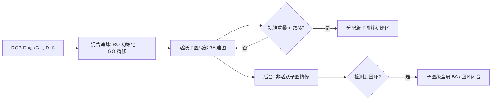

## 一句话总结

MIPS-Fusion 用"多个神经子图（multi-implicit-submap）"的分治方案，加上"随机优化 + 梯度优化"的混合追踪，实现了可扩展、且能在快速相机运动下稳定工作的在线神经 RGB-D 重建。

## 研究背景

- 领域现状：自 KinectFusion 以来，在线 RGB-D 稠密重建的核心是同时做相机定位（tracking）与深度融合（mapping）。近年神经隐式表示（如 iMAP、NICE-SLAM、Vox-Fusion）被引入建图，用紧凑的网络编码场景，带来了可微、端到端优化的新可能。
- 核心痛点：现有神经方法在"可扩展性"和"鲁棒性"上都不理想。用单个 MLP 表示整个场景（iMAP）扫描大场景时会"遗忘"、难以扩展；用稠密特征网格（NICE-SLAM、Vox-Fusion）提升容量又带来立方级存储开销，同样难以扩展。同时，主流追踪依赖梯度优化，在快速相机运动下因大位姿优化的高度非线性而变得脆弱、容易失败。
- 本文 idea：坚持"纯神经"表示，用分治思路把场景拆成沿扫描轨迹增量分配的多个神经子图，每个子图只管一小块局部体积，既保持容量又保持可扩展性；追踪上首次把随机优化引入神经设定，与梯度优化组合成混合追踪，兼顾鲁棒性与精度。

## 方法

整体框架：系统并行跑两个进程。前台"活跃进程"对当前活跃子图做追踪、关键帧选择与建图（本质是局部 BA）；后台"非活跃进程"用更密集的采样精修已固定的非活跃子图。子图沿轨迹增量分配，检测到非平凡回环时做子图级 BA 完成回环闭合。

关键设计：

1. **多隐式子图表示**：每个子图是一个元组 $$M_s = \langle f_{\theta_s}, c_{\lambda_s}, \boldsymbol{T}_s, \boldsymbol{F}_s, \Omega_s \rangle$$，其中 $$f_{\theta_s}$$ 是 TSDF 网络、$$c_{\lambda_s}$$ 是辐射场（均为 MLP），$$\boldsymbol{T}_s$$ 是子图在世界系的全局位姿，$$\boldsymbol{F}_s$$ 是关联关键帧集合，$$\Omega_s$$ 是它管辖的轴对齐长方体子体积。每个子图定义在自身局部坐标系里，因此可以整体做刚体变换来做全局对齐——这比重新训练神经图快得多。相邻子图刻意保留重叠并共享至少一个关键帧，重叠区的 TSDF 用不确定度加权融合：$$\psi(\boldsymbol{x}_W) = \frac{w_s(\boldsymbol{x}_s)\psi_s(\boldsymbol{x}_s) + w_t(\boldsymbol{x}_t)\psi_t(\boldsymbol{x}_t)}{w_s(\boldsymbol{x}_s) + w_t(\boldsymbol{x}_t)}$$，权重取 $$w_* = 1/h_*(\boldsymbol{x}_*)^2$$。

2. **分类式神经 TSDF**：不直接回归 SDF，而是在截断区间 $$[-\tau, \tau]$$（$$\tau = 0.1\text{m}$$）里取 5 个离散距离作为类别，网络输出 5 维概率向量，再用带冷度参数 $$\beta$$ 的 soft-argmax 近似出 SDF 值。这样做收敛更快、更易学；更妙的是可以用分类分布的香农熵 $$h_s(\boldsymbol{x}_s) = -\sum_i p_i \log p_i$$ 作为预测不确定度，用来过滤不可靠点并给追踪加权。

3. **混合追踪（RO + GO）**：核心是一个"深度到 TSDF"损失 $$L_{d2t}(\boldsymbol{R}_t, \boldsymbol{t}_t) = \sum_{p \in \mathcal{P}} \psi_s(\boldsymbol{T}_s^{-1}(\boldsymbol{R}_t \boldsymbol{x}_p + \boldsymbol{t}_t))^2$$，它只对深度图反投影出的 3D 点做网络查询，不需要昂贵的体积深度渲染，因此又快又可微。追踪按计划表进行：先用随机优化（粒子滤波 PFO，预采样 Particle Swarm Template 并逐步移动/缩放去覆盖最优解）快速跳出局部极小、拿到好初值；再用梯度优化（Adam）在初值附近精修。RO 阶段用不确定度加权的适应度 $$\eta(\pi_k^i) = \sum_{p} \psi_s(\cdot)^2 / h_s(\boldsymbol{x}_p)^2$$ 评价每个候选位姿。RO 擅长逃离局部极小、GO 擅长局部收敛，二者结合正好互补，这是它在快速运动下依然稳的关键。

4. **分布式精修与子图级回环闭合**：活跃子图为保实时往往训练不足，后台线程用更密的关键帧/像素采样单独精修非活跃子图。回环检测简化为"相机是否重新进入某个非活跃子图的子体积"（只处理涉及至少四个子图的非平凡回环）。相邻子图间通过沿 TSDF 梯度移动找点对应，构造点到面约束，配合基于追踪运动的位姿到位姿约束，用 Ceres + LM 联合优化所有子图位姿。因为子图定义在局部系，回环调整只需变换子图，比调整神经图本身高效得多，且多子图调整比单一 $$SE(3)$$ 变换有更多自由度。

## 实验结果

在快速相机运动数据集 FastCaMo-Synth（10 段，无噪声）上比较追踪精度（ATE RMSE，单位 cm，越低越好）。MIPS-Fusion 是唯一能重建全部序列的方法，iMAP 与 NICE-SLAM 在多数快速运动序列上直接失败。

| 序列 | iMAP | NICE-SLAM | Vox-Fusion | MIPS-Fusion |
|------|------|-----------|------------|-------------|
| Apartment_1 | – | – | 9.1 | 7.0 |
| Apartment_2 | – | – | 4.1 | 1.5 |
| Frl_apartment_2 | – | – | 7.2 | 1.9 |
| Hotel_0 | 20.3 | 4.2 | 5.0 | 4.8 |
| Office_0 | 39.2 | 8.4 | 4.8 | 3.6 |
| Office_1 | – | 13.7 | 4.6 | 5.6 |
| Office_2 | – | – | 10.2 | 7.4 |
| Office_3 | – | 14.3 | – | 17.4 |
| Room_0 | – | – | 8.2 | 4.4 |
| Room_1 | – | 29.7 | 5.8 | 5.1 |

其余实验补充：在常规序列 Replica、ScanNet 上，本方法与最好的 Vox-Fusion 精度相当，但运行时间和显存占用显著更低，且在含多回环的复杂轨迹（如 scene0000、scene0024）上因后台优化表现更好。消融实验（ScanNet 6 段 + FastCaMo 4 段）表明：去掉子图初始化（No SI）和平滑重访处理（No SR）导致最严重的精度下降甚至失败；RO 对快速运动序列贡献最大、GO 对常规运动更关键，二者结合优于任一单独使用；分类式 TSDF 与不确定度加权也都实测有效。

## 亮点与局限

- 亮点：
  - 纯神经的分治建图，同时拿下可扩展性（大到 200m² 的场景）和局部细节，避免了单 MLP 的遗忘问题与特征网格的立方存储开销。
  - 首次把随机优化引入神经追踪，混合 RO+GO 让神经方法第一次能在快速相机运动下稳定工作。
  - 分类式 TSDF 一举三得：收敛更快、更易学、还免费提供了可用于加权与滤波的不确定度。
  - 首次在神经建图里实现回环闭合——借助子图可整体变换，回环调整既高效又比单纯 $$SE(3)$$ 变换自由度更高。
  - 贡献了新的大场景快速运动数据集 FastCaMo-Large。

- 局限：
  - 表示仍用较朴素的 MLP，作者也指出可换用更先进的哈希编码等进一步提升重建质量。
  - 回环时的点对应只能在截断区域内找到，依赖"相邻子图间漂移较小"的假设；首末子图漂移过大时还得借助传统特征匹配。
  - 多进程共享重叠关键帧需要写锁避免脏写，系统工程复杂度较高。
  - 在带极大旋转的最难序列（Office_3）上误差仍偏高，鲁棒性并非无上限。

## 延伸思考

- 子图定义在局部坐标系、可整体刚体变换的思想，本质上把"神经图的全局一致性"从"重训网络"降维成"优化一组子图位姿"，这对任何需要在线增量扩展的神经场景表示都有借鉴意义，值得思考它与 Gaussian Splatting 类显式表示的子图化融合。
- 把 SDF 回归改成分类并顺带得到不确定度，是一个轻巧而通用的技巧；这种 epistemic uncertainty 除了用于追踪加权，是否还能指导主动扫描/下一最佳视角选择值得探究。
- 混合 RO+GO 的调度策略（先随机跳出局部极小再梯度精修）对高度非线性的位姿优化很有效，这一范式或可迁移到其他非凸的可微渲染反问题（如逆向渲染、材质估计）。
- 该团队后续的 RemixFusion 用残差式的显隐混合表示进一步做大规模在线重建，可作为这条线的延伸对照阅读。
