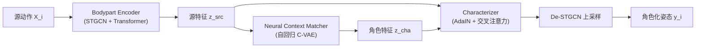

## 一句话总结

MOCHA 是一个在线实时运动角色化框架，能把一段"无风格"的用户动作，一次性同时迁移目标角色的运动风格与身体比例，让普通人动作即时"变身"成僵尸、公主、小丑等角色的独特动态。

## 研究背景

- 领域现状：数据驱动的动作风格迁移大多把"风格"当作数据里时间不变的静态特征——要么从目标样本里抽风格元素贴到源动作上，要么把风格作为条件变量去生成动作。这类方法在刻板的行走类数据集上表现不错。
- 核心痛点：把风格当静态特征表达力有限。作者用一套高质量专业表演数据集指出：风格其实是**上下文相关**的——同样是"快乐"，在跳跃里的表现和在爬行里的表现完全不同，两者不可互换。此外，角色的独特动态与其独特身形紧密耦合（角色未必是人类比例），因此风格化与重定向（retargeting）必须**联合求解**，而非先后处理。
- 本文 idea：用户做动作时，从目标角色的动作库里检索**上下文最相似**的一段动作，再把它的风格元素迁移到用户动作上。为避免存库、实时检索慢、以及被库内动作限制的问题，作者受"学习式运动匹配"启发，训练一个神经网络 Neural Context Matcher (NCM) 直接**生成**匹配的目标角色特征，而不是查库。

## 方法

整体 pipeline：输入是长度 $$T$$（1 秒、60 帧）的源动作序列，先由 bodypart encoder 编码成源特征；再由 NCM 针对每一帧生成与源动作上下文最匹配的目标角色特征；最后由 characterizer 把角色特征注入源特征、合成出角色化的姿态，只取序列最后一帧作为实时输出。bodypart encoder 与 characterizer 对所有角色共享，NCM 则每个目标角色单独训练。

关键设计：

1. **Bodypart Encoder（部件感知的运动编码）**：借鉴 ViT 把图像切 patch 的思路，用时空图卷积块（STGCN）在保持人体骨架图结构的前提下降低关节与时间分辨率，把身体组织成 6 个部件（头、脊柱、双臂、双腿），再用 Transformer 编码器捕捉时空依赖，得到源特征。这样的结构化表示既保住了拓扑，又能捕捉运动的序列依赖，是后续做上下文匹配的基础。

2. **Neural Context Matcher（自回归 C-VAE 生成角色特征）**：这是框架核心。它不查库，而是把匹配过程建模成一个自回归的条件变分自编码器。关键点在于**上下文映射**：从源特征中抽出一个"角色无关"的上下文特征 $$f(z_{src})$$，这个上下文空间跨角色共享，才能在不同角色域之间做匹配。给定上一帧角色特征与当前源上下文，学习到的先验网络给出下一帧潜变量分布，NCM 解码器据此逐帧采样生成角色特征。相比只每隔几帧匹配一次的传统运动匹配，NCM **每帧都跑**，从而产生时间连贯的角色特征。

3. **Characterizer（把风格注入源特征）**：用一个改造过的 Transformer 解码器块，先用 AdaIN 迁移角色特征的全局统计量（相当于全局风格），把源特征按角色特征生成的仿射参数 $$\gamma$$、$$\beta$$ 做归一化再缩放平移；随后用"基于上下文映射的多头交叉注意力"，其中 query 来自全局风格化后特征的上下文、key 来自角色上下文、value 来自角色特征本身。这样既注入风格，又借上下文对齐保住源动作语义。输出特征经对称的 De-STGCN 上采样还原成角色化动作。根运动上保留源动作角速度，只按平均髋速比例缩放线速度，让轨迹形状不变而整体速度贴合目标角色。

4. **两阶段训练与关键损失**：阶段一无监督训练 encoder 与 characterizer，随机取源/角色动作对，用身份损失、循环一致性损失，外加新引入的**身体 patch 级对比损失**（infoNCE）——保证输出同位置部件的上下文与源动作对应部件更接近，避免左右腿被交叉注意力错配。阶段二有监督训练 NCM：用带上下文度量的最近邻搜索在目标特征库里取"真值"角色特征序列，训练自回归的 NCM 去重建这些上下文匹配的目标特征，同时把潜变量约束成标准正态；运行时丢弃编码器，只用解码器逐帧预测。

## 实验结果

在自建 MOCHA 数据集与公开 Adult2child 数据集上，用 Frechet Motion Distance（FMD，衡量运动质量）、风格识别准确率（SRA）、上下文识别准确率（CRA）与 Motion Puzzle 及"用最近邻检索替换 NCM"两个基线对比。下表为 MOCHA 数据集上的主对比：

| 方法 | FMD↓ | SRA Top1↑(%) | SRA Top5↑(%) |
|------|------|------|------|
| Ground truth | - | 43.61 | 84.76 |
| Ours (MOCHA) | 34.99 | 36.51 | 73.68 |
| Nearest Neighbor | 32.80 | 23.62 | 69.06 |
| Motion Puzzle | 39.51 | 31.78 | 70.70 |

MOCHA 相比离线的 Motion Puzzle 在 FMD 与 SRA 上都更优，说明运动质量更高、风格还原更准；相比最近邻检索，MOCHA 凭借自回归 C-VAE 带来的时间连贯性获得更高 SRA（最近邻 CRA 略高是因为它直接复用库内特征，但输出会出现明显不连续）。消融显示：去掉 AdaIN 无法还原如 Ogre 抬臂的风格；去掉对比损失会让输出角色左右腿交换。整体推理耗时低于 16ms，在 2080 Ti 上达 60Hz 以上，支持稀疏 6 点输入与实时流式动作角色化。

## 亮点与局限

- 亮点：
  - 首个能**同时**迁移运动风格与身体比例的**在线**角色化框架，把风格化和重定向合二为一。
  - 用自回归 C-VAE 的 NCM 取代实时数据库检索，兼顾实时性与时间连贯性。
  - 提出跨角色共享的角色无关上下文空间 + 身体 patch 级对比损失，缓解风格错配、保住部件语义。
  - 贡献了 6 角色、多动作、5 种情绪的高质量动作数据集（约 159 分钟、573k 帧）。
- 局限：
  - 每个目标角色需单独训练一个 NCM，角色数量增加时 NCM 数量线性增长。
  - 当一个角色的同一上下文下存在多种不同风格（如把所有情绪合并）时，NCM 难以生成时间一致的特征，导致动作不连续。
  - 无监督的上下文映射不够灵活，无法覆盖全部风格多样性（如 Ogre 四肢着地奔跑、侧向跳跃这类独特风格无法与其他角色的跑跳建立关联）。

## 延伸思考

- 把"风格是上下文相关的"这一立场落成可检索/可生成的上下文空间，是这篇工作最值得借鉴的点；它比"风格=静态标签/Gram 矩阵"更贴近真实表演数据。
- NCM 每角色一网的代价，未来或可用条件化的单一模型统一多角色，甚至引入显式的情绪/动作条件来解决"同上下文多风格"的不连续问题。
- 稀疏 6 点输入即可驱动，天然契合 VR/AR 三点或六点追踪场景，配合流式实时推理，很适合作为消费级 XR 化身动作风格化的底座。
- 与后续基于扩散模型的动作风格迁移相比，本文的自回归 C-VAE 在实时性上有优势，二者在质量与延迟上的权衡值得进一步比较。
