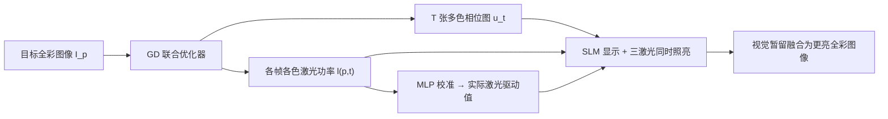

## 一句话总结

提出一种全新的全息显示驱动方案：让每一帧全息图同时被红绿蓝三束激光以各自可调的强度照亮，并用梯度下降联合优化相位图与各激光功率，从而在不加大激光功率、不改动硬件的前提下把全息显示的亮度提升至约三倍。

## 研究背景

- 领域现状：全息显示能生成高质量 3D 图像、支持轻薄的 AR/VR 近眼形态，但要达到"感知真实"仍有障碍，其中一个关键瓶颈是亮度不足。传统全息显示采用"场序彩色"（field-sequential color）方案，用单个空间光调制器（SLM）按时间顺序依次显示三张单色全息图，每张只由对应颜色的单一激光照亮。
- 核心痛点：由于每个颜色通道任一时刻只有一束激光工作，图像的亮度上限被单色激光的峰值强度锁死。想显示超过该峰值的亮度时，结果往往偏暗、出现失真或颜色错配。单纯提高激光功率则带来护眼风险、发热、成本与散热复杂度上升，尤其不适合移动/可穿戴设备。
- 本文 idea：不改硬件，转而"更激进地利用现有的色彩基元和全息图"。核心思路是让每张全息图同时被多个波长的激光以不同强度照亮（多色全息图），把原本闲置的其它两束激光"借"来给当前帧供光，用持续视觉暂留把连续几张多色全息图融合成一幅更亮的全彩 3D 图像。

## 方法

整体思路：把传统"三张单色相位图各自独立求解"的问题，改写为"联合优化 $$T$$ 张多色相位图 + 每张图上每个色彩基元的激光强度"的优化问题，用基于梯度下降的求解器配合几个面向应用的损失项来求解。

关键设计：

1. **多色驱动方案与联合优化目标**。设复现一幅彩色图共用 $$T$$ 个子帧（传统方案 $$T=3$$）。优化变量既包括每个子帧的 SLM 相位 $$u_t$$，也包括第 $$p$$ 个色彩基元在第 $$t$$ 个子帧的激光幅度 $$l(p,t)$$。图像损失把"三束激光在各子帧上按其波长传播、叠加后的强度"与缩放后的目标 $$s I_p$$ 对齐。由于相位是针对某个"锚定波长" $$\lambda_{p\text{anchor}}$$（原型中为 515 nm）标定的，其它波长通过 $$\lambda_p / \lambda_{p\text{anchor}}$$ 因子换算。

2. **激光损失加速收敛与配色**。仅有图像损失时，激光功率容易在某些子帧被压到零或分配不均。作者加入激光损失 $$L_{\text{laser}}$$，鼓励每个色彩基元在所有子帧上激光强度平方和逼近目标图像被缩放后的最大强度，即 $$\left(\sum_{t=1}^{T} l_{(p,t)}^2\right) - \max(I_p)\, s$$ 的平方，从而加快 $$L_{\text{image}}$$ 收敛并在复杂场景里得到更准的颜色。

3. **变分损失抑制散斑**。方法沿用双相位（double-phase）编码的变体：从均值相位 $$u_t^{\text{mean}}$$ 加/减一个偏移相位 $$u_t^{\text{offset}}$$，按棋盘格奇偶交错得到高/低相位。变分损失 $$L_{\text{variation}}$$ 惩罚这两张相位图的剧烈变化与过大标准差（在重建图像金字塔上计算总变差），有效压制实验中常见的散斑伪影。总损失为 $$L_{\text{total}} = w_1 L_{\text{image}} + w_2 L_{\text{laser}} + w_3 L_{\text{variation}}$$。

4. **内容自适应的动态强度缩放**。把缩放因子 $$s$$ 直接顶到理论极限（$$T=3$$ 时为 3）并不总能保证高质量。作者改为在"图像损失低于用户设定阈值 $$\epsilon_{\text{image}}$$"时把 $$s$$ 也当作优化变量、尽量抬高（目标里加一项 $$-w_4 s$$），一旦损失超阈值则退回只优化相位与激光。这样能为每个场景自动选出内容相关的最大亮度（例如某场景自动选到 ×1.63 而非硬编码 ×1.8）。此外用一个四层 MLP 把优化器给出的归一化激光功率映射为真实激光驱动值，保证硬件上的配色准确。

## 实验结果

原型用 Holoeye Pluto-VIS SLM 显示、Ximea 相机拍摄，默认 $$T=3$$。主实验用 PSNR/SSIM/LPIPS 对比传统方案与多色方案在不同峰值亮度下的成像质量。下表取 AR Glasses 场景的 PSNR（传统 / 多色，单位 dB）：

| 峰值亮度 | 传统方案 PSNR↑ | 多色方案 PSNR↑ |
|----------|----------------|----------------|
| ×1.0 | 30.33 | 29.92 |
| ×1.5 | 23.82 | 24.75 |
| ×2.0 | 16.16 | 22.39 |
| ×2.5 | 12.16 | 17.95 |
| ×3.0 | 9.66 | 15.08 |

可以看到在 ×1.0 时两者相当（传统略高），但一旦亮度超过 ×1.0，传统方案质量迅速崩塌，而多色方案在高亮度区（×2.0 及以上）保持明显优势，SSIM 与 LPIPS 呈相同趋势。实拍显示多色方案可在无明显失真的情况下安全支持约 ×1.8 峰值亮度，而传统全息图超过 ×1.0 就被噪声主导。功率对比上，多色方案最坏情况用约 140 mW 电功率（Class 3R 低风险激光）即可达到传统方案需要 Class 3B 激光更高功率才能实现的亮度。颜色直方图对比也表明多色方案能贴合目标分布，而传统方案超过 ×1.0 后无法跟随。

## 亮点与局限

- 亮点：
  - 纯软件/驱动层创新，不改硬件即把亮度提升约三倍，直接缓解全息近眼显示的亮度瓶颈。
  - 用更低功率、更安全的激光等级达到同等亮度，对电池供电的可穿戴设备友好（省电、降成本、降护眼风险）。
  - 联合优化相位与激光功率、动态强度缩放的内容自适应策略，以及配色 MLP，构成一套可实机验证的完整流程，并开源了代码。
- 局限：
  - 以更长的"点亮时间"（更多子帧供光）换取亮度，可能影响刷新率；$$T=2/1$$ 虽可提速但牺牲配色精度。
  - ×1.8 的无伪影上限依赖场景内容，并非任意场景都能保证；极高亮度下仍会轻微损失颜色完整性或出现噪声。
  - 面向 HDR 目标的自动色调映射、动态画面跨帧亮度一致性等仍是未验证的未来工作；配色依赖对相机线性响应的假设。

## 延伸思考

这项工作把全息显示的"亮度"问题重新表述为一个"如何更充分调度已有激光资源"的优化问题，思路上与计算摄影中"多曝光合成 HDR"异曲同工——都是用时间维度换动态范围。它与学习式全息（如同组后续的 learned light power control、面向显示与场景自适应的方法）天然衔接：多色驱动提供了更大的亮度/动态范围预算，而神经网络负责快速求解与硬件校准。值得追问的是，在真实动态视频、跨帧亮度一致性以及与注视点渲染结合时，多子帧供光带来的刷新率代价如何权衡；以及这套方案能否推广到 piston-mode、纳米光子相控阵等新型 SLM 上，从而摆脱当前对 LC 相位型 SLM 的依赖。
