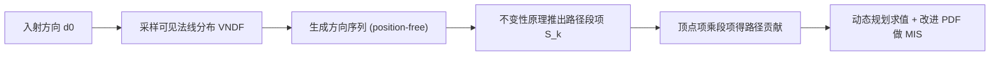

## 一句话总结

借助辐射传输里的"不变性原理"（invariance principle），本文为 Smith 微表面模型推导出一个形式简洁、无偏的多次弹射 BRDF，并配套一个更贴合真实多次弹射分布的重要性采样 PDF，在等时间下比已有方法噪声更低。

## 研究背景

- 领域现状：微表面模型是渲染中最常用的解析材质模型，但经典模型只描述光在微几何上的单次弹射。对粗糙表面，光实际会在微几何间多次弹射，只算单次会造成明显的能量损失（表面偏暗）。围绕多次弹射，已有几条路线：把微表面等价成微片/体介质后做随机游走（Heitz 等 2016、Dupuy 等 2016，结果准确但方差高）；对高度分布做闭式预积分降维（Bitterli 和 d'Eon 2022，无偏且噪声更低，但推导依赖高度分布、公式复杂）；引入 position-free 性质、把路径积分压缩到纯角度域（Wang 等 2022a，噪声大幅下降）。
- 核心痛点：随机游走方差高；预积分方法公式复杂、单次 BRDF 求值慢；position-free 方法为了简化假设了各次弹射相互独立，这个独立性假设引入了偏差，使其结果与前两类方法不一致。也就是说，"无偏"和"简洁高效"当时还没被同时满足。
- 本文 idea：把源自行星物理/辐射传输的不变性原理引入微表面多次弹射，并把它扩展到各向异性相函数。核心是把 shadowing-masking 从"逐次弹射分别定义"提升为"针对整条由方向序列构成的路径统一定义"，从而在保留 position-free 优点的同时去掉独立弹射假设，得到既无偏、推导又简单的解析路径贡献。

## 方法

整体上，本文沿用 Wang 等 2022a 的 position-free 框架：一条光路只由一串方向 $$\bar{x}=(\boldsymbol{d}_0,\boldsymbol{d}_1,\dots,\boldsymbol{d}_k)$$ 表示（首尾对齐宏观入射/出射方向），路径贡献是各顶点项 $$v_i$$ 与一个段项（segment term）的乘积。关键区别在于：Wang 等把段项按每次弹射独立累乘，本文则认识到某次弹射的遮蔽依赖之前的弹射，因此段项必须对整条路径统一定义：

$$f(\bar{x}) = \left( \prod_{i=0}^{k-1} v_i \right) S_k(\boldsymbol{d}_0,\dots,\boldsymbol{d}_k)$$

关键设计分三点：

1. **用不变性原理推段项。** 不变性原理的直觉是：给一个半无限均匀介质叠加一层厚度极小、性质相同的薄层，介质的反射率不应改变，因此薄层引入的所有过程贡献之和必须为零。作者把光穿过薄层的行为拆成四种情形（薄层内被吸收、只在薄层散射一次、入射方向散射一次后进入介质、出射方向的对称情形），令这四项的辐射变化满足能量守恒，抵消公因子并统一到上半球积分后，得到多次弹射 BRDF $$\rho(\omega_i,\omega_o)$$ 的递推积分方程。它把"介质深度"这一维度消掉了，只留角度域。

2. **路径段项的解析递推。** 从上述方程出发，展开一条 $$k$$ 次弹射的采样光路，抵消顶点项后得到段项的递推式：

$$S_k(\boldsymbol{d}_0,\dots,\boldsymbol{d}_k) = S_1(\boldsymbol{d}_0,\boldsymbol{d}_k)\left(S_{k-1}(\boldsymbol{d}_0,\dots,\boldsymbol{d}_{k-1}) + S_{k-1}(\boldsymbol{d}_1,\dots,\boldsymbol{d}_k)\right)$$

其中单次段项 $$S_1(\boldsymbol{d}_0,\boldsymbol{d}_1)=1/(1+\Lambda(-\boldsymbol{d}_0)+\Lambda(\boldsymbol{d}_1))$$，$$\Lambda$$ 是 Smith Lambda 函数；这个单次段项恰好等于 Ross 等的高度相关 shadowing-masking。递推里两个分支不总同时有物理意义：当出射方向朝下或入射方向来自下半球时该光路无效、段项置零。求值时用动态规划计算 $$S_k$$。该式使模型无偏（与 Heitz 等 2016 结果一致）且满足互易性；理论复杂度 $$O(NM)$$（$$N,M$$ 为朝上/朝下的方向数），但实际中约九成光路只有一两个方向朝下，故耗时近似与弹射次数线性。

3. **更匹配的重要性采样 PDF。** 以往用"单次弹射项 + 朗伯项"近似多次弹射 PDF，在低粗糙度、掠射角处会高估。本文观察到：各向异性介质虽无解析多次弹射式，但可用 Hapke 的各向同性多次弹射解析式来估计，其中介质反照率经验地取两向粗糙度均值 $$a=(\alpha_x+\alpha_y)/2$$，再由 $$H$$ 函数给出。最终 PDF 为单次弹射项加这个估计的多次弹射项，比朗伯近似更贴合真值。作为 MIS 的 PDF，这种近似不引入偏差。

## 实验结果

方法在 Mitsuba 中实现，并提供单向路径追踪（PT）与双向路径追踪（BDPT）两种估计器。下面取论文首图的 DecorativeSet 等时间对比（Silver, GGX, $$\alpha=1.0$$），以 MSE 相对 Heitz 等 2016 的收敛结果为真值，等时间下各方法用不同 spp：

| 方法 | spp（等时间） | MSE↓ |
|------|--------------|------|
| Heitz et al. 2016 | 18 | 1.91e-4 |
| Bitterli and d'Eon 2022 | 15 | 1.62e-4 |
| 本文 | 16 | 1.53e-4 |

在等时间下本文噪声最低。其他实验用文字补充：BRDF 值与逆效率（方差×时间）曲线显示本文在不同粗糙度、不同入射方向下逆效率均最优；Matpreview 场景里本文 BDPT 收敛最快、误差最低，MSE-采样率曲线证实本文（PT/BDPT）能收敛到参考、而 Wang 等 2022a 因独立弹射假设有残余偏差不收敛；Pot 场景验证改进 PDF 在低粗糙度铝质材质上比"单次+朗伯"近似噪声更小。

## 亮点与局限

- 亮点：
  - 首次将不变性原理用于各向异性相函数的多次弹射微表面推导，得到形式简洁、可解析的路径段项。
  - 同时做到无偏（结果与 Heitz 等一致）和高效（公式比 Bitterli 和 d'Eon 简单，等时间下噪声更低），并保持白炉测试通过、支持各向异性与 Beckmann/GGX 等分布。
  - 配套的多次弹射 PDF 在低粗糙度下明显优于常用朗伯近似，且不引入偏差；开源了实现。
- 局限：
  - 不变性原理只在空间域消维，角度域仍需 Monte Carlo 采样得到路径。
  - 只处理反射表面。折射表面因微表面与均匀介质的等价在空间域会导致不连续映射，扩展困难（Bitterli 和 d'Eon 同样只考虑反射）。
  - 各向异性材质的 PDF 因把粗糙度做了平均而不如各向同性情形精确。

## 延伸思考

不变性原理这种"叠加薄层、令净贡献为零"的思路，本质是把一个难解的多次散射积分方程转化为可递推的边界关系，作者也指出它有望推广到分层微片模型（SpongeCake）等类似结构，值得关注它在更一般分层/体积外观模型中的适用边界。另一个自然的追问是折射情形：微表面-介质等价在折射下的空间不连续是这条线上多篇工作的共同拦路石，若能找到角度域上绕开空间映射的表述，可能是打通完整微表面多次散射理论的关键。此外，路径段项已是解析形式且实际耗时近线性，配合神经网络或预计算把角度域采样也压下来，或许能进一步逼近实时的多次弹射材质求值。
