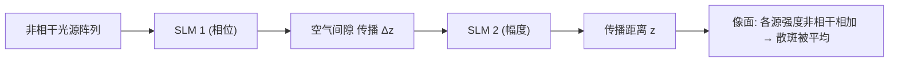

## 一句话总结

提出"多源全息（multisource holography）"显示架构：用一组彼此非相干的光源阵列照明、并串联两片带空气间隙的空间光调制器（SLM），在单帧内既压制散斑又不牺牲分辨率，实现带自然离焦模糊、眼盒能量均匀的高质量全息显示。

## 研究背景

- 领域现状：计算全息（CGH）用 SLM 重建三维波前，能提供逐像素的正确聚焦线索，被视为解决立体显示"辐辏—调节冲突"、实现紧凑头显的有力技术路线。
- 核心痛点：全息依赖相干照明，会产生散斑噪声。已有几条压制散斑的路都有硬伤——平滑相位全息（smooth phase）虽无散斑，但眼盒能量高度不均、对眼动和眼内杂质极其敏感，且被用户研究证明难以驱动人眼调节；随机相位全息眼盒均匀、离焦自然，但三维体内自由度不足、散斑严重；部分相干照明会在分辨率与散斑之间强制权衡；时间复用（多帧平均）则需要千赫兹级高速调制器，且散斑抑制随帧数呈亚线性增长，还会挤占本可用于扩大眼盒/视场的时间带宽。
- 本文 idea：既然要"多份带不同散斑的图像去平均"，那就在空间维度上一次性拿到多份——用一组互不相干的光源阵列照明。但单片 SLM 下每个光源只会产生同一全息图的平移副本（记忆效应），造成重影与雾化。于是加第二片 SLM，靠两片之间的空气间隙形成"角度选择性"响应，让不同入射角的光源各自看到不同的调制，从而独立成像、去除重影，同时保留多源平均带来的去散斑收益。

## 方法

整体框架：把传统全息显示中"单一相干平面波"照明替换为"光源阵列 + 两片间隔 $$\Delta z$$ 的 SLM"。每个光源以不同入射角照亮第一片 SLM，经间隙传播后再被第二片 SLM 调制；由于各光源互不相干，它们在像面按强度直接相加，散斑因平均而被压制。两片 SLM 的图案由梯度下降联合优化。

关键设计：

1. **为什么单片 SLM 不行**：在小角近似下，第 $$i$$ 个光源的输出场只是在轴照明输出场的一个平移副本（乘一个载波），即系统具有"无限记忆效应"。于是总强度等于单源图像与一串源位置冲激的卷积，要还原目标图像就得做去卷积，而被去卷积量是必须非负的物理强度——这是一个病态问题，无法显示任意内容，只会产生重影/雾化。

2. **两片 SLM 打破相关性**：加入距离 $$\Delta z$$ 的第二片 SLM 后，每个光源在到达第二片时经历不同的相对平移，等价于"每个源看到两片图案的不同相对错位"，从而生成互不相关的输出。只要任意两源的相对平移至少一个 SLM 像素，输出就充分去相关，条件为 $$\Delta m \ge \dfrac{2\pi p}{\lambda \Delta z}$$，其中 $$\Delta m$$ 为源间距（相位斜率之差）、$$p$$ 为像素间距。满足该"记忆效应"判据的源才真正贡献独立散斑。

3. **压缩特性带来超线性去散斑**：尽管只有两片 SLM，系统却能同时为远多于两个光源生成正确图案（类似静态 DOE 对可产生多幅不同全息图）。这种"压缩性"意味着，在相同自由度下，多源全息能生成比时间复用更多的非相干图像副本，因而去散斑更强。

4. **联合优化与物理标定**：两片 SLM 图案用 ADAM 联合求解，损失为体内多个传播平面上重建强度与目标强度的 L2 距离，目标图像按 SLM 最大衍射角渲染自然离焦模糊。实验系统另配一套"物理可解释、无黑箱网络"的可学习前向模型（含 LUT、场边缘串扰核、像差光瞳函数、薄板样条对齐、源角度/强度），用少量实测 SLM-图像对离线标定，并辅以相机在环（active CiTL）对特定内容在线微调。

## 实验结果

主实验（仿真，与时间复用对比）：在生成带自然模糊的焦栈时，本文"单帧、25 个光源（$$\Delta m = 75$$ rad/mm）"的多源全息，超过了"单源、每色 6 帧联合优化"的时间复用方案。

| 方法 | 帧数/色 | PSNR↑ | SSIM↑ |
|------|--------|-------|-------|
| 多源全息（本文） | 1 | 28.89 dB | 0.849 |
| 单源 + 时间复用 | 6 | 25.91 dB | 0.805 |

其余结论用文字补充：源配置分析表明，PSNR 随光源数增加持续上升，但"1 弧分对比度"指标在约 36 个光源（6×6 网格）后开始下降，故最佳约为 6×6，可达 29.4 dB，比单源基线高出 10 dB 以上；源间距需足够大以让更多光源脱离记忆效应区才能保住高分辨率。实验方面，台式原型用 SLED 经光纤分束得到 4×4=16 个互不相干光源、两片 Holoeye 相位 SLM（$$\Delta z = 2$$ mm）：2D 图像 PSNR 提升约 4.7 dB，焦栈整体 PSNR 提升约 7.4 dB，均在单帧内实现且眼盒能量近似均匀。

## 亮点与局限

- 亮点：
  - 用"空间维度的多源阵列 + 双 SLM 角度选择性"把散斑抑制搬到单帧内完成，同时保住全分辨率、自然离焦与均匀眼盒，兼具三者不再互相牺牲。
  - 揭示并利用了双调制器的"压缩性"：同等自由度下比时间复用产生更多独立副本，去散斑更强，且与时间复用正交、可叠加。
  - 提供完整的可解释物理标定流程（无黑箱网络、参数物理有意义、约 300 张/色即可训练），并有全彩台式原型的真机 2D 与焦栈验证。
  - 初步展示了对瞳孔位置的鲁棒性（pupil-invariance），在瞳孔偏离眼盒中心时仍能给出低噪声正确图像。

- 局限：
  - 实验用 SLED 有约 10 nm 光谱带宽，而主分析假设单色，宽带建模计算代价高、被移到补充材料处理。
  - 原型是含多个 4f 系统的大型台式装置，紧凑化（波导耦合、透射式幅度调制器、高阶滤除）仍属设想。
  - 光源数受自由度上限约束，超过约 36 个后高频对比度反而下降；且分析仅限于均匀强度、网格排布、限定在原生 SLM étendue 内的光源。
  - 需要两片 SLM 及精确亚像素对齐/标定，硬件与工程复杂度较高。

## 延伸思考

- 把"角度选择性"从第二片 SLM 换成静态 DOE（并与系统参数协同优化），有望在单个有源调制器下保留大部分收益，是走向可穿戴形态的关键一步。
- 增大源间距或许能像 étendue 扩展工作那样兼顾扩视场/眼盒，与去散斑目标存在耦合，值得在统一目标下联合权衡。
- 该架构与时间复用、瞳孔感知（pupil-aware）、光场全息等方向正交，组合起来可能是逼近"通过视觉图灵测试"的全息头显的现实路径；如何把物理标定模型与在线 CiTL 推广到未见内容与更大带宽光源，是落地的核心难点。
