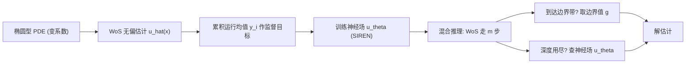

## 一句话总结

用一个神经场（neural field）作为缓存去"接住"Walk on Spheres（WoS）随机游走的尾巴，构建一个既低偏差、又低方差、还快的混合式椭圆型偏微分方程（PDE）求解器。

## 研究背景

- 领域现状：无网格的蒙特卡洛 PDE 求解器（以 Walk on Spheres 为代表）近年在图形学里很受欢迎，因为它无偏、无需离散化，还能处理变系数椭圆型方程、几何处理、流体模拟等任务。另一条路是用神经场直接拟合 PDE 解（如 PINNs、SIREN 等）。
- 核心痛点：两条路各有硬伤。蒙特卡洛求解器无偏但方差高，每个采样点要跑很多条、且每条可能上百步的随机游走才能收敛，实时性差；神经场求解快（一次前向传播即得解），但用自监督损失训练不稳定、对超参敏感，而且解带有难以控制的偏差。
- 本文 idea：借鉴神经辐射缓存（Müller 等人 2021 用神经场缓存加速蒙特卡洛渲染）的思路，把神经场当作 WoS 的"缓存"。先用 WoS 的无偏估计去监督训练一个神经场，然后在求解阶段跑 WoS 但在固定深度处提前终止随机游走、改用查询神经场来补齐剩余贡献，从而在偏差、方差、速度三者间取得可控的折中。

## 方法

整体框架分两步：第一步用 WoS 估计值作监督目标、训练出一个近似 PDE 解的神经场；第二步在推理时运行"浅层 WoS + 神经场兜底"的混合估计器——随机游走走到预设深度 $$m$$ 就不再递归，直接查神经场取值。

关键设计：

1. **用 WoS 监督替代自监督损失**。自监督损失（式 8）里带高阶微分算子，会放大网络的高频成分、使损失本身高频而难优化，训练对架构/初始化/学习率都很敏感。本文改用 WoS 估计器产生的目标值做 L2 回归监督，损失里不再需要对网络求导，训练稳定得多。

2. **数据生成与训练并行、目标在线累积**。不等到监督信号足够精确才开训，而是维护每个训练点 $$x_i$$ 上的运行均值 $$y_i^{(k+1)} = (k\,y_i^{(k)} + \hat u(x_i))/(k+1)$$，一边用更多 WoS 游走精化目标、一边用 SGD 训练网络。实现里每 5000 次迭代补一批新的 WoS 样本（每点 50 条游走），恰好和训练节奏对齐，无需等待。

3. **收敛性分析**。作者证明（Theorem 5.1）：只要 WoS 估计器无偏且方差有界，用这种在线累积目标做 SGD，期望梯度范数以 $$\mathcal{O}(\log(T)/T)$$ 量级衰减，保留了与常规 SGD 相当的收敛保证——蒙特卡洛目标的方差只是叠加到 SGD 本身的方差上，不破坏收敛。

4. **深度可控的混合推理**。推理时从查询点出发做 WoS 随机游走，若落入边界薄带（距离小于 $$\epsilon$$）就取边界值 $$g$$；若游走步数用尽（深度 $$m$$ 归零）就查神经场 $$u_\theta$$ 兜底；否则按 WoS 递归式继续走一步。深度 $$m$$ 是一个显式旋钮：$$m$$ 越大越接近纯 WoS（低偏差高方差、慢），$$m$$ 越小越接近纯神经场（快、但更依赖网络的偏差）。取浅层（如 $$m=1$$）即可在推理时又快又干净地补齐解。

## 实验结果

主实验是在 3D 变系数椭圆型方程上、对三个形状（Sprocket、Missile、Cow）做等时（各 5 分钟计算预算）对比，指标为相对参考解的均方误差（MSE，参考解由 $$10^4$$ 条 WoS 游走在 $$512\times512$$ 切片上平均得到）。三种解法的核心性质对比如下（忠于原文的定性结论）：

| 解法 | 偏差 | 方差/噪声 | 推理速度 | 等时 MSE |
|------|------|-----------|----------|----------|
| 纯 WoS | 无偏 | 高（图像噪声大） | 慢 | 较高 |
| 神经场（自监督 NF） | 有偏、难控 | 无（确定性） | 快 | 较高 |
| 本文混合（$$m=1$$） | 低偏差 | 低（图像更干净） | 快 | 最低 |

结论：混合解在相同算力下 MSE 低于两个基线——比 NF 基线偏差更小，比 WoS 基线噪声更低；解的空间频率越高（如 Missile、Cow），本文优势越明显。计算时间拆解显示，当需要求解的位置越多（如 $$1024\times1024$$ 切片），混合法相对 WoS 的时间优势越大，因为训练时间固定、而浅层推理极快。此外深度 $$m$$ 让用户按需在算力与偏差之间权衡，在大多数精度区间混合估计器都能取得更低的整体误差。

## 亮点与局限

- 亮点：
  - 把渲染里的"神经辐射缓存"思路迁移到蒙特卡洛 PDE 求解，是这个方向的第一步尝试，思路清晰且可解释。
  - 用 WoS 无偏目标监督神经场，绕开了自监督损失的高频/不稳定问题，训练更稳；并给出了收敛率的理论保证。
  - 深度 $$m$$ 提供了显式的"算力换偏差"旋钮，推理位置越密集收益越大。

- 局限：
  - 只针对（无漂移项的）变系数椭圆型稳态方程验证，尚未覆盖更广的 PDE 类型；能否推广到时变、含漂移项等仍待验证。
  - 神经场缓存仍带偏差，浅层推理时结果质量依赖网络训练得够好；需要额外的训练阶段（约几分钟）与存储。
  - 方法本质仍受限于 WoS 可适用的 PDE 范围，未利用数据驱动先验（作者明确将其列为范围外）。

## 延伸思考

- 这项工作把"神经缓存 + 蒙特卡洛无偏采样"的混合范式从渲染搬到了 PDE 求解，提示了一条通用模式：凡是有无偏但高方差的蒙特卡洛估计器，都可以训练一个神经场缓存来接住游走尾部、以可控偏差换取方差与速度。
- 一个自然的追问是能否把边界值缓存、控制变量（control variates）等渲染里成熟的方差缩减手段与神经缓存叠加，进一步压低方差。
- 结合数据驱动先验（如神经算子）来初始化或正则化这个缓存，可能缩短训练时间、并把方法推广到更难的 PDE 家族，是值得探索的方向。
