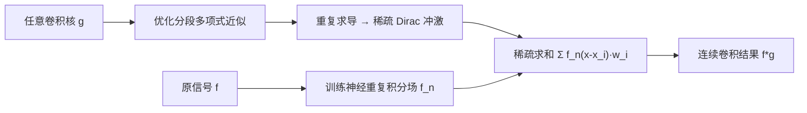

## 一句话总结

利用"分段多项式核经多次求导后退化为稀疏 Dirac 冲激"这一性质，把神经场与任意大核的连续卷积转化为对信号重复积分场的少量点采样，从而实现与核大小无关、可空间变化的高效卷积。

## 研究背景

- 领域现状：神经场（用 MLP 把坐标映射到值的隐式表示）正在成为图像、几何、光场等视觉数据的通用连续表示，具有连续、紧凑、易优化三大优点。
- 核心痛点：神经场本质上只支持"点查询"，难以做信号处理里最核心的操作——卷积。连续卷积需要对坐标加权积分，直接离散化会带来巨大内存开销，Monte Carlo 采样又噪声严重；已有的可微方法（如基于高阶导数的 INSP）只能处理很小的、空间不变的核，参数化条件方法（Mip-NeRF 风格）则把核限制在预先设定的参数族里且训练昂贵。
- 本文 idea：借用离散图形学里 Heckbert 的"重复积分滤波"经典思想并把它抬升到连续神经域——既然分段多项式核多次求导后只剩稀疏的 Dirac 冲激，那么只要事先把信号的重复积分（反导数）学成一个神经场，卷积就退化成在若干冲激位置上对该积分场的稀疏求和。

## 方法

整体框架：方法由两个可分离的部件组成。其一，把目标卷积核近似为分段多项式核 $$\hat{g}$$，它经 $$n$$ 次逐维求导后变成一组稀疏 Dirac 冲激；其二，训练一个神经场来表示原信号 $$f$$ 的 $$n$$ 重反导数 $$\hat{f}_n$$。最终连续卷积化为二者的离散求和。核心恒等式是：卷积可以把"对 $$f$$ 求反导数"与"对 $$g$$ 求导数"配对进行，反复应用得到

$$f * g = \left(\int^n \cdots \int^n f \, \mathrm{d}x^n\right) * \left(\frac{\partial^{dn}}{\partial x_1^n \cdots \partial x_d^n} g\right) = f_n * g_{-n}$$

当 $$g_{-n}$$ 是 $$m$$ 个冲激时，利用 Dirac 的筛选性质，卷积塌缩为

$$(f * \hat{g})(\boldsymbol{x}) = \sum_{i=1}^{m} f_n(\boldsymbol{x} - \boldsymbol{x}^{(i)}) \, w^{(i)}$$

即只需在 $$m$$ 个由冲激位置决定的点上评估重复积分场，且 $$m$$ 与核的实际大小无关。

关键设计：

1. **稀疏可微核的参数化与优化**：把多项式核写成一组平移的"$$n$$ 阶斜坡"（Dirac 的 $$n$$ 重反导数）的线性组合 $$\hat{g}(\boldsymbol{x}) = \sum_i \delta_n(\boldsymbol{x} - \boldsymbol{x}^{(i)}) w^{(i)}$$，这样它的 $$n$$ 阶导数天然就是冲激，冲激位置与幅值可直接读出。优化目标为拟合原核的 $$L_2$$ 误差加上一个鼓励幅值和为零的正则项（保证核紧支）。优化中若某冲激幅值趋近零就剔除，自动适配所需冲激数 $$m$$。

2. **训练神经重复积分场**：直接用 Monte Carlo 估计反导数来监督会因需在整个半域积分而方差极大、结果模糊。作者转而要求"用小核对积分场做卷积等于用对应核对原信号做卷积"，损失为

$$\mathbb{E}_{\boldsymbol{x}}\left[\left\lVert \sum_{i=1}^{m} \hat{f}_n(\boldsymbol{x} - \boldsymbol{x}^{(i)}) w^{(i)} - \mathbb{E}_{\boldsymbol{\tau} \in \mathrm{supp}(h_n)}\left[f(\boldsymbol{x} - \boldsymbol{\tau}) h_n(\boldsymbol{\tau})\right]\right\rVert\right]$$

其中监督核 $$h_n$$ 取"盒函数自卷积 $$n$$ 次"这种极紧的最小核，对应高阶有限差分，只需 $$(n+1)^d$$ 项、Monte Carlo 方差低，同时防止网络"偷懒"学成被卷积后的信号。核大小存在一个甜点：太小训练不稳、太大结果模糊。

3. **空间变化卷积与核变换**：由于每个位置的卷积评估相互独立，可让核 $$\hat{g}$$ 随位置变化。对核做平移与（各向异性）缩放只需对冲激位置施加矩阵 $$\boldsymbol{x}^{(i)}_T = T\boldsymbol{x}^{(i)}$$、幅值按 $$w^{(i)}_T = w^{(i)} / \det(T)^n$$ 调整，于是一个核只需在标准姿态下优化一次，即可近乎零成本得到任意缩放的实例，也支持连续尺度空间分析。

## 实验结果

作者在图像、视频、几何（SDF）、角色动画、音频五种模态上验证。以 3D 几何（用盒核平滑 SDF）为主实验，与 INSP、BACON 对比，指标为 SDF 的 MSE、Chamfer 距离、IoU，跨三个物体平均：

| 方法 | MSE (σ=0.05)↓ | Chamfer (σ=0.05)↓ | IoU (σ=0.05)↑ | MSE (σ=0.15)↓ | IoU (σ=0.15)↑ |
|------|------|------|------|------|------|
| INSP | 292.5 | 171.77 | 0.90 | 281.3 | 0.73 |
| BACON | 0.40145 | 360.90 | 0.82 | 1.85791 | 0.61 |
| 本文 | 0.00109 | 20.97 | 0.99 | 0.00026 | 0.99 |

本文在所有核尺寸与所有指标上均大幅领先：INSP 受噪声困扰，BACON 无法复现较大尺度的滤波。图像实验中，对很小的核 BACON/PNF 质量略高，但随核增大本文显著超越所有方法；积分场质量分析显示本文比 AutoInt 反导数质量更高、训练更快（高阶积分时 AutoInt 需 14.7 小时、计算图达上万节点，本文恒为约 1 小时、图仅 11 节点），且反导数质量与卷积质量高度相关（Pearson R = -0.98）。

## 亮点与局限

- 亮点：
  - 把离散图形学的"重复积分滤波"优雅地推广到连续神经场，卷积代价与核大小解耦，天然支持大核与空间变化核。
  - 训练一次积分场即可适配同一多项式阶数下的任意核，无需像条件式方法那样为每个核重训。
  - 通用性强，同一框架覆盖图像、视频、几何、动画、音频，还能做非线性（双边）滤波。
- 局限：
  - 需要访问完整信号来训练积分场，无法处理仅通过可微前向过程部分观测的信号（如 NeRF）。
  - 基于有限差分的训练对极小核不稳定，存在可忠实计算的滤波尺寸下限（下限以下退回 Monte Carlo）。
  - 空间变化假设核是参考核的（各向异性）缩放版本，核变换仅限轴对齐操作，一般性形变尚无可扩展方案。
  - 不主张优于网格表示——只有在必须用神经场（极致压缩、连续查询等）时本方法才有价值。

## 延伸思考

- 该方法把"summed-area table / 积分图"这一经典离散加速思想在连续域重新激活，提示很多依赖前缀和/积分图的技术（盒滤波、方差估计、局部统计）都可能有连续神经版本。
- "训练反导数而非直接拟合信号"的思路与 AutoInt 形成有趣对照：前者用有限差分监督、图规模恒定，后者靠自动微分、图随阶数爆炸；这对需要高阶积分的任务（体渲染、光场积分）有借鉴意义。
- 最大的实用瓶颈在于需要完整信号，若能与可微渲染结合、支持部分观测下的积分场学习，将直接打通到 NeRF 等重建场景，是明确的后续方向。
