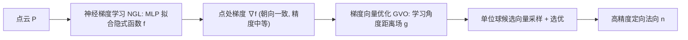

## 一句话总结

本文提出"先全局定向、后局部精修"的两阶段流水线：用神经梯度学习（NGL）从点云的全局隐式表示中直接导出方向一致的梯度向量，再用梯度向量优化（GVO）学习一个角度距离场来精细化这些粗糙梯度，从而端到端地估计出既定向一致又高精度的点云法向。

## 研究背景

- 领域现状：定向法向（朝向一致的法向）是曲面重建、渲染等下游任务的前提。传统做法把它拆成两个独立阶段——先做无定向法向估计（求垂直于局部曲面的向量），再做法向定向（把相邻向量的朝向统一）。定向阶段大多依赖基于最小生成树等的传播策略。
- 核心痛点：两阶段范式需要拼接两个独立算法、调两套参数，且稳定性无法保证。作者发现一个关键现象——对同一个定向算法，换用精度更高的无定向法向估计器，并不必然带来更好的定向结果。传播策略受无定向向量朝向分布的影响，简单的"若与参考向量点积小于零就翻转"规则会在很多情形下判错，且定向阶段的局部错误会沿传播过程不断扩散（误差传播）。
- 本文 idea：把传统流水线倒过来。先求出朝向一致但精度中等的法向，再对其做精修。全局朝向由隐式表示天然保证一致性，局部精度则交给一个基于局部平面几何的角度距离场来提升，二者组成一个统一、完整的流水线。

## 方法

整体框架分两步串联：NGL 阶段 $$\boldsymbol{P} \to f \to \nabla f$$ 用一个简单 MLP 拟合点云的全局隐式函数，反向传播得到点处的梯度向量，其朝向天然一致但精度不足；GVO 阶段 $$\nabla f \to g \to \boldsymbol{n}$$ 以粗梯度为初值，在单位球上采样候选向量并用学到的角度距离场挑出最优者作为最终法向。

关键设计：

1. **神经梯度学习（NGL）的目标函数**。用 MLP $$f(\boldsymbol{x};\boldsymbol{\theta})$$ 参数化目标函数，其归一化梯度 $$\boldsymbol{v}=\nabla f / \lVert \nabla f \rVert$$ 即隐式曲面的法向方向。与以往只把查询点移向单个最近点的重建式目标不同，本文把目标改为把点推向其邻域的均值向量，损失写作 $$L(\boldsymbol{\theta}) = \lVert f(\boldsymbol{x};\boldsymbol{\theta})\cdot\boldsymbol{v} - \tfrac{1}{k}\sum_{i=1}^{k}(\boldsymbol{x}-\mathcal{N}_i^k(\boldsymbol{x},\boldsymbol{P})) \rVert$$ 。为什么这么做：输入点云含噪、单个点未必落在真实曲面上，用邻域均值来匹配梯度使得对噪声、离群点和密度变化都更鲁棒。作者强调其目标不是学一个精确的距离场去逼近曲面，而是从各类含噪数据中学到一个朝向一致的神经梯度场。

2. **梯度向量优化（GVO）与角度距离场**。NGL 的梯度因为要拟合整个曲面而非局部，往往不够精确。GVO 引入一个网络 $$g(\boldsymbol{x},\boldsymbol{v};\boldsymbol{\vartheta})$$ 预测归一化梯度 $$\boldsymbol{v}$$ 与真值法向 $$\hat{\boldsymbol{n}}$$ 之间的（无符号）角度距离场，其零水平集刻画点云的法向。测试时围绕初始向量 $$\boldsymbol{v}$$ 在单位球上按高斯分布采样一组候选向量，由网络挑出角度距离最小的候选作为输出法向。相比直接回归角度，这种基于加权局部平面特征的选优对噪声更稳、能产出更高质量的法向。

3. **各向异性核（Anisotropic Kernel）保细节**。朴素的局部平面拟合像低通滤波，会抹掉尖锐细节。特征编码层用一个由 MLP 组成的各向异性核，对邻域点按几何关系（而不仅是位置）加权，权重 $$w_j = d_j / \sum_i d_i$$ ，其中 $$d_i=\mathrm{sigmoid}(\vartheta_1 - \vartheta_2 \lVert \boldsymbol{x}_i - \boldsymbol{x}\rVert)$$ 让核聚焦在离中心更近的点上，从而保留尖锐特征。

4. **内点分数（Inlier Score）抗离群**。用分数函数 $$s(\boldsymbol{x},\boldsymbol{v};\boldsymbol{\vartheta})$$ 给邻域点打分：离局部平面近的内点得高分、离群点得低分（监督信号 $$\delta$$ 由点到平面距离经高斯核给出）。分数被融入角度距离场的特征编码中做分数加权优化，最终损失 $$L_{\text{GVO}} = L_1(\boldsymbol{\vartheta}) + \lambda L_2(\boldsymbol{\vartheta})$$ （$$\lambda=0.5$$），从而对噪声和离群点鲁棒。

## 实验结果

主实验为 PCPNet 与 FamousShape 两数据集上定向法向的 RMSE 对比（越低越好），下表摘取各设置的平均值一列以体现整体趋势：

| 方法 | PCPNet 平均 | FamousShape 平均 |
|------|-------------|------------------|
| PCA+MST | 28.52 | 40.48 |
| PCA+SNO | 26.52 | 41.31 |
| AdaFit+ODP | 30.93 | 47.60 |
| HSurf-Net+ODP | 31.07 | 49.37 |
| PCPNet | 37.66 | 44.57 |
| SHS-Net | 19.79 | 32.79 |
| 本文 | **18.49** | **27.69** |

本文在两个数据集的平均 RMSE 上均取得最优，尤其在 FamousShape（更复杂形状）上相对次优的 SHS-Net 有明显优势。补充实验中：无定向法向估计上本文与 SHS-Net、HSurf-Net 等 SOTA 基本持平（PCPNet 平均约 9.98）；效率方面，本文可学习参数量最小（2.38M），测试耗时（约 71 秒/10 万点）远低于依赖 ODP 定向的两阶段方法（300 秒以上）。消融实验表明：去掉 NGL 后定向法向 RMSE 从约 18.49 恶化到 120 以上（朝向完全失准），去掉 GVO 则精度大幅下降，内点分数与核权重各自也都带来可见增益。

## 亮点与局限

- 亮点：
  - 把传统"先无定向、后定向"的流水线倒置为"先定向、后精修"，用隐式表示的全局性质天然规避了传播式定向的误差传播问题。
  - 单一统一框架端到端产出定向法向，避免拼接两套算法与调两套参数；参数量与推理时间都优于依赖重量级定向算法的两阶段方案。
  - 各向异性核 + 内点分数两个加权机制，同时兼顾细节保持与抗噪抗离群。
- 局限：
  - GVO 依赖 PCPNet 训练集提供的真值法向来学习角度距离场，属有监督精修，对无真值数据的泛化仍受训练分布约束。
  - 在个别设置（如某些条带/密度变化）上 RMSE 并非全面领先，NGL 的逐形状拟合式训练对每个点云需单独优化，规模化推理成本值得关注。

## 延伸思考

- 该方法体现了隐式神经表示与显式局部几何优化的互补：全局隐式场负责朝向一致性、局部学习场负责精度，这一"全局定序、局部精修"的思路可迁移到其他需要全局一致性的几何量估计（如曲率方向、切向场）。
- GVO 把法向估计转化为"在候选向量集合中选优"的分类式问题，而非直接回归，这与近来在角度场/方向场上以采样—评分替代直接回归的做法相呼应，值得对比其在高噪场景下的稳定性来源。
- 若能把 GVO 的监督需求放宽为自监督（例如与无监督神经梯度函数结合），有望摆脱对带真值训练集的依赖，进一步提升对真实扫描数据的适应性。
