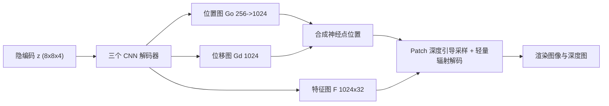

## 一句话总结

NPVA 用"约束在目标表情表面附近的可移动神经点 + 神经体渲染"来建可驱动的高保真头部化身，配合三项加速设计，在嘴巴内部、眼睛、胡须等难点区域比网格类方法更清晰，同时把体渲染速度提到接近网格方法、比 NeRF 快约 70 倍。

## 研究背景

- 领域现状：AR/VR 与视频会议里对可驱动、照片级真实感头部化身的需求很高。主流数据驱动方法（DAM、PiCA、MVP 等）大多建立在网格表示之上。
- 核心痛点：网格拓扑固定、离散分辨率有限，导致嘴巴内部这类拓扑会变化的区域出现明显伪影，胡须这类半透明细结构模糊；即便把颜色换成神经纹理或体积基元，本质上仍嵌在预定义拓扑里，一旦对应关系不准就糊。而纯 NeRF 类隐式表示虽无固定拓扑，但对新表情的控制不精确、渲染慢。
- 本文 idea：抛弃网格的预定义连接与硬对应，改用灵活的神经点表示 + 神经体渲染；同时用一张解码出的粗几何（UV 位置图）把神经点约束在目标表情表面附近以保证可控性，再叠加高分辨率位移图让点能在表面附近自适应移动、在难点区域"加厚点壳"提升建模能力。

## 方法

整体框架：给定对应目标面部状态的隐编码 $$\boldsymbol{z}$$（以变分自编码方式训练），用三个解码器分别生成低分辨率位置图 $$\hat{\boldsymbol{G}}_o$$、高分辨率位移图 $$\hat{\boldsymbol{G}}_d$$ 与特征图 $$\hat{\boldsymbol{F}}$$。位置图上采样后与位移图合成，确定神经点的三维位置，特征图提供每个点的外观特征；随后做基于神经点的体渲染，从任意视角产出高保真图像与细节深度图。

关键设计：

1. **表面引导的可动神经点**：神经点集 $$A=\{(\boldsymbol{p}_i,\boldsymbol{f}_i)\}$$ 的位置由粗几何（$$256^2$$ 位置图，带中间监督以保证表情控制）上采样到 $$1024^2$$ 后叠加位移图得到。只对过大位移施加正则，因此点可以既沿切向在表面滑动、又沿法向移动，训练后在嘴巴内部等难点自动形成更厚的"点壳"，增大体渲染的建模容量。

2. **轻量辐射解码**：对某个着色点，取半径 $$R$$ 球内最多 $$K$$ 个最近邻神经点，按到该点欧氏距离的倒数 $$w_i=1/\lVert \boldsymbol{p}_i-\boldsymbol{x}\rVert^2$$ 加权聚合特征与相对位置，得到"平均"特征 $$\boldsymbol{f}_x,\boldsymbol{v}_x$$，再送两个浅层 MLP 解出密度 $$\sigma_x$$ 与视角相关颜色 $$\boldsymbol{c}_x$$。关键改动是去掉了 Point-NeRF 里聚合前的逐点处理 MLP：既省算力（约 7 倍加速），又在动态新表情上泛化更好（推测过大容量易过拟合）。

3. **Patch 深度引导采样**：先用 $$256^2$$ 位置图光栅化出粗深度图 $$\boldsymbol{D}_{\text{rast}}$$。对每条光线不只看当前像素深度，而是看一个局部深度 patch（实现里取 9 个像素）取最小/最大深度。若两者差小于阈值就按单一深度层在中心附近采样；若差较大（如下颌与脖子在不同深度层）则把采样预算均分到前后两个深度层分别采样。相比只看单像素的 pixel-wise 深度采样，能避免胡须等区域出现"网格状"伪影，每条光线只需约 20 个采样点（NeRF 约 200）。

4. **GEP 三阶段光线采样训练**：G 阶段（网格均匀采样）保证全图覆盖并初始化，同时记录每个网格误差得到误差图；E 阶段按网格误差做重要性采样，把预算倾斜到嘴内、眼睛、头发等难点；P 阶段以图像 patch 为单位采样，从而能施加 LPIPS 感知损失、减少模糊。总损失为逐像素光度、感知、粗网格、两项深度、位移正则、TV 平滑与 KL 先验的加权和。

## 实验结果

在 Multiface 多视角人脸数据集上，训练用部分表情、测试用留出的新表情（约 11K 帧训练 / 1K 帧测试），在掩膜区域内计算 MSE 与 LPIPS，与 DAM、PiCA、MVP 对比。NPVA 在全部主体上取得最低 MSE 与 LPIPS，代价是单帧推理时间略长。

| 方法 | 主体1 MSE↓ | 主体1 LPIPS↓ | 主体2 MSE↓ | 主体2 LPIPS↓ | 推理(ms) |
|------|-----------|-------------|-----------|-------------|---------|
| PiCA | 34.50 | 0.232 | 28.83 | 0.108 | 73 |
| DAM | 28.40 | 0.208 | 23.53 | 0.088 | 107 |
| MVP | 48.59 | 0.242 | 28.25 | 0.102 | 144 |
| NPVA (本文) | 23.70 | 0.160 | 18.16 | 0.075 | 482 |

消融进一步表明：位移图比单纯增加点数更有效（MSE 26.36→23.70）；轻量辐射解码相比 Point-NeRF 式解码在提质的同时提速约 7 倍（3129ms→482ms）；patch 深度采样优于 pixel 深度采样（23.70 vs 24.92）；去掉 GEP 会明显变差（30.08）。与单帧 NeRF 拟合相比，NPVA 质量接近但推理快约 70 倍（约 524ms vs 38392ms）。

## 亮点与局限

- 亮点：
  - 用"表面约束 + 可移动神经点 + 体渲染"统一了可控性与对拓扑变化/细结构的建模能力，在嘴内、眼睛、胡须等长期难点上明显更清晰。
  - 三项工程设计（轻量解码、patch 深度采样、GEP 训练）把体渲染的效率拉到接近网格方法，兼顾质量与速度。
  - "点壳厚度随难度自适应增大"是个直观且可解释的容量分配机制。
- 局限：
  - 依赖粗网格跟踪，对很长头发或多样发型（如未测试的女性主体）支持不足；此时放松位移正则又会让新表情渲染变糊。
  - 推理时间仍显著慢于网格类方法（约 482ms 对比 73~144ms），离实时还有差距。
  - 跟踪网格不含舌头、牙齿顶点，口腔内部细节仍受限于驱动信号质量。

## 延伸思考

- 与并行工作 PointAvatar 的对比点很关键：后者点上只存颜色、用 splatting 渲染，本文用体渲染换取半透明毛发的更高保真——这也预示了后续 3D Gaussian Splatting 路线在头部化身上的爆发，值得把 NPVA 的"表面约束点 + 自适应壳厚"思想与显式高斯基元结合来看。
- "去掉逐点 MLP 反而泛化更好"提示：在动态/新表情这类需要跨状态泛化的任务里，表示容量并非越大越好，正则与几何先验可能比堆网络更重要。
- 深度引导采样把先验几何用于压缩采样预算，与后来各种"用粗代理加速体渲染"的思路一脉相承；patch 级双深度层处理对遮挡边界的启发可迁移到更一般的动态场景渲染。
